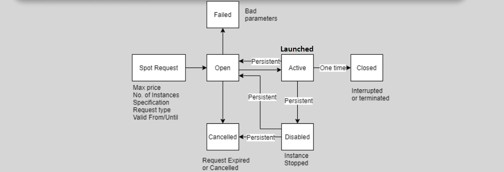
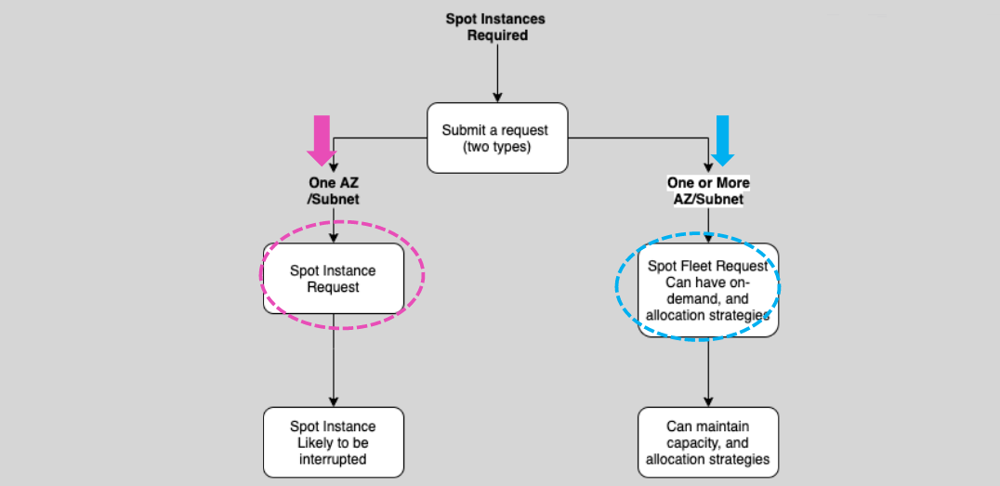

# **EC2 Spot Instances 💥**

**Spot Instances** allow you to take advantage of unused EC2 capacity at a **massive discount** (up to 90%) compared to On-Demand pricing. These instances are ideal for applications and workloads that can tolerate interruptions, making them a cost-effective choice for many types of workloads. However, there are trade-offs when using Spot Instances regarding availability and termination risks.

## **Key Features** 🌟

- **Significantly Lower Cost**: Spot Instances offer deep discounts compared to On-Demand pricing, making them a great option for reducing cloud costs.
- **Interruptible**: Spot Instances can be terminated by AWS if the Spot price exceeds your bid or if capacity is no longer available. This means you need to plan for potential interruptions.
- **No Availability Guarantee**: Spot Instances may not always be available when you need them. They are subject to availability and can be terminated at any time by AWS.

### **Ideal Use Cases** 🎯

- **Batch processing** 🛠️
- **Data analysis** 📊
- **Background processing** 📝
- **Optional tasks** that can be scheduled flexibly.
- **Non-critical workloads** that can tolerate interruptions, such as scientific simulations or data crunching.

## **Spot Instance Request Types 🔄**

You can choose from different request types when launching Spot Instances, which will determine how the instance behaves when the Spot price changes or capacity is no longer available.

### **1. One-Time Request** 🕒

- The request is active until it’s fulfilled, expired, or manually canceled.
- Ideal for tasks that require a one-time allocation of Spot Instances.

### **2. Persistent/maintain Request** 🔄

- The request remains active until it expires or is canceled, even after the Spot Instance is fulfilled. This ensures the instance stays running and is replaced automatically if terminated.
- Best for workloads that need consistent compute capacity over a longer period.

### **Difference**

| Feature                        | One-Time Request                   | Persistent Request                           |
| ------------------------------ | ---------------------------------- | -------------------------------------------- |
| **Duration**                   | Active until fulfilled or canceled | Active until the end of the term or canceled |
| **Replacement on Termination** | No                                 | Yes                                          |
| **Ideal For**                  | One-time workloads                 | Long-term or consistent workloads            |

## **Fleet Management 🚢**

A **Fleet** is a collection of Spot Instances (and optionally On-Demand Instances) that are launched based on the specifications you set. It helps you manage a fleet of instances across multiple availability zones (AZs) to `maintain` the capacity required for your workload.

### **EC2 Fleet 🚀**

- **Can Launch Multiple Instance Types**: EC2 Fleet can launch instances across multiple Availability Zones in one region.
- **Define On-Demand and Spot Capacity**: You can separately define how much On-Demand or Spot capacity you need.
- **Specify Maximum Price**: You can define the maximum amount you are willing to pay for the fleet.
- **API/CLI-Based**: EC2 Fleet can only be launched via CLI, SDKs, and APIs.

### **Spot Fleet 🚢**

A **Spot Fleet** is a collection of Spot Instances and optionally On-Demand Instances. It’s designed to `maintain` the required capacity for your application based on a Spot Instance request.

- **Maintain Target Capacity**: Spot Fleet can replace terminated Spot Instances to `maintain` the required capacity.
- **Mixed Instances**: The Spot Fleet can launch a combination of Spot and On-Demand instances.
- **Spot Capacity Pools**: Spot Fleet selects the best Spot capacity pools to meet the request specifications.

### **Spot Fleet vs EC2 Fleet 🚀**

Both Spot Fleet and EC2 Fleet allow you to launch instances across multiple AZs, but they differ in terms of flexibility and management.

| **Feature**                                         | **Spot Fleet**              | **EC2 Fleet**                                      |
| --------------------------------------------------- | --------------------------- | -------------------------------------------------- |
| **Launch date**                                     | May 2015                    | May 2018                                           |
| **Default Launch Type**                             | Spot                        | On-Demand                                          |
| **Can reference On-demand Capacity Reservation ID** | No                          | Yes                                                |
| **Can specify a maximum fleet price**               | Yes                         | Yes                                                |
| **Can use a launch template**                       | Yes                         | Yes                                                |
| **Can launch On-demand and Spot instances**         | Yes                         | Yes                                                |
| **Can benefit from matching RI instance pricing**   | Yes                         | Yes                                                |
| **Request types**                                   | Request (onetime), maintain | Instance (one-time synchronous), request, maintain |
| **Can be configured from the console**              | Yes                         | No                                                 |
| **Comment**                                         | -                           | Can be seen as an evolution of Spot Fleet          |

## **Spot Fleet Allocation Strategy 🎯**

When setting up a Spot Fleet, you can choose one of the following strategies to determine how Spot Instances are allocated:

### **1. Capacity Optimized (Recommended) 📈**

- **Goal**: Ensure that the Spot instances launched meet your capacity requirements, even if the price isn’t the cheapest.
- **Best For**: Workloads that prioritize availability over cost.

### **2. Lowest Price 💲**

- **Goal**: Select the lowest-priced instance pools available.
- **Best For**: Cost-sensitive workloads that can tolerate fluctuations in availability.

### **3. Diversified 🎯**

- **Goal**: Distribute Spot instances across multiple instance types to ensure availability and cost savings by reducing the risk of unavailability from any one pool.
- **Best For**: Balanced workloads that need both cost optimization and availability.

## **How to Request Spot Instances 📋**

There are two main ways to request Spot Instances:

1. **Spot Instance Request**: Launch Spot Instances within a **single Availability Zone (AZ)** or subnet.
2. **Spot Fleet Request**: Launch **multiple Spot Instances** across multiple AZs and subnets, with the option to include On-Demand Instances as well.

## **Spot Instance Interruption 🚨**

Spot Instances are subject to interruptions by AWS. AWS provides a **2-minute warning** before an interruption occurs, allowing you to take action before the instance is terminated.

### **Interruption Behavior**

- **Default Behavior**: Spot Instances are **terminated** when an interruption occurs. However, you can configure Spot Instances to **stop** or **hibernate** (for EBS-backed instances) instead of terminating them.

### **Rebalance Recommendations** 🔄

- AWS sends a **rebalance recommendation** to EventBridge when a Spot Instance is at risk of interruption. This allows you to take proactive action before the 2-minute notice.

## **Conclusion 🏁**

Spot Instances provide an excellent opportunity to save costs for non-critical workloads that can tolerate interruptions. By using **Spot Fleet** or **EC2 Fleet**, you can efficiently manage Spot capacity and ensure the resources you need are available. Always plan for interruptions, use the appropriate request types, and choose the right allocation strategy to maximize your Spot Instance usage.
