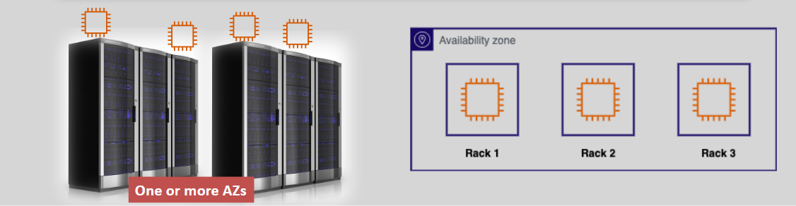

# **EC2 Placement Groups 🗂️**

EC2 Placement Groups allow you to control how your instances are placed across the underlying hardware infrastructure. Depending on the needs of your workload, you can influence the placement of your instances to optimize performance, availability, and fault tolerance. Here’s a breakdown of the **different types of EC2 Placement Groups** and how to use them effectively.

## **What Are EC2 Placement Groups?** 🤔

By default, AWS tries to launch instances spread across different racks and physical servers to prevent a failure from impacting multiple instances. However, **Placement Groups** allow you to control and optimize the way your instances are placed in relation to one another, depending on the type of workload and application needs.

### **Types of Placement Groups** 💡

There are three main types of placement groups you can use to influence where your EC2 instances are launched:

## **1. Cluster Placement Group 🏢** (Low Latency)

### **Key Features**

- **All instances are placed in a single Availability Zone (AZ)**.
- Designed to provide **low-latency** and **high-throughput** network performance between instances.
- Instances are placed on the **same physical hardware** for optimized communication.
- Ideal for workloads that require **extremely low latency** like **High Performance Computing (HPC)**.

### **Where are Instances Placed?**

- **Same AZ**: All instances must be in the same AZ.
- **Same rack**: Instances are typically placed in the same rack to reduce latency.

### **Use Cases**

- **High-performance applications** like HPC, video rendering, or real-time analytics.
- Applications that require **low-latency communication** between instances.

## **2. Partition Placement Group 📊** (Fault Isolation)

### **Key Features**

- **Multiple partitions** in a single AZ or across **multiple AZs**.
- Each partition is a **separate logical grouping of hardware** within an AZ or across AZs.
- Designed to ensure that instances in different partitions are **physically isolated** from one another to protect against hardware failures.
- **Up to 7 partitions** per AZ.

### **Where are Instances Placed?**

- **Different partitions**: Instances must be placed in **different partitions** to avoid failure in one partition affecting all instances.
- **Same or different AZs**: Instances can be placed in one or more AZs, but **each partition must be isolated**.

### **Use Cases**

- **Big data** applications, like **HDFS**, **HBase**, **Cassandra**, and other distributed databases that benefit from **partitioned fault tolerance**.
- **Workloads** that require **reliable storage and computing capacity** while minimizing failure risks.

## **3. Spread Placement Group 📂** (Max Fault Tolerance)

### **Key Features**

- **Instances are placed on different racks** within a data center to maximize fault tolerance.
- Can span **multiple AZs** for additional resilience.
- Limited to **7 instances per AZ per group** to reduce the risk of failure impacting more than one instance.

### **Where are Instances Placed?**

- **Different racks**: Instances are **spread across different racks** to minimize the impact of a hardware failure in one rack.
- **Same or different AZs**: Can be distributed across one or more AZs for additional fault tolerance.

### **Use Cases**

- **Critical applications** that need to be **isolated** from other instances in the group.
- **Small-scale applications** with **high availability** requirements, such as **single points of failure** that need isolation from others.

## **Comparison of Placement Groups** 📊

| **Feature**                     | **Cluster Placement Group**        | **Partition Placement Group**          | **Spread Placement Group**                   |
| ------------------------------- | ---------------------------------- | -------------------------------------- | -------------------------------------------- |
| **Instances in Same AZ**        | Yes                                | Yes                                    | Yes                                          |
| **Instances in Same Partition** | Yes                                | No                                     | Yes                                          |
| **Instances in Same Rack**      | Yes                                | No                                     | No                                           |
| **Number of Instances**         | No fixed limit, all in the same AZ | Limited to 7 partitions per AZ         | Up to 7 instances per AZ                     |
| **Fault Tolerance**             | Low                                | High                                   | Very high                                    |
| **Use Case**                    | Low-latency, high-performance apps | Distributed databases, fault isolation | Critical apps requiring full fault tolerance |

## **Moving Instances Between Placement Groups 🔄**

### **How to Move Instances**

1. **Stop the Instance**: Before moving an instance, it must be stopped.
2. **Choose New Placement Group**: Select the desired placement group (Cluster, Partition, or Spread).
3. **Restart the Instance**: Once the instance is moved, restart it in the new placement group.

Note: Some instances cannot be moved between placement groups if they don’t meet the specifications for the new group (e.g., Cluster to Spread, or Partition to Cluster).

## **Conclusion 🏁**

EC2 Placement Groups allow you to control the placement of instances across AWS infrastructure to meet specific workload requirements. **Cluster Placement Groups** provide low-latency communication within a single AZ, **Partition Placement Groups** offer fault tolerance through logical separation of hardware, and **Spread Placement Groups** maximize fault tolerance by spreading instances across different racks and AZs.
