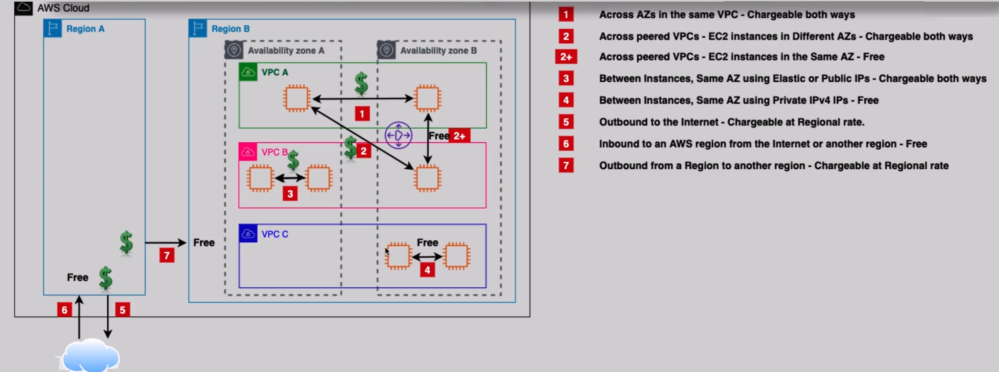

# **EC2 Data Transfer Costs 💸**

Amazon EC2 data transfer charges can add up quickly if not carefully managed. Data transfer refers to the movement of data between instances, VPCs, regions, and the internet. Understanding how AWS handles data transfer and which types are chargeable can help you optimize costs. Below is a breakdown of EC2 data transfer costs based on different scenarios.

## **Key EC2 Data Transfer Scenarios and Costs** 🔄

Here are the common scenarios where data transfer charges apply:

| **Scenario**                                                        | **Cost**                        |
| ------------------------------------------------------------------- | ------------------------------- |
| **1. Across Availability Zones (AZs) in the same VPC**              | **Chargeable both ways**        |
| **2. Across peered VPCs - EC2 instances in different AZs**          | **Chargeable both ways**        |
| **3. Across peered VPCs - EC2 instances in the same AZ**            | **Free**                        |
| **4. Between instances in the same AZ using Elastic or Public IPs** | **Chargeable both ways**        |
| **5. Between instances in the same AZ using Private IPv4 IPs**      | **Free**                        |
| **6. Outbound to the internet**                                     | **Chargeable at regional rate** |
| **7. Inbound to an AWS region from the internet or another region** | **Free**                        |
| **8. Outbound from a region to another region**                     | **Chargeable at regional rate** |

## **Explanation of EC2 Data Transfer Costs** 💬

1. **Across AZs in the same VPC**:

   - **Chargeable both ways**: Data transferred between EC2 instances in different Availability Zones within the same VPC is chargeable in both directions.

2. **Across Peered VPCs - EC2 instances in Different AZs**:

   - **Chargeable both ways**: Data transfer between instances in different AZs across peered VPCs is chargeable both for the source and destination.

3. **Across Peered VPCs - EC2 instances in the Same AZ**:

   - **Free**: Data transfer between instances located in the same AZ across peered VPCs is **free**.

4. **Between Instances in the Same AZ using Elastic or Public IPs**:

   - **Chargeable both ways**: Data transferred between instances in the same AZ using Elastic IPs or public IPs is chargeable in both directions.

5. **Between Instances in the Same AZ using Private IPv4 IPs**:

   - **Free**: If instances are in the same AZ and communicate using private IPv4 IPs, the data transfer is **free**.

6. **Outbound to the Internet**:

   - **Chargeable at Regional Rate**: Any data sent from EC2 instances to the internet is chargeable based on the regional data transfer rates.

7. **Inbound to an AWS region from the Internet or Another Region**:

   - **Free**: Data that is inbound to an AWS region, whether from the internet or another region, is **free**.

8. **Outbound from a Region to Another Region**:
   - **Chargeable at Regional Rate**: Transferring data from one AWS region to another incurs charges based on the regional data transfer pricing.

## **Optimizing EC2 Data Transfer Costs** 💡

1. **Minimize Cross-AZ and Cross-Region Traffic**:

   - To save costs, try to keep instances that frequently communicate with each other within the same AZ. Also, consider using **Private IPv4 IPs** instead of Elastic IPs or public IPs to reduce transfer fees.

2. **Use VPC Peering Efficiently**:

   - When you have multiple VPCs, leverage **peering** to reduce costs, but be aware of the data transfer charges between AZs and instances in different VPCs.

3. **Consider Using AWS Direct Connect or AWS VPN**:

   - For high-volume data transfer needs, consider using AWS **Direct Connect** or **VPN** to potentially lower costs when transferring large amounts of data between on-premises environments and AWS.

4. **Leverage Amazon CloudFront**:
   - Use **Amazon CloudFront** for content delivery to reduce internet-bound traffic from your EC2 instances and optimize your data transfer costs.

## **Conclusion 🏁**

Understanding EC2 data transfer costs is critical for managing your AWS expenses. Data transfer within the same AZ or using private IPs is generally free, while moving data across regions, AZs, or to the internet will incur charges. By optimizing your instance placement, utilizing VPC peering effectively, and leveraging AWS services like Direct Connect or CloudFront, you can manage and reduce data transfer costs efficiently.
