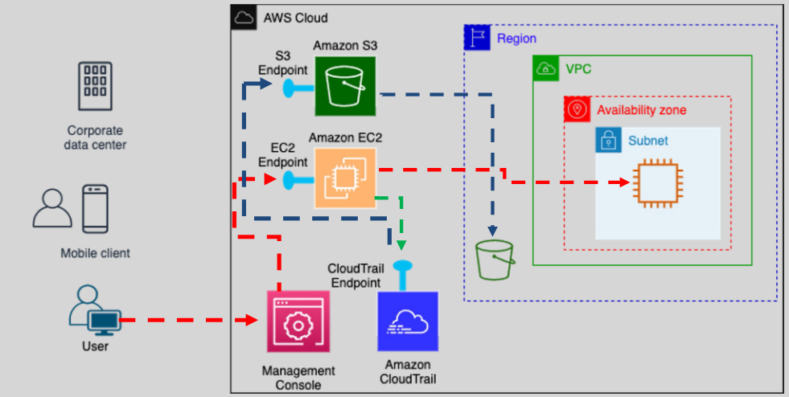
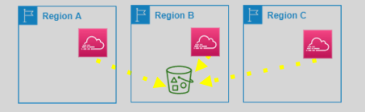
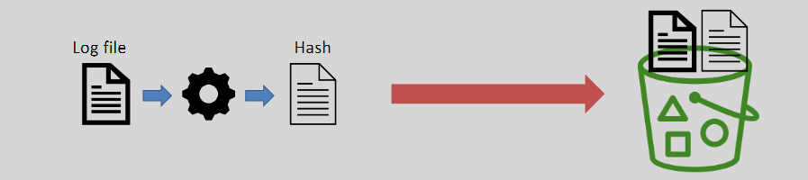

# **AWS CloudTrail** 🛠️

**AWS CloudTrail** is a service that helps you **monitor** and **audit** your AWS account by **recording** and **logging API calls** made by users, roles, and services. It helps ensure your AWS resources are being used properly and allows for **compliance**, **security**, and **operational** auditing.

## **What is CloudTrail?** 🔍

**CloudTrail** enables **governance**, **compliance**, **operational auditing**, and **risk management** for your AWS account. It tracks **API calls** made to AWS services and records these actions in the **CloudTrail event history**.

- **Records actions** taken by **IAM users**, **roles**, and **AWS services**.
- **Stores logs for 90 days** by default.
- Allows you to **view, search, and download** the events for review and analysis.

**Note**: CloudTrail logs **only API calls to AWS Services**, not API calls to workloads you host on AWS.

## **Why Use CloudTrail?** 🔒

CloudTrail is essential for:

- **Security**: Helps detect unauthorized activity or suspicious actions in your AWS environment.
- **Tracking Changes**: Provides visibility into changes made to AWS resources (e.g., who created or modified a resource).
- **Compliance and Auditing**: Helps ensure that your AWS account is compliant with internal or external regulations.
- **Operations and Troubleshooting**: Assists in debugging issues by providing event history of API calls.

## **CloudTrail Log Lifecycle Process** 🔄

Here’s how the **CloudTrail log lifecycle** works:

1. **API Call**: A user or AWS service makes an API call to an AWS service.
2. **Log Creation**: CloudTrail captures this API call and creates an event log.
3. **Log Delivery**: The event log is delivered to **CloudTrail** and stored in the **CloudTrail event history** for 90 days by default.
4. **Log Archive**: If you need long-term storage, you can **create a trail** that sends the logs to **S3** for archiving.
5. **Log Monitoring**: Logs can be integrated with **CloudWatch** for real-time monitoring or with **SNS** for notifications.

## **CloudTrail Events and Trails** 📜

### **Event Storage and Retention** 🗃️

- **Events** are stored by CloudTrail for **90 days** by default.
- If you want to **archive** or **analyze** the logs beyond 90 days, you need to **create a trail**.
- A **CloudTrail trail** can be configured:
  - **Single Region**: Tracks events within a specific AWS region.  
    
  - **All Regions (Recommended)**: Tracks events across all regions and future regions.  
    

### **CloudTrail Trail Features** ⚙️

- **Store Logs in S3**: CloudTrail logs can be stored in **S3 buckets** for long-term retention and analysis.
- **CloudWatch Integration**: Logs can be sent to **CloudWatch Logs** for real-time monitoring and alerting.
- **SNS Integration**: CloudTrail can notify you of new log file deliveries via **SNS** (Simple Notification Service).
- **Log Encryption**: Logs in S3 are **encrypted** by default using **SSE-S3** (encryption can be disabled).

## **Types of Log Events** 📝

1. **Management Events** 🌐

   - **Visibility** into management operations on AWS resources (e.g., create, delete, or modify resources).
   - **Enabled by default**, and **free** of charge.
   - **Examples**: Creating a bucket, creating a subnet.

2. **Data Events** 🗃️

   - Provide visibility into **resource-level operations** (e.g., **GET**, **PUT**, or **DELETE** operations on S3 objects).
   - **Disabled by default**. If enabled, these events are **chargeable**.
   - Provide **granular-level visibility** for actions taken within resources.

3. **Insights Events** 📊
   - Logs **unusual API write activities** within your account.
   - **Disabled by default** and **chargeable** when enabled.

## **Log File Integrity Validation** 🔐

CloudTrail offers **log file integrity validation** to ensure that your log files haven’t been tampered with.

- CloudTrail creates a **hash** for each log file it delivers to your S3 bucket.
- You can **validate** the log file to check if it was modified, deleted, or remains unchanged after delivery.
- This is especially useful for **security and forensic investigations**, as it helps identify whether a log file has been altered and who made the changes.

## **Summary** 📚

**AWS CloudTrail** is a powerful tool for monitoring and auditing actions within your AWS account. It provides:

- **Visibility into AWS API calls** made by users and services.
- **Log storage** and **management** for auditing and troubleshooting.
- **Integration with other AWS services** (e.g., SNS, CloudWatch) to enhance monitoring and alerts.
