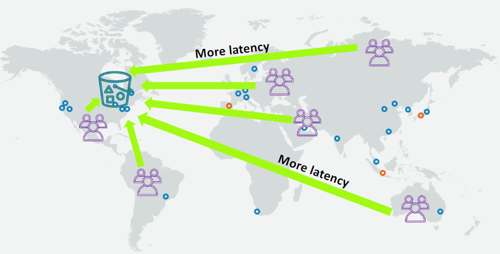
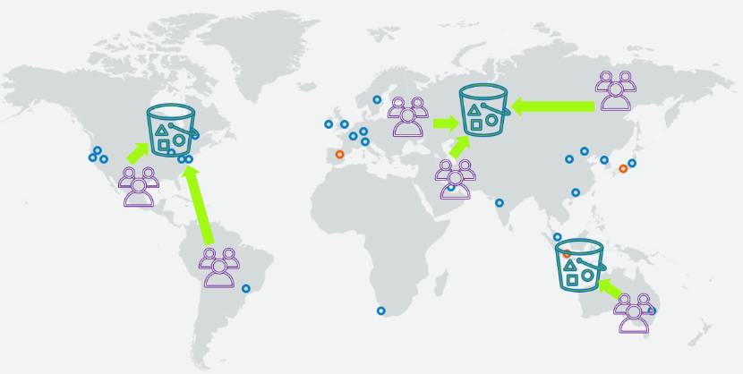
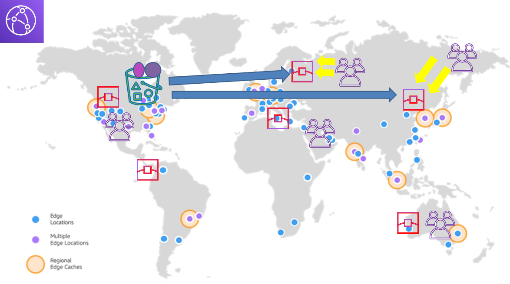

# **AWS CloudFront** 🌐

**AWS CloudFront** is a **content delivery network (CDN)** that helps distribute your content globally with low latency and high transfer speeds. It caches your content in multiple locations (called **edge locations**) around the world, improving the performance of your website, application, or service. Let's explore how CloudFront can benefit your content delivery!

## **Without CloudFront – Simple Use Case** ❌

Without CloudFront, when a user accesses content from your website or application, the request is sent directly to your **origin server** (the server where your website or application is hosted). This means that the further the user is from your origin server, the slower the response time.

In this setup:

- Users in distant regions experience **high latency**.
- Your origin server has to handle all the traffic, leading to **performance bottlenecks**.
- **Scalability** can become a concern as the traffic increases.

## **Without CloudFront – Replicating Content to Other Geo-Locations** ❌

Without CloudFront, if you want to serve users globally, you would need to replicate your content across multiple **data centers** in different regions, which can be complex, costly, and hard to manage.

This approach involves:

- **Complex management** of servers and storage across various regions.
- **Increased operational cost** due to the need for multiple data centers.
- **Content synchronization issues**, leading to inconsistent user experiences.

## **With AWS CloudFront** ✅

When you use **AWS CloudFront**, it caches your content in **edge locations** distributed globally. This improves performance by serving content from the nearest edge location, reducing latency and speeding up the delivery process.

In this setup:

- **CloudFront caches content** at **edge locations**, ensuring faster access for users, regardless of their geographic location.
- **Origin server load** is reduced, as CloudFront handles the majority of requests.
- **Automatic scaling**: CloudFront scales based on demand, ensuring that users receive content quickly without worrying about server capacity.

## **Key Benefits of AWS CloudFront** 💨

- **Low Latency**: Content is cached in edge locations close to your users, reducing the time it takes to load your content.
- **Improved Scalability**: CloudFront automatically scales to handle sudden traffic spikes without overloading your origin server.
- **Global Reach**: CloudFront delivers content to users worldwide with high speed and reliability, thanks to its extensive network of edge locations.
- **Cost-Effective**: By offloading traffic from your origin server, CloudFront reduces the need for expensive infrastructure investments in multiple data centers.

## **Conclusion** 📚

AWS CloudFront helps optimize the delivery of content by caching it at edge locations, ensuring fast, scalable, and reliable service to users around the world. With **CloudFront**, you don’t need to worry about managing multiple data centers or handling traffic spikes, as it provides an easy, cost-effective solution for global content delivery.
