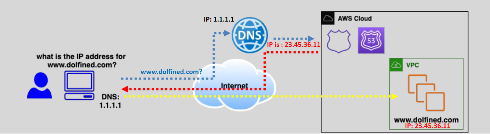

# **AWS Route 53** 🌐

**AWS Route 53** is a scalable and highly available **Domain Name System (DNS)** web service designed to route traffic to your applications efficiently. Whether your resources are **public-facing** or **private**, Route 53 offers flexibility and reliability in managing DNS records and routing traffic.

Let’s dive into the key features and how Route 53 works for both **public** and **private** workloads.

## **What is AWS Route 53?** 🧭

**AWS Route 53** is a fully managed DNS and domain registration service. It helps route traffic to resources within AWS or other locations using DNS records. Route 53 works with **public hosted zones** for **internet-facing workloads** and **private hosted zones** for **internal workloads** (e.g., within a VPC).

### **Key Features of Route 53:**

- **DNS Management**: Route 53 is used to configure and manage DNS records, directing user traffic to resources (like EC2, Load Balancers, or S3 buckets).
- **Domain Registration**: You can register new domains or manage existing ones.
- **Health Checks and Monitoring**: Route 53 monitors the health of your resources and routes traffic to healthy instances.
- **Routing Policies**: You can use multiple routing policies like **latency-based routing**, **geolocation routing**, and **weighted routing**.

## **Public vs. Private Hosted Zones** 🌍

### **Public Hosted Zones** 🌐

- **Public hosted zones** are used to manage DNS records for domains that are **accessible over the internet**.
- When you create a **public hosted zone**, you can configure DNS records for resources that are exposed to the **internet**, such as websites, web applications, or API endpoints.

**Example**: If you have a website with the domain name **www.example.com**, you would create a **public hosted zone** for **example.com**. This allows users from anywhere on the internet to access your website.

### **Private Hosted Zones** 🏢

- **Private hosted zones** are used for **internal resources** that you only want to be accessible from within a specific **Amazon VPC** (Virtual Private Cloud).
- A **private hosted zone** allows you to manage DNS records for your internal applications, services, or databases that should not be accessed publicly.

**Example**: You can create a private hosted zone for **internal.example.com** and use it for internal servers, such as a database or an internal API, ensuring that only resources inside your VPC can resolve these records.

**Key Benefit**: Private hosted zones allow you to use DNS within a VPC without exposing the records to the public internet.

## **How Route 53 Works** 🛠️

Route 53 uses **DNS records** to map domain names to the appropriate resources, whether they are public or private.

1. **Create a Hosted Zone**: First, create either a **public** or **private hosted zone** depending on your use case.
2. **Define DNS Records**: Add various records such as **A**, **CNAME**, **MX**, or **NS** to route traffic to the correct resources.
3. **Traffic Routing**: Route 53 then resolves the domain to an IP address, either publicly (internet-facing) or privately (internal VPC resources).

## **Common DNS Record Types in Route 53** 📝

1. **A Record**: Maps a domain to an **IPv4 address** (e.g., **192.168.1.1**).
2. **AAAA Record**: Maps a domain to an **IPv6 address**.
3. **CNAME Record**: Points a domain to another domain name (e.g., **www.example.com** → **example.com**).
4. **MX Record**: Directs email traffic to the correct mail server.
5. **NS Record**: Specifies the authoritative DNS servers for your domain.

## **Route 53 Routing Policies** 🌍

Route 53 provides several **routing policies** to control how traffic is directed to your resources:

1. **Simple Routing**: Routes traffic to one resource.
2. **Weighted Routing**: Distributes traffic between resources based on assigned weights.
3. **Latency-Based Routing**: Routes traffic to the region that provides the lowest latency.
4. **Geolocation Routing**: Routes traffic based on the geographic location of the user.
5. **Failover Routing**: Routes traffic to a backup resource if the primary resource fails.

## **Health Checks and Monitoring** 🔍

Route 53 can monitor the health of your resources (like web servers) and reroute traffic to healthy instances if any resource fails. This is particularly useful for ensuring high availability and reliability.

## **When to Use Public and Private Hosted Zones** 🧐

- **Public Hosted Zones**: Use when your domain needs to be publicly accessible, such as for a website, application, or public API.
- **Private Hosted Zones**: Use when you need DNS resolution for **internal resources** within your **VPC**, ensuring that your resources are not exposed to the internet.

## **Use Case Example** 💡

Imagine you have a web application with the following setup:

- **Public-Facing Website**: You create a **public hosted zone** for **www.example.com** and configure **A records** to point to your web server’s IP address.
- **Internal API**: You create a **private hosted zone** for **api.internal.example.com** and configure it to resolve to an internal API that is only accessible within your **VPC**.

This configuration ensures that the public-facing website is accessible globally, while the internal API is only available within your private network.

## **Summary** 📚

- **AWS Route 53** is a **scalable DNS service** that helps manage traffic for both **public** and **private** resources.
- **Public hosted zones** are used for internet-facing resources, while **private hosted zones** are used for internal resources within a VPC.
- With **health checks**, **routing policies**, and **DNS management**, Route 53 ensures reliable, scalable, and cost-effective traffic management for your applications.

By using **Route 53**, you can seamlessly manage both **public** and **private** DNS records, offering greater flexibility in routing traffic to your AWS resources.
