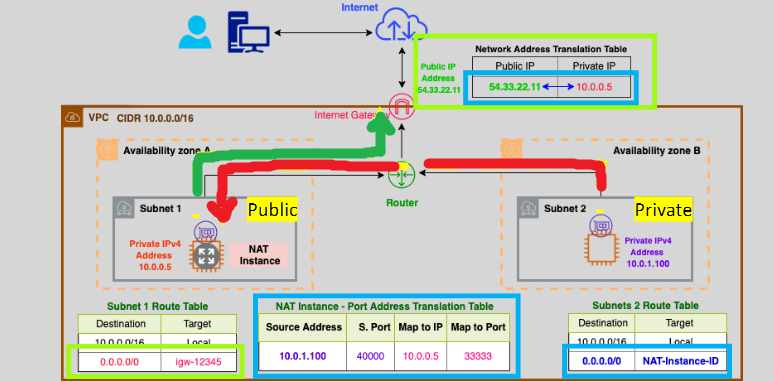
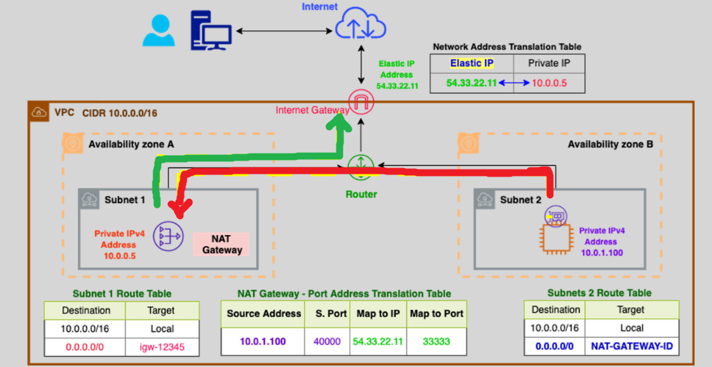
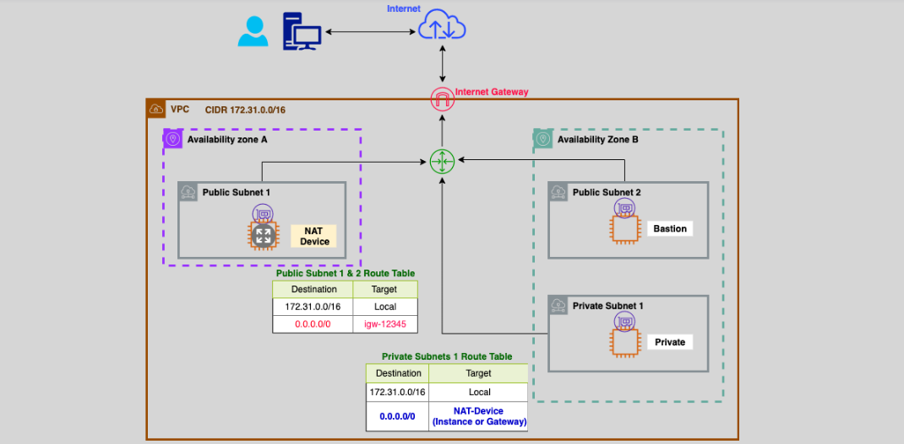

# **NAT Instance and NAT Gateway** 🌐

In AWS, **NAT Instances** and **NAT Gateways** are used to allow **private instances** in a **private subnet** to access the **internet**, while keeping them hidden from direct incoming internet traffic. Both serve similar purposes but differ in terms of performance, management, and cost. Let’s explore these concepts in detail!

## **Why Do We Need It?** 🧐

In an AWS Virtual Private Cloud (VPC), **private subnets** are isolated from the internet. However, there are cases when private instances need to initiate outbound connections to the internet, such as:

- **Software updates** for applications.
- **Accessing external APIs** or resources.
- **Connecting to services** hosted outside AWS (like on-premises systems).

To allow this, we use **NAT (Network Address Translation)** solutions to let private instances communicate with the internet while maintaining their privacy. This is where **NAT Instances** and **NAT Gateways** come into play!

## **NAT Instance** 🖥️

A **NAT instance** is an EC2 instance configured to allow traffic from **private instances** to the **internet**. It acts as a middleman, forwarding traffic between the private instances and the internet.

### **How It Works:**

- NAT instances must be launched in a **public subnet** (accessible from the internet).
- The route table for the **private subnet** must have a default route pointing to the NAT instance’s private IP.
- The **Source/Destination Check** on the NAT instance must be **disabled** so that it can act as a mediator for private instances.

#### **Key Points:**

- **Manual Setup**: You manage and configure the instance yourself.
- **Failover Needs**: You need to set up scripts to manage failover to a standby NAT instance if the primary one fails.
- **Performance**: Limited by the EC2 instance type you choose.

#### **Pros:**

- Flexible (you can use security groups, and SSH access is available).
- Cost-effective if traffic is low.

#### **Cons:**

- More management overhead (manual failover, scaling).
- Limited by instance type performance.

## **NAT Gateway** 🌉

A **NAT Gateway** is a **fully managed AWS service** designed to provide scalable and highly available outbound internet connectivity for private instances. It is a better solution for high availability and performance, especially when dealing with large traffic.

### **How It Works:**

- A **NAT Gateway** is deployed in a **public subnet**.
- **Private subnets** route traffic to the NAT Gateway, which forwards it to the internet.
- **Elastic IP** (EIP) is required for a public NAT Gateway.

#### **Types of NAT Gateways:**

1. **Public NAT Gateway**:

   - Needs an **Elastic IP** to connect with the internet.
   - Best for connecting private instances to the internet and external on-premises networks.

2. **Private NAT Gateway**:
   - **No Elastic IP** needed.
   - Typically used for communication between **private VPCs** or with an **on-premises network** through a **Transit Gateway**.

### **Key Points:**

- **Fully Managed**: AWS handles all maintenance, failover, and scaling.
- **High Availability**: It’s highly available within the **same AZ** when deployed with multiple NAT Gateways across AZs.
- **Performance**: Can scale up to **45 Gbps** per Gateway.
- **No Security Groups**: NAT Gateways cannot be associated with security groups.

#### **Pros:**

- **Fully Managed**: AWS takes care of the scaling and failover.
- **High Performance**: Ideal for large-scale or high-traffic applications.

#### **Cons:**

- More expensive than NAT Instances.
- Cannot be used with **Security Groups** (only NACLs).

## **NAT Instance vs NAT Gateway Comparison** 📊

| **Feature**              | **NAT Gateway**                             | **NAT Instance**                               |
| ------------------------ | ------------------------------------------- | ---------------------------------------------- |
| **Availability**         | Fully managed, highly available in each AZ. | Manual failover setup required.                |
| **Performance**          | Scales up to 45 Gbps per Gateway.           | Depends on EC2 instance type.                  |
| **Management**           | Fully managed by AWS.                       | Customer-managed (requires maintenance).       |
| **Elastic IP**           | Requires Elastic IP.                        | Elastic or public IP address can be used.      |
| **Security Groups**      | Cannot associate security groups.           | Can associate security groups.                 |
| **NACLs**                | Can use Network ACLs (NACLs).               | Can use Network ACLs (NACLs).                  |
| **SSH and Bastion Host** | No SSH access.                              | Can SSH into the instance (used as a bastion). |
| **Cost**                 | Higher cost, per-hour and per-GB pricing.   | Lower cost, based on instance type.            |

## **Choosing Between NAT Instance and NAT Gateway** 🏁

- **Use a NAT Gateway** if you want a **fully managed** solution with **high availability** and **scalability**, especially if you expect high traffic or require fast failover.
- **Use a NAT Instance** if you have **low traffic** and prefer a **cheaper** option, and you don’t mind managing failover and scaling manually.

## **Cost Optimization Tips** 💡

- **Same AZ**: To minimize data transfer charges, place **NAT Gateways** in the same AZ as the private EC2 instances.
- **Spot Instances**: Consider using **Spot Instances** for **NAT Instances** to save costs if your traffic isn’t consistent.
- **Data Minimization**: Reduce outbound internet traffic by designing your application to **store data** locally and use **internal communication** within AWS services as much as possible.

## **Exercise**

