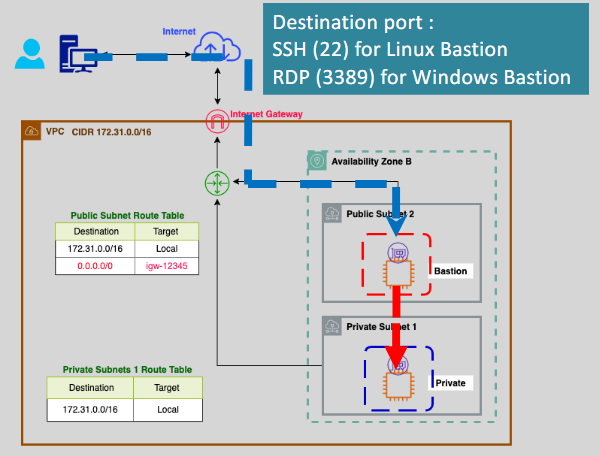
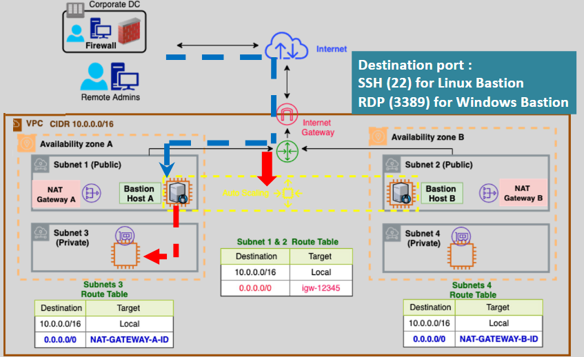

# **Bastion Host in AWS** 🔐

A **Bastion Host** (also known as a **Jump Server**) is a special-purpose compute instance used to securely connect to instances in a private network (VPC) from the public internet. It acts as a **gateway** to access private resources, ensuring secure and controlled access while maintaining isolation for the private instances. Let’s explore how to securely manage and use a Bastion Host in AWS.



## **What is a Bastion Host?** 🏰

A **Bastion Host** is a **secure, hardened EC2 instance** placed in a **public subnet** within your **VPC**. It allows authorized users to **SSH or RDP** into private instances or resources within **private subnets**, providing a secure entry point to manage and interact with them.

Bastion Hosts ensure that **private resources** are not directly accessible from the internet, adding an additional layer of security to your infrastructure.

## **How Does a Bastion Host Work?** ⚙️

1. **Public Subnet Placement**:  
   The Bastion Host is placed in a **public subnet** and is accessible from the internet. It acts as a **jumping point** for users to access private resources inside private subnets.

2. **Private Subnet Access**:  
   The private instances or resources that need to be accessed remain in **private subnets**, and they don’t have direct internet access. Accessing these resources from the internet is done via the Bastion Host.

3. **SSH/RDP Access**:  
   You SSH into the Bastion Host (using an **Elastic IP**) and then use it to connect to private instances. This is a **two-step connection**:

   - First, connect to the Bastion Host via SSH/RDP.
   - Then, connect from the Bastion Host to the private instances.

4. **Security Best Practices**:
   - **Restrict access** to the Bastion Host by limiting inbound traffic via **Security Groups** and **NACLs**.
   - Only allow **SSH** or **RDP** access from **trusted IP addresses**.
   - Use **Elastic IPs** instead of **public IPs** for better consistency.
   - Implement **Multi-Factor Authentication (MFA)** to enhance security.

### **Enhancing Security with SSH Agent Forwarding** 🔑

One of the most **secure** ways to connect to instances through a Bastion Host is by using **SSH Agent Forwarding** and the **`ssh-add`** command. This prevents your private key from being stored on the Bastion Host, keeping it secure on your local machine.

1. **Download Key**: `my-key.pem`

2. **Start Agent and Add Key**:

   ```bash
   eval "$(ssh-agent -s)"
   chmod 400 /path/to/my-key.pem
   ssh-add /path/to/my-key.pem
   ```

3. **Connect to Public Instance**:

   ```bash
   ssh -A ec2-user@your-public-instance-ip
   ```

   - **`-A`**: this option forwards your local SSH agent to the remote server.

4. **SSH to Private Instance**:

   ```bash
   ssh ec2-user@your-private-instance-ip
   ```

5. **Hint for Troubleshooting**:

   If you encounter issues, you can use the `-v` option to enable verbose mode and debug the authentication process:

   ```bash
   ssh -v ec2-user@your-private-instance-ip
   ```

By forwarding the SSH agent, your private key never leaves your local machine, enhancing security and minimizing exposure on the Bastion Host.

Does this help? Let me know if there's anything else you need!

## **Best Practices for Bastion Host Configuration** 🔐

### **1. Placement in Public Subnet** 🌐

- Always place the Bastion Host in a **public subnet** so it can be accessed from the internet, but keep the private instances in a **private subnet** for isolation.

### **2. Elastic IP (EIP)** 💻

- Assign an **Elastic IP** (EIP) to the Bastion Host to ensure **consistent access** even if the instance is stopped or restarted.

### **3. Limit Access with Security Groups** 🔒

- Restrict access to the Bastion Host by configuring **Security Groups** to only allow **SSH (port 22)** or **RDP (port 3389)** from trusted IP addresses (e.g., your corporate network or a VPN).

### **4. Use Multi-Factor Authentication (MFA)** 🔑

- For added security, configure **MFA** for the Bastion Host. This ensures that only authorized users can gain access.

### **5. Monitoring and Logging** 📊

- Enable **CloudWatch Logs** to capture activity on the Bastion Host.
- Monitor **SSH** and **RDP** logins and implement alerting for any suspicious access attempts.

## **High Availability with Bastion Hosts** 🌎



You can deploy **Bastion Hosts** in **high availability (HA)** mode to ensure continued access to your private instances even in case of failure. By using **Auto Scaling** and **multiple availability zones (AZs)**, you can maintain availability and minimize downtime.

- Deploy a **Bastion Host** in each **availability zone (AZ)** of your VPC to ensure **fault tolerance** and **redundancy**.
- Configure **Elastic Load Balancing** (ELB) to distribute incoming traffic across Bastion Hosts for **scalability**.

## **Alternatives to Bastion Hosts** ⚙️

While Bastion Hosts are effective, there are other alternatives that provide even more secure and scalable ways to access private instances:

- **AWS Systems Manager Session Manager**: A secure and auditable way to connect to EC2 instances without needing SSH or RDP access. It enhances security by reducing the need for direct access to private instances.
- **AWS VPN**: For broader use cases, you can set up a **VPN connection** to provide secure access to your VPC, including private instances, without relying on a Bastion Host.

## **Conclusion** 📚

- **Bastion Hosts** provide a secure way to connect to private instances within a VPC while keeping them isolated from the internet.
- By following **best practices** such as using **Elastic IPs**, **restricting access**, and employing **SSH Agent Forwarding**, you can securely manage your private resources without exposing sensitive data.
- Consider **high availability** configurations and explore alternatives like **AWS Systems Manager** for an even more secure and scalable access solution.
