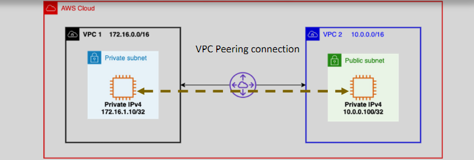
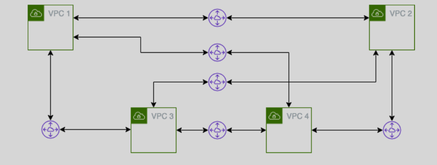
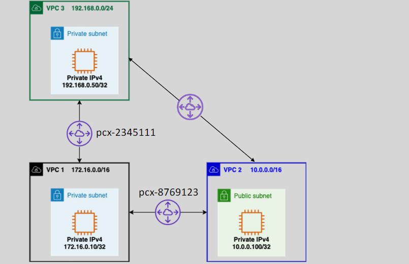
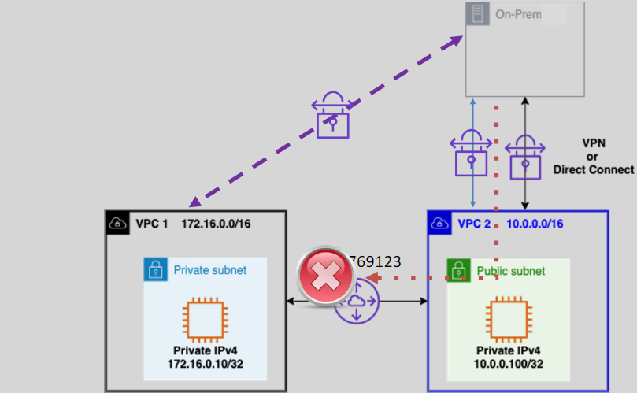

# **VPC Peering** 🌐

**VPC Peering** allows communication between two Virtual Private Clouds (VPCs) in AWS, but as the infrastructure grows, managing VPC peering can become challenging. Let’s explore how **VPC Peering** works, its limitations, and how to solve these problems efficiently using **AWS Transit Gateway**.

## **What is VPC Peering?** 🔄

- **VPC Peering** enables routing between two VPCs, allowing instances in different VPCs to communicate.
- Peered VPCs can be in the **same** or **different AWS accounts**.
- The two VPCs can also be in **different AWS regions**.
- **CIDR Range Restriction**: The CIDR ranges of the two VPCs **cannot overlap**.

## **Key Features of VPC Peering** 🔑

- **Highly Available**: The VPC peering connection is highly available, ensuring reliable communication.
- **One-to-One Connection**: You can only create a single peering connection between any pair of VPCs. Additional connections are required to peer with other VPCs.

## **Scaling Limitations** ⚠️

When you establish **VPC Peering**, the scaling limitations become evident as the number of VPCs grows. Here's why:

- **N-to-N Peering Connections**: To establish **any-to-any communication** between N VPCs, you would need to create **N(N-1)/2 peering connections**. This quickly becomes **complex** and difficult to manage as the number of VPCs increases.

- **On-Premises to Multiple VPCs**: If you want to connect your on-premises network to multiple VPCs, you would need to establish **multiple VPN connections** or **AWS Direct Connect (DX)** connections for each VPC, which is **time-consuming** and **resource-intensive**.

**Solution: AWS Transit Gateway:** 💡

- **AWS Transit Gateway** simplifies the connection of multiple VPCs and on-premises networks. Instead of establishing individual peering connections or multiple VPNs, **Transit Gateway** acts as a **central hub** for communication between VPCs and on-premises networks.
- **Transit Gateway** allows for **scalable**, **centralized management** and **transitive routing** between VPCs without the need for complex direct peering or multiple VPNs.

## **Transitive Peering** 🚫

**Transitive Peering** refers to the ability for VPCs to communicate indirectly through an intermediate VPC. For example, if **VPC1** and **VPC2** are peered, and **VPC2** and **VPC3** are also peered, transitive peering would allow **VPC1** to communicate with **VPC3** through **VPC2**.

However, **VPC Peering** does not support transitive peering, meaning a VPC cannot route traffic through another VPC.

**Solution to Transitive Peering:** 💡

To enable communication between multiple VPCs, you need to establish **direct peering connections** between each pair of VPCs:

- **VPC1 ↔ VPC2**
- **VPC2 ↔ VPC3**

Alternatively, you can use **AWS Transit Gateway** to simplify routing between multiple VPCs. The **Transit Gateway** acts as a central hub, allowing VPCs to communicate with each other without needing direct peer-to-peer connections.

**Recommended Solution:**

- Use **AWS Transit Gateway** for easier management and scalability when connecting many VPCs, as it supports **transitive routing** between multiple VPCs.

## **Edge to Edge Routing** 🚫

**Edge to Edge Routing** refers to enabling communication between an **on-premises network** and a VPC through an intermediary VPC. However, VPC peering does not support this type of communication directly. If your on-premises network needs to communicate with a VPC, a direct connection is required.

**Solution to Edge to Edge Routing:** 💡

For edge-to-edge routing, you need to set up either an **AWS VPN** or **AWS Direct Connect**:

- **AWS VPN**: Establishes a secure connection from your on-premises network to your VPC.
- **AWS Direct Connect**: Offers a dedicated, high-performance connection from your on-premises network to AWS.

**Recommended Solution:**

- **AWS Transit Gateway** can also be used for edge-to-edge connectivity by connecting your on-premises network to multiple VPCs via **Direct Connect** or **VPN**. This eliminates the need to manually configure routing between your on-premises network and each VPC individually.

## **Why Transit Gateway is a Better Alternative** 🚀

- **Centralized Management**: With **Transit Gateway**, you don’t need to create multiple peering connections or manage complex routing tables for each VPC.
- **Transitive Routing**: Transit Gateway allows for transitive routing between VPCs, meaning that VPCs can communicate with each other without needing direct peering connections.
- **Simplifies Edge Connectivity**: Transit Gateway simplifies edge-to-edge connectivity by connecting your on-premises network to multiple VPCs at once, using **Direct Connect** or **VPN**.

## **Use Cases for VPC Peering** 🎯

- **Cross-Account Communication**: Allow different teams or services in separate accounts to securely communicate.
- **Cross-Region Communication**: If you have resources in different regions, VPC peering can enable seamless communication between those resources.

## **Conclusion**

In summary, **VPC Peering** is a useful tool for connecting two VPCs, but it has limitations such as **no transitive peering** and **edge-to-edge routing**. For a more scalable and simplified solution, **AWS Transit Gateway** provides a more efficient and manageable way to connect multiple VPCs and on-premises networks.
