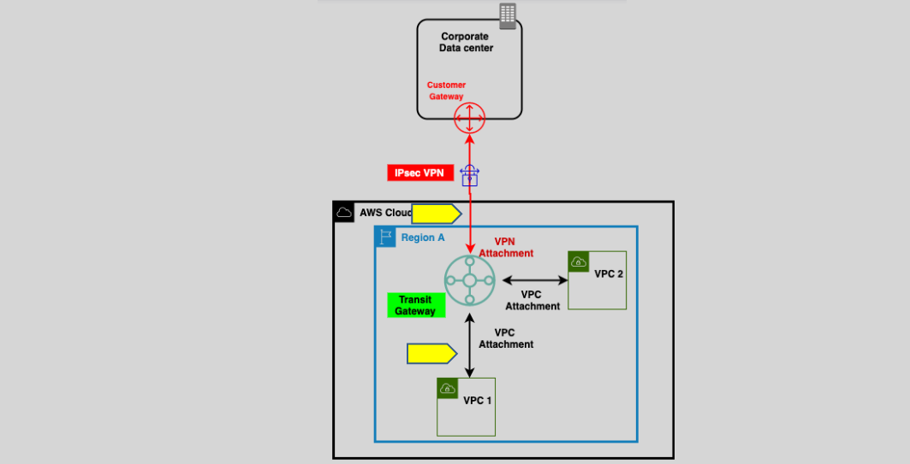
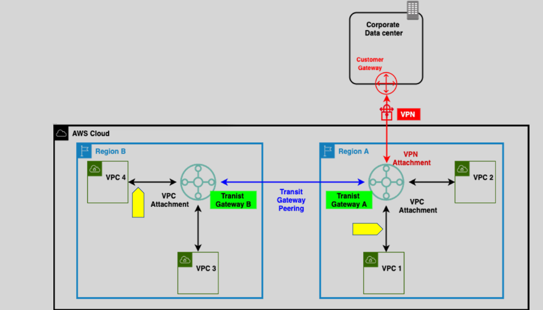
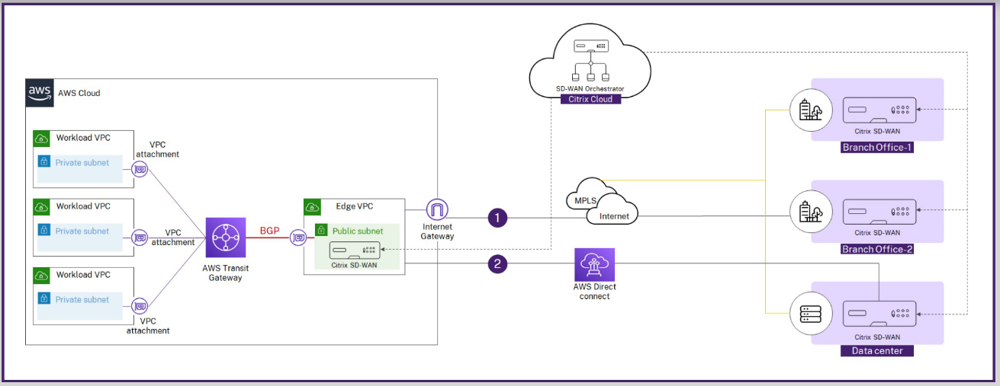

# **AWS Transit Gateway** 🌐

**AWS Transit Gateway** is a **fully managed network service** that acts as a **central hub** to simplify the connection of multiple VPCs, on-premises networks, and remote offices. Instead of managing complex VPC peering or site-to-site VPN connections, Transit Gateway offers a **scalable, reliable, and centralized network** to connect your resources across AWS and on-premises locations.

## **What is AWS Transit Gateway?** 🚀

Think of **AWS Transit Gateway** as the central traffic hub of your network infrastructure, facilitating communication between multiple VPCs and external resources in a **hub-and-spoke architecture**.

### **Key Features:**

- **Regional Resource**: Transit Gateway is deployed at the regional level, so it's confined to the region where it is created, providing centralized connectivity between your resources in that region.
- **High Availability**: Transit Gateway is highly available across multiple Availability Zones (AZs). Each AZ must have a separate attachment, ensuring redundancy and minimizing the risk of failure.
- **Multi-account Support**: Transit Gateway can be shared across multiple AWS accounts using **AWS Resource Access Manager (RAM)**. This enables seamless integration between organizations or teams that need access to a shared network hub.

## **How AWS Transit Gateway Works** 🔧

- **Hub-and-Spoke Model**: Transit Gateway acts as the **hub** and VPCs, on-premises locations, or remote offices as the **spokes**. This model simplifies communication and network management by routing traffic through the central hub (Transit Gateway), instead of establishing complex individual connections between every resource.

### **Key Benefits:**

1. **Simplifies Network Management**: Instead of creating multiple VPC peering connections, you create a single Transit Gateway and attach all your VPCs and on-premises resources to it.
2. **Scalable**: Transit Gateway supports large-scale architectures with up to thousands of VPCs, easily handling large amounts of traffic.
3. **Centralized Connectivity**: You can manage and control routing from one place, making it easier to troubleshoot, monitor, and scale.

## **VPC Access Across Regions** 🌎

With **AWS Transit Gateway**, you can connect VPCs not only within the same region but across multiple regions as well, using **inter-region peering**.

### **How It Works:**

- You can set up **intra-region** or **inter-region peering** between Transit Gateways.
- **Inter-region peering** allows VPCs in **different AWS regions** to communicate through the Transit Gateways in those regions, establishing a **global network** for your infrastructure.

**Note**: To enable inter-region connectivity, a **Transit Gateway in each region** is required.

## **How to Set Up AWS Transit Gateway** ⚙️

Setting up a Transit Gateway involves a few simple steps:

1. **Create the Transit Gateway**:  
   In the AWS Management Console, create a **Transit Gateway** and specify your desired configurations such as region, ASN (Autonomous System Number), and other network settings.

2. **Create Attachments**:  
   Once your Transit Gateway is created, you can establish **attachments** to the Transit Gateway. Attachments can be to:
   - **VPCs**: For communication between VPCs.
   - **VPN Connections**: For connecting your on-premises data centers.
   - **Direct Connect Gateways**: For dedicated connectivity to your on-premises network.
   - **Transit Gateway Connect Attachments**: For connecting third-party appliances, such as SD-WAN devices, via a **GRE tunnel**.

## **Transit Gateway Connect** 🛠️

- The **Connect attachment** allows you to integrate with third-party virtual appliances like SD-WAN devices running in your VPC.
- **GRE (Generic Routing Encapsulation)** is supported for high-performance tunneling, and **BGP (Border Gateway Protocol)** is used for dynamic routing, which provides flexibility and scalability.

## **Supported Protocols** 🖧

- **IPv4 and IPv6**: Transit Gateway supports both IPv4 and IPv6, ensuring compatibility with your existing and future network configurations.
- **BGP**: For dynamic routing, you can use **BGP** to propagate routes and enable the automatic discovery of network paths.

## **Costing of AWS Transit Gateway** 💵

- **Hourly Pricing**: Transit Gateway is billed based on **hourly charges** for the Transit Gateway itself and the attachments.
- **Data Processing Charges**: You will also incur costs based on the amount of data processed by the Transit Gateway.

**Tip**: To reduce costs, ensure that resources within the same **Availability Zone** use **local Transit Gateway attachments** to avoid cross-AZ data processing charges.

## **Why Use AWS Transit Gateway?** 🚀

Here’s why **AWS Transit Gateway** might be the perfect solution for your AWS network:

- **Centralized and Scalable**: Simplifies complex networking architectures by centralizing connectivity and supporting large-scale VPCs, VPNs, and Direct Connect setups.
- **Cost-Effective**: Avoid the complexity and cost of managing multiple VPC peering connections or maintaining numerous VPN connections.
- **High Availability**: Transit Gateway provides **redundancy** and **resiliency** across Availability Zones for reliable, uninterrupted connectivity.

## **Comparing AWS Transit Gateway to VPC Peering** 🏆

| **Feature**                   | **AWS Transit Gateway**                  | **VPC Peering**                                  |
| ----------------------------- | ---------------------------------------- | ------------------------------------------------ |
| **Scalability**               | Easily scalable for large number of VPCs | Difficult to scale as number of VPCs increases   |
| **Transitive Routing**        | Supports transitive routing              | Does not support transitive routing              |
| **Cross-Region Connectivity** | Supports inter-region peering            | Does not support cross-region peering            |
| **Connectivity Complexity**   | Simplified hub-and-spoke model           | Requires multiple direct peering connections     |
| **Management**                | Fully managed by AWS                     | Customer-managed, requiring manual configuration |

## **Summary** 📚

- **AWS Transit Gateway** provides a **centralized, scalable** solution for connecting VPCs, on-premises networks, and remote offices, simplifying network management and reducing the need for multiple VPC peering connections.
- It supports **IPv4/IPv6**, **BGP**, and **GRE**, and offers **inter-region peering** for a global network solution.
- Transit Gateway is ideal for **large-scale infrastructures** and **dynamic network topologies**, while **VPC Peering** is better for **smaller, simpler environments**.
- With **AWS Transit Gateway**, you can achieve **transitive routing** and **centralized management**, making it the **recommended choice** for more complex network requirements.
