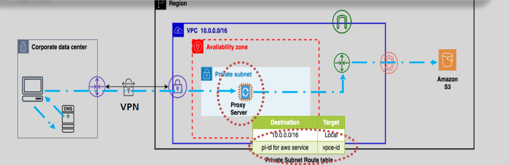
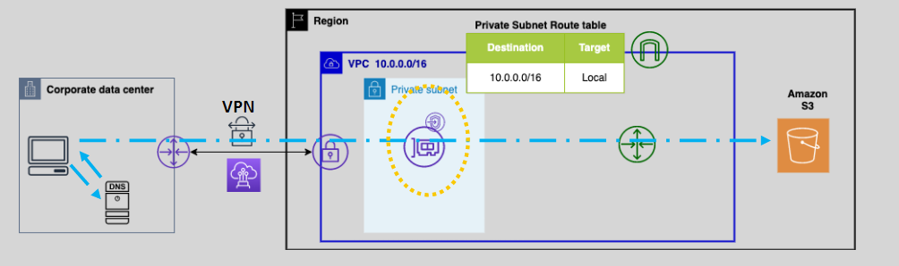

# **VPC Endpoints with Remote Networks** 🌍

## **Accessing AWS Services with VPC Endpoints from Remote Networks** 🔒

AWS **VPC Endpoints** allow you to access **AWS services** from remote locations, such as **on-premises networks** or **remote offices**, using secure connections like **VPN** or **Direct Connect (DX)**. This offers a private, secure communication channel, avoiding exposure to the public internet.

### **1. Accessing S3 via Gateway Endpoints from Remote Networks** 🌐

When accessing **Amazon S3** from a remote network using **Gateway Endpoints**, there are specific configurations required to ensure secure, private connectivity:

- **DNS-based Proxy Solution**: The source IP must come from within the VPC where the **Gateway Endpoint** is configured. Since remote networks don't natively have access to the VPC, we use **Elastic Load Balancers (ELB)** with a **proxy farm** to route traffic from the on-premises network to the Gateway Endpoint in the VPC.
- **High Availability**: By using **ELB** along with a **proxy farm**, you ensure high availability and fault tolerance for S3 access from remote environments.

#### **Benefits:**

- **Simplified Network Access**: Gateway Endpoints allow access to S3 without the need for public IPs or internet exposure.
- **Cost-Effective**: This method is cost-effective for on-premises connections where proxy solutions are feasible.

### **2. Accessing S3 via Interface Endpoints from Remote Networks** 🌍

**Interface Endpoints** offer a more seamless and secure method for remote access to **AWS services** (like **S3**) over **Direct Connect** or **VPN**. Unlike Gateway Endpoints, **Interface Endpoints** use **private IPs** within the VPC for communication.

- **Direct IP Resolution**: With **Interface Endpoints**, there’s no need for proxy servers. Remote networks can directly resolve **ENI (Elastic Network Interface)** IP addresses to securely access S3, making it a cleaner, more secure solution.
- **Preferred Solution**: Interface Endpoints provide a more efficient solution by using private IPs, which keeps the traffic within the AWS network and avoids going through the public internet.

#### **Benefits:**

- **Private Communication**: All traffic is routed through private IP addresses, keeping it secure and off the public internet.
- **No Proxy Required**: This method does not require complex proxy configurations, simplifying the setup.
- **Scalability**: Interface Endpoints can easily scale to accommodate large volumes of traffic.

## **Centralize Services Access Across Multiple VPCs Using VPC Interface Endpoints** 🌐

**VPC Interface Endpoints** provide a way to centralize access to **AWS services** across multiple VPCs using a **hub-and-spoke model**. This approach simplifies networking by allowing centralized access to shared services such as **S3**, **SNS**, or **SQS** from multiple VPCs in your organization.

### **How It Works:**

1. **Hub VPC**: The **centralized VPC** (hub) hosts the Interface Endpoints, which provide access to AWS services.
2. **Spoke VPCs**: These are other VPCs that need to access the shared services.
3. **Private Communication**: Traffic from spoke VPCs to the AWS services is routed privately through the hub VPC's Interface Endpoints, ensuring secure and direct communication without needing multiple connections or public access.

### **Benefits:**

- **Simplified Management**: You only need to manage a single set of Interface Endpoints in the hub VPC, rather than configuring endpoints in every VPC.
- **Improved Security**: With traffic staying within AWS's private network, the risk of exposure to the public internet is eliminated. Additionally, you can use **Security Groups** to control access at the endpoint level.
- **Cost Efficiency**: Centralizing access reduces the need for complex routing configurations and multiple endpoint connections across VPCs, resulting in lower costs.

#### **Implementation:**

- **VPC Peering or Transit Gateway**: Use **VPC Peering** or **Transit Gateway** to route traffic between spoke VPCs and the central hub VPC where the Interface Endpoints are located.
- **Route Tables**: Ensure that the route tables in the spoke VPCs direct traffic to the Interface Endpoints in the hub VPC.

## **Summary** 📚

- **VPC Endpoints** (both **Gateway** and **Interface**) provide secure, private communication between AWS services and remote networks, allowing access without using the public internet.
- **Gateway Endpoints** are used for S3 and DynamoDB access and are best for simpler configurations.
- **Interface Endpoints** provide more secure and efficient access, especially when connecting from remote networks like on-premises data centers.
- **Centralizing access** using **Interface Endpoints** allows you to simplify network management and improve security across multiple VPCs.
