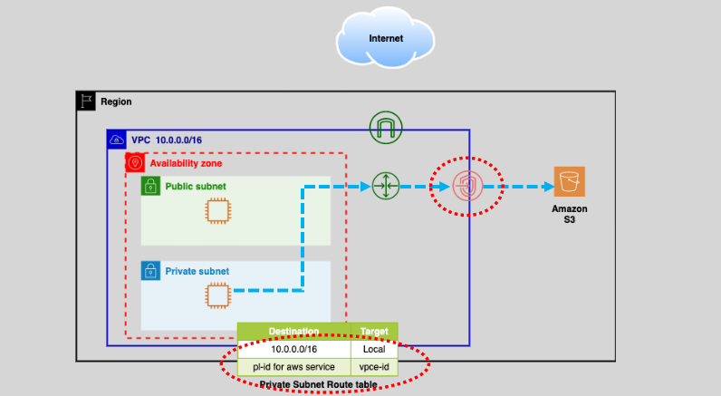
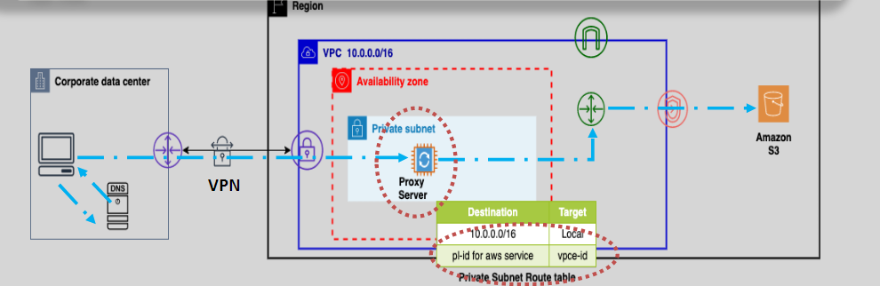

# **VPC Endpoints** 🔏

**VPC Endpoints** provide a highly secure, scalable, and efficient way to connect your **VPC** to AWS services and third-party applications without using the public internet. They allow private communication within AWS's internal network, enhancing security and reducing the need for NAT Gateways, internet gateways, or VPNs for accessing AWS services.

## **What Are VPC Endpoints?** 🔑

VPC Endpoints are **virtual devices** that allow your **VPC resources** to privately connect to supported AWS services without using public IPs or the internet. They are **redundant, highly available**, and **scalable**, ensuring reliable and secure communication for your VPC.

### **Key Features of VPC Endpoints**:

- **Private Communication**: Ensures traffic remains within AWS's private network, providing **high security**.
- **Security**: By using **private IPs**, VPC Endpoints keep your data secure within the AWS network, avoiding exposure to the public internet.
- **No Need for Public Internet**: VPC Endpoints eliminate the need for **NAT Gateway** or **Internet gateway** access for private subnet instances.
- **Highly Available**: They are built to be redundant and highly available.
- **Cost-Effective**: No data processing or hourly charges for Gateway Endpoints (used for services like S3 and DynamoDB).

## **Types of VPC Endpoints** 🛠️

There are two types of VPC Endpoints: **Gateway Endpoints** and **Interface Endpoints**. Let’s break down both options and their features.

### **1. Gateway Endpoints (For S3 and DynamoDB)** 🛣️

A **Gateway Endpoint** allows private access to **Amazon S3** and **DynamoDB**. The endpoint is configured in your **VPC route tables** to route traffic to these services privately.

- **Route Table Integration**: Gateway Endpoints are integrated with your **route tables**, which direct traffic destined for S3 or DynamoDB to the endpoint.
- **Highly Available**: AWS ensures high availability for Gateway Endpoints.
- **No Security Group Support**: You cannot associate a security group with a Gateway Endpoint.

**Benefits**:

- **Free to Use**: No charges for Gateway Endpoints.
- **Unlimited Throughput**: No throughput limitations.

**Best Use Case**:

- For accessing **S3** or **DynamoDB** from private subnets in your VPC.

### **2. Interface Endpoints (AWS PrivateLink)** 🔏

**Interface Endpoints** use **AWS PrivateLink** to privately connect to supported AWS services and third-party applications. These endpoints are **Elastic Network Interfaces (ENIs)** that get a **private IP address** in your VPC.

- **Private IP Communication**: Traffic is routed to private IPs, maintaining security by avoiding public routes.
- **Support for More Services**: Interface Endpoints support a wide range of services, including **SNS**, **SQS**, and **EC2**, and even **third-party applications**.
- **Security Group Support**: You can assign security groups to **Interface Endpoints**, providing extra security for your communication.

**Benefits**:

- **Private Connectivity**: Allows access to AWS services without the need for public IP addresses.
- **Highly Available**: Interface Endpoints can be configured across multiple **Availability Zones** for high availability.
- **Charges**: Interface Endpoints incur **hourly** and **data processing** charges.

**Best Use Case**:

- For connecting to services like **SNS**, **SQS**, and **EC2** in a private and secure manner.

## **DNS Resolution for VPC Endpoints** 🔎

One of the key features of VPC Endpoints is how DNS resolution works. The way your private instances access AWS services via these endpoints is determined by how DNS is configured.

### **1. Gateway Endpoints DNS Resolution** 🔐

When using a **Gateway Endpoint**, the DNS resolution works as follows:

- **S3 and DynamoDB**: The default AWS service domain names for **S3** and **DynamoDB** (e.g., `s3.amazonaws.com` and `dynamodb.amazonaws.com`) are resolved to **public IPs** for routing through the internet. However, with the **Gateway Endpoint**, the traffic stays within AWS's private network, so while the DNS resolution still returns a **public IP**, the actual communication happens entirely within the **AWS network**.
- **Route Table**: The **route table** is the key here, as it ensures that requests for S3 or DynamoDB go through the Gateway Endpoint.

### **2. Interface Endpoints DNS Resolution** 🌍

With **Interface Endpoints**, DNS resolution is **different**:

- **Private IPs**: The AWS service domain name is resolved to a **private IP** within your VPC. This ensures that all communication to the AWS service (like **S3** or **SNS**) happens entirely within the **AWS private network**, without traversing the public internet.
- **Route Table**: Unlike Gateway Endpoints, Interface Endpoints don’t require changes to the **route table**. Instead, they rely on **DNS resolution** to direct traffic to the **private IP** of the ENI.

This setup provides a much more secure and private communication channel to AWS services, without the need for any public IP addresses.

## **Cost Considerations** 💸

- **Gateway Endpoints**: No **hourly** or **data transfer** charges for supported services like S3 and DynamoDB.
- **Interface Endpoints**: Charged **per hour** for each AZ and **data processing** charges. Ensure to monitor the costs associated with the usage of Interface Endpoints, especially for high-throughput services.

## **S3 Access: Gateway vs. Interface Endpoints** 💡

When choosing between **Gateway** and **Interface Endpoints** for **S3**, here’s what you should consider:

**Gateway Endpoint for S3:**

- **Free** to use.
- Ideal for accessing S3 from **within** your VPC.
- Limited to resources **inside the VPC**; external access requires a proxy.
- **No throughput limit**.

**Interface Endpoint for S3:**

- **\$0.01 per AZ per hour** and **data transfer charges**.
- Ideal for access from **on-premises** environments or **cross-VPC communication**.
- Supports **10Gbps burstable up to 40Gbps** per ENI.

## **Accessing AWS Services with VPC Endpoints from Remote Networks** 🌍

VPC Endpoints also allow you to connect to AWS services from **on-premises** or **remote** networks, such as via **VPN** or **Direct Connect**.

### **1. Accessing S3 via Gateway Endpoints from Remote Networks** 🌐

When accessing **S3** via **Gateway Endpoints** from a remote network (e.g., on-premises), you will need a **DNS-based proxy solution**.

- **Proxy Server Usage**: The **source IP** must be from within the VPC where the Gateway Endpoint is located. To circumvent this, you can use **Elastic Load Balancer (ELB)** with a **proxy farm** to make the connection to **S3**.
- **High Availability**: Using a load balancer with a proxy farm provides high availability for S3 access from your on-premises environment.

### **2. Accessing S3 via Interface Endpoints from Remote Networks** 🌍

With **Interface Endpoints**, you can connect from **on-premises** data centers to **AWS services** (like **S3**) over **Direct Connect (DX)** or **VPN**.

- **Direct IP Resolution**: No need for proxy servers – you can **directly resolve the ENI IP addresses** of the Interface Endpoint for secure communication.
- **Preferred Solution**: This is the preferred solution for remote access to services, as it eliminates the need for a proxy and enhances security.

## **Comparing Gateway and Interface Endpoints** 🔄

| **Feature**                  | **Gateway Endpoint**                              | **Interface Endpoint**                               |
| ---------------------------- | ------------------------------------------------- | ---------------------------------------------------- |
| **Supported Services**       | S3, DynamoDB                                      | Many AWS services, third-party apps, and custom apps |
| **Private IP Communication** | Yes                                               | Yes                                                  |
| **Security Groups**          | Not Supported                                     | Supported                                            |
| **Pricing**                  | Free                                              | \$0.01/AZ per Hour + Data Transfer Charges           |
| **Use Case**                 | Best for accessing S3 and DynamoDB within the VPC | Best for accessing services like SNS, SQS, EC2       |
| **Connectivity Method**      | Route Table-based                                 | Uses Private IPs and ENI for secure communication    |
| **NAT Gateway Cost Savings** | Helps reduce NAT Gateway costs                    | Can still reduce NAT Gateway dependency              |

## **Summary** 📚

**VPC Endpoints** provide a **secure**, **private**, and **cost-effective** way to access AWS services. By eliminating the need for NAT gateways and reducing the need for internet access, VPC Endpoints ensure your data stays safe within the AWS network.

- **Gateway Endpoints** are **free** and best for accessing services like **S3** and **DynamoDB** within your VPC.
- **Interface Endpoints** provide private connectivity to a wider range of services, **supporting security groups** and dynamic routing.
- Whether you need access from within your VPC or from an **on-premises network**, VPC Endpoints offer a streamlined, secure solution.
