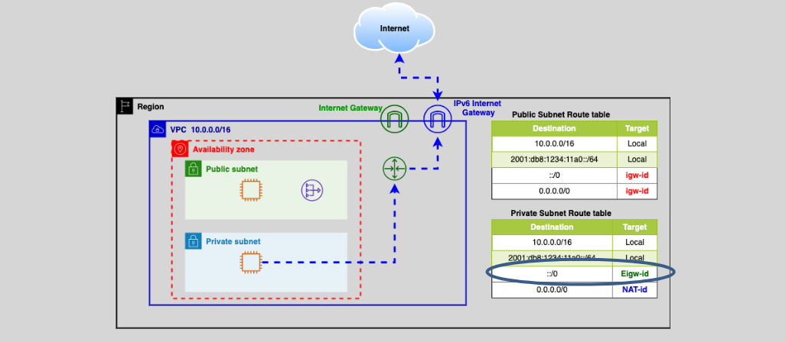

# **AWS IPv6 Egress-only Internet Gateway** 🌐

The **IPv6 Egress-only Internet Gateway** is a service provided by AWS to handle **IPv6 traffic** for resources inside a VPC. It allows **outbound IPv6 traffic** from instances in the VPC to the internet, while **blocking inbound traffic** from the internet to the VPC.

## **What Is the IPv6 Egress-only Internet Gateway?** 🔍

When you use **IPv6** for communication, **all IPv6 addresses are public**. However, in many cases, you may only need instances in your VPC to send traffic to the internet (outbound traffic), while **keeping them secure** by preventing direct access from the internet to your VPC’s resources.

This is where the **Egress-only Internet Gateway** comes into play.

### **How Does It Work?** 🔧

- **Outbound Communication**: The Egress-only Internet Gateway allows **instances within a VPC** to initiate **outbound connections** to the internet (for example, to download software updates or access external services).
- **Inbound Communication Blocked**: It **prevents inbound traffic** initiated by external sources from reaching the VPC's IPv6-enabled resources. This provides a **one-way traffic flow** (from the VPC to the internet, not vice versa).
- **Stateful Nature**: Like other internet gateways, it is **stateful**, meaning the response to an outgoing request is automatically allowed back in. For example, if an instance sends a request to a website, the response is allowed back to the instance.

### **Key Features** 🛠️

- **Public IPv6 traffic**: Supports **IPv6 traffic** for VPC instances, ensuring they can access the internet.
- **No inbound access**: It blocks **inbound traffic** initiated from the internet, enhancing security by preventing unsolicited connections.
- **Stateful**: The gateway tracks outbound requests, allowing responses to return to the initiating instance without needing additional rules.
- **No association with security groups**: It **cannot be associated** with a security group, as it is not directly tied to any instance. Instead, it works by allowing or blocking traffic based on the direction (outbound vs inbound).

## **When Do You Use an Egress-only Internet Gateway?** 🧐

You would typically use the **Egress-only Internet Gateway** in scenarios where you need:

- **Outbound IPv6 traffic**: Your VPC has **IPv6-enabled instances** that need to communicate with the internet for updates, downloads, or external services.
- **Enhanced security**: You want to ensure that **no inbound IPv6 traffic** can reach your instances, making your network more secure by restricting public access.
- **IPv6 support**: You have configured IPv6 addressing for your VPC and need a way to route outbound traffic.

## **Example Use Case** 💡

Suppose you have a **web server** running in an **IPv6-only VPC**, and this server needs to reach out to external services like software repositories, APIs, or websites. The **Egress-only Internet Gateway** would enable that web server to make **outbound requests** to the internet (e.g., for pulling updates or sending data), but it would **block any direct inbound traffic** from the internet to that server, ensuring that no external requests can initiate communication with it.

## **How to Set It Up** 🔧

Setting up the **Egress-only Internet Gateway** is straightforward:

1. **Create the Gateway**: In your VPC, you create an **IPv6 Egress-only Internet Gateway**.
2. **Attach to VPC**: The gateway is then **attached to your VPC**, enabling your instances to route IPv6 traffic to it for outbound access.
3. **Update Route Table**: You need to update the route table for your **subnets** to route IPv6 traffic to the Egress-only Internet Gateway.
4. **Configure Security**: Although the Egress-only Internet Gateway itself isn’t associated with security groups, you still configure your **security groups and NACLs** to allow outbound IPv6 traffic as needed.

## **Summary** 📚

The **AWS IPv6 Egress-only Internet Gateway** is a key service for managing **outbound IPv6 traffic** from your VPC to the internet, while keeping inbound traffic blocked for security purposes. It enables **one-way communication** from your instances to external resources, ensuring that no unsolicited traffic from the internet can access your VPC. This is an essential tool when working with **IPv6** in AWS, providing both **security** and **connectivity**.
