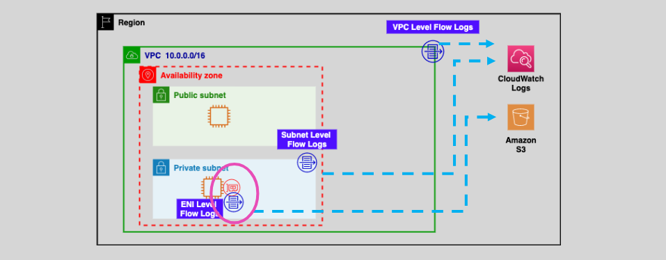

# **AWS Flow Logs** 🌐

**VPC Flow Logs** is a powerful feature in AWS that helps you capture and monitor IP traffic flowing to and from network interfaces within your **Virtual Private Cloud (VPC)**. This provides insights into the traffic patterns, security events, and helps in troubleshooting network-related issues.

## **Key Features** 🛠️

- **Traffic Capture**: Flow logs capture detailed information about **IP traffic**, including:

  - **Source IP** and **Port**.
  - **Destination IP** and **Port**.
  - **Traffic status**: Whether the traffic was **Accepted** or **Rejected**.

- **Granularity**: You can create flow logs at different levels:

  - **VPC-level**: Captures traffic for all network interfaces within the VPC.
  - **Subnet-level**: Captures traffic for a specific subnet.
  - **ENI (Elastic Network Interface)-level**: Captures traffic for a specific network interface.

- **Storage Options**: The flow log data can be stored in:
  - **CloudWatch Logs** for real-time monitoring and alerts.
  - **Amazon S3** for long-term storage and analysis.

## **Why Use Flow Logs?** 📊

- **Security Monitoring**: Flow logs help track and analyze the traffic for potential security risks, such as unauthorized access attempts or rejected connections.
- **Troubleshooting**: If you experience issues with network communication, flow logs provide the data you need to identify and resolve the problem.
- **Compliance**: Ensures that you can monitor and store network traffic data for auditing and compliance purposes.

## **How to Create Flow Logs** 🔧

To create **VPC Flow Logs** at different levels, follow these steps:

### 1. **VPC-Level Flow Logs**:

- In the **VPC Console**, select the VPC for which you want to create flow logs.
- Choose **Create Flow Log**, select the log destination (CloudWatch Logs or S3), and specify the traffic to log (accepted, rejected, or all traffic).

### 2. **Subnet-Level Flow Logs**:

- In the **Subnet Console**, choose the subnet for which you want to capture traffic.
- Follow the same process as for VPC-level flow logs, and define the destination for the log data.

### 3. **ENI-Level Flow Logs**:

- Navigate to **Network Interfaces** in the EC2 console.
- Select the network interface and choose to create flow logs with the destination as CloudWatch Logs or S3.

## **Summary** 📚

**VPC Flow Logs** are a simple yet powerful tool for monitoring network traffic within your AWS environment. They provide detailed traffic information, support multiple storage options, and help you secure and troubleshoot your VPC networks efficiently. You can create flow logs at different levels (VPC, Subnet, ENI) to capture traffic data based on your needs, and store the data in CloudWatch Logs or Amazon S3 for further analysis.
