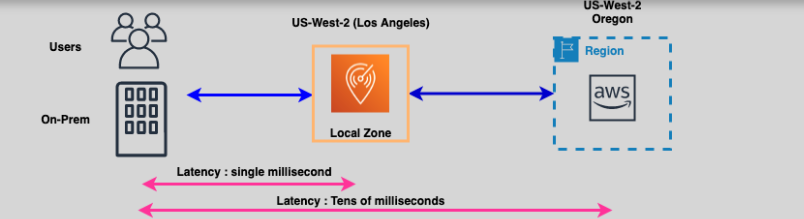
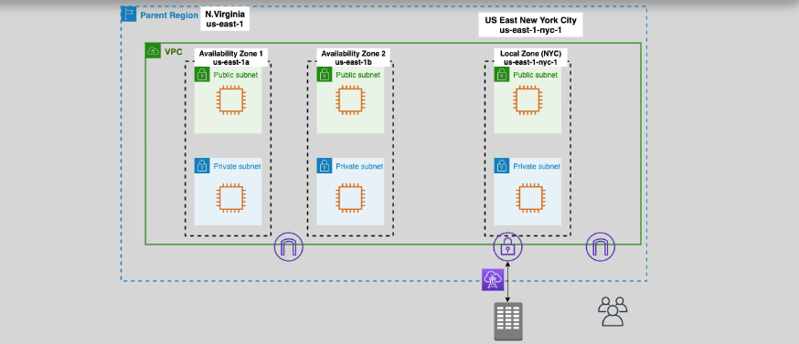

# **AWS Local Zones** (PUBG 🔫)

**AWS Local Zones** are a powerful extension of AWS regions that bring AWS services closer to your users, enabling low-latency applications and services in specific geographic locations. Local Zones allow you to run workloads that require single-digit millisecond latencies, such as **real-time gaming**, **AR/VR**, **live streaming**, and **virtual workstations**.



## **What are AWS Local Zones?** 🌐

AWS Local Zones are a **geographically distributed extension** of AWS regions. They provide infrastructure and services in **close proximity** to end users, making them ideal for applications that demand high performance and low latency.

### **Key Features**:

- **Close to Users**: Local Zones are located near large metropolitan areas to reduce latency.
- **Wide Range of Services**: You can use AWS services such as **VPC**, **Compute**, **Storage**, and **RDS** within a Local Zone.
- **Managed by AWS**: AWS Local Zones are fully managed and hosted in AWS facilities, ensuring reliability and high availability.
- **Independent Infrastructure**: Each local zone has its own **internet gateway**, **Direct Connect**, and other networking components.
  

## **Why Use AWS Local Zones?** 🚀

- **Low Latency**: Local Zones are ideal for running applications that require **single-digit millisecond latency**, making them perfect for latency-sensitive workloads like gaming and real-time video streaming.
- **Proximity to End Users**: They bring AWS services closer to users, which improves performance for applications that serve a large, dispersed user base.
- **Comprehensive Services**: You can deploy and manage your infrastructure, including VPC, EC2 instances, and databases, in a Local Zone just like in a regular AWS region.

## **How AWS Local Zones Work** 🔧

Once you create a subnet in a Local Zone within a VPC, the **VPC is extended** to that Local Zone. You can then use the same **VPC route tables**, **security groups**, and **Network ACLs** to manage traffic and security across your infrastructure in the Local Zone.

- **VPC Integration**: By extending your VPC into a Local Zone, you can manage and configure your resources in the same way you would within a standard AWS region.
- **Direct Connectivity**: Local Zones provide internet access through their own **Internet Gateway** and support **Direct Connect** for private connectivity.

## **Use Cases for AWS Local Zones** 🎮

1. **Real-Time Gaming**: Host gaming applications with low-latency responses to ensure a seamless gaming experience for players across regions.
2. **AR/VR**: Enable immersive augmented and virtual reality applications that require quick interactions and low latency.
3. **Live Streaming**: Stream events or content in real-time with minimal buffering and high-quality performance.
4. **Virtual Workstations**: Provide remote virtual desktops with fast and responsive access to resources, reducing the need for on-premises infrastructure.

## **Finding EC2 Instance Offerings in Local Zones** 🔍

To check available EC2 instance types in a specific Local Zone, you can use the AWS CLI command:

```bash
aws ec2 describe-instance-type-offerings --location-type availability-zone --filters Name=location,Values=us-east-1-nyc-1a --region us-east-1
```

This command helps you identify the instance types available in a Local Zone such as **NYC (New York City)**.

## **Summary** 📚

**AWS Local Zones** are ideal for applications that require low-latency access and high-performance computing in specific geographic locations. They extend your VPC to provide services close to your users, offering flexibility and scalability for real-time applications. Whether you're working with gaming, AR/VR, or virtual desktops, Local Zones ensure that your infrastructure is optimized for performance, while AWS handles the management and availability.
