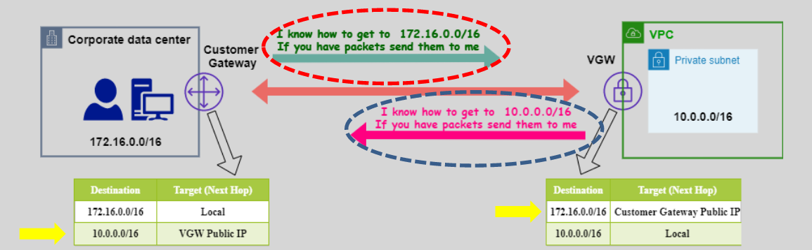

# **TCP/IP Routing** 🌐

**TCP/IP Routing** is a process that enables data packets to travel across networks using routing protocols. It's the backbone of internet and network communication, ensuring that packets find their way from the source to the destination using the most efficient path available.



## **What is Routing?** 🚦

Routing refers to the process of directing data packets from their source to their destination across multiple networks. Routers make decisions about where to send traffic by consulting their **routing tables**, which contain information about available networks and how to reach them.

## **Types of Routing** 🔄

Routing can be done in two primary ways:

1. **Static Routing**
2. **Dynamic Routing**

## **Static Routing** 🛠️

**Static routing** is the process where network routes are manually configured and fixed. The network administrator explicitly defines how packets should move from one network to another. It’s simple and effective for smaller, less complex networks.

### **How Static Routing Works** 🖧

- **Manually Configured Routes**: You create fixed, predefined routes for traffic between networks.
- **Route Table**: Each router has a **static route table**, which tells it where to send packets based on their destination IP address.
- **No Dynamic Adjustments**: If a route fails, the administrator must manually intervene to change the route.

### **Example**:

Imagine you have two networks:

- **Network A (192.168.1.0/24)**: Corporate office
- **Network B (10.1.1.0/24)**: Branch office

The route configuration on **Router 1** (connected to Network A) might look like this:

```
Destination    | Next Hop
----------------------------
10.1.1.0/24    | 192.168.1.2 (Router 2)
```

Router 1 knows that to reach **Network B (10.1.1.0/24)**, it must send the traffic to Router 2 at IP **192.168.1.2**.

## **Dynamic Routing** 🚀

**Dynamic routing** allows routers to automatically adjust their routing tables based on real-time network conditions. This method uses **routing protocols** to learn and share network routes dynamically across routers, making it ideal for larger, more complex networks.

### **How Dynamic Routing Works** 🗺️

- **Routing Protocols**: Routers exchange information using dynamic protocols like **BGP** (Border Gateway Protocol) or **OSPF** (Open Shortest Path First).
- **Automatic Updates**: When a network path changes, routers automatically adjust their routing tables.
- **Scalability**: Dynamic routing scales easily, adjusting to network changes like failures or new networks.

### **Example**:

Imagine two networks:

- **Network A (192.168.1.0/24)**
- **Network B (10.1.1.0/24)**

Both networks are connected through routers that use **BGP** to dynamically learn the best path to each other. If there’s a failure in one route, BGP will automatically find an alternative route for the traffic.

**Dynamic routing** helps ensure the traffic is always routed efficiently, even if a network path becomes unavailable or congested.

## **Static vs. Dynamic Routing Comparison** ⚖️

| **Feature**       | **Static Routing**                             | **Dynamic Routing**                                                 |
| ----------------- | ---------------------------------------------- | ------------------------------------------------------------------- |
| **Configuration** | Manual setup by the network administrator.     | Automatic via routing protocols.                                    |
| **Adaptability**  | Doesn’t adapt to network changes.              | Adapts automatically to network changes.                            |
| **Complexity**    | Simpler to configure for small networks.       | More complex, but scalable for large networks.                      |
| **Maintenance**   | Requires manual intervention if routes change. | No manual intervention needed, but requires network protocol setup. |
| **Use Case**      | Ideal for small networks.                      | Best for large, dynamic networks.                                   |

## **Conclusion** 🔚

**TCP/IP Routing** is essential for ensuring that data can travel efficiently across networks. **Static Routing** is ideal for smaller, simpler networks, but it requires manual configuration and maintenance. **Dynamic Routing**, on the other hand, is better suited for larger, complex networks where real-time adaptability and scalability are crucial. By understanding both, network administrators can choose the best method for their specific needs.
