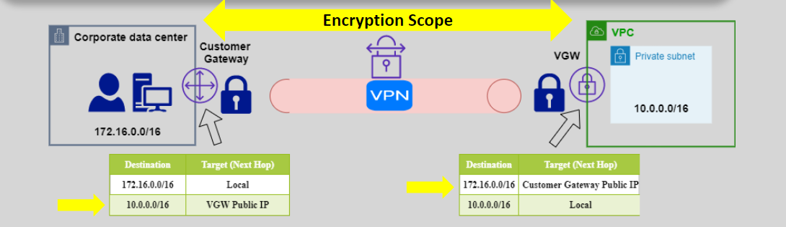

# **Internet Protocol Security (IPSec)** 🔒

**IPSec** is a widely used **network protocol suite** designed to ensure **secure communication** over IP networks. It works at the **network layer** and helps protect data by authenticating and encrypting data packets between different network nodes, whether they are hosts or gateways. It is most commonly used in **Virtual Private Networks (VPNs)** to secure connections between remote networks or devices.

## **What is IPSec?** 🌐

**IPSec** is a framework that defines protocols for securing internet protocol (IP) communications by authenticating and encrypting each IP packet in a communication session. IPSec can be used for:

- **Host-to-host** connections (e.g., between two devices).
- **Gateway-to-gateway** connections (e.g., between two networks).
- **Host-to-gateway** connections (e.g., device to a remote network).

It is mainly used for creating **VPNs** that provide a secure tunnel over the internet or any other untrusted network.

## **How Does IPSec Work?** 🔧

**IPSec** works by using two main protocols: **Authentication Header (AH)** and **Encapsulating Security Payload (ESP)**.

### 1. **Authentication Header (AH)** 🛡️

- **AH** provides **data integrity** and **authentication** by verifying that the packet has not been altered during transmission.
- It does **not** provide encryption; it only ensures the packet is from a legitimate sender and that it has not been tampered with.

### 2. **Encapsulating Security Payload (ESP)** 🔒

- **ESP** provides both **encryption** and **data integrity**.
- It encrypts the data in the IP packet, ensuring confidentiality, and also authenticates the packet, ensuring that the data has not been modified.

### 3. **Combination of AH and ESP:**

- **IPSec** can be used with either AH or ESP or both, depending on the level of security needed. Most VPN implementations prefer **ESP** because it provides both encryption and authentication.

## **Types of IPSec Configurations** ⚙️

IPSec supports two modes for securing communications:

### **1. Transport Mode** 🏠

- **Transport mode** encrypts only the **payload** (the data) of the IP packet, not the header.
- It is typically used for **host-to-host** communications where both the sender and receiver are within the same network or VPN.
- The packet header remains intact, which means that the sender’s and receiver’s IP addresses remain visible.

**Use Case**: A device communicating securely with another device over a trusted network.

### **2. Tunnel Mode** 🚀

- **Tunnel mode** encrypts both the **payload and the header** of the IP packet, creating a new IP packet with a new header.
- It is used for **gateway-to-gateway** or **host-to-gateway** communication where the communication occurs over a public or untrusted network.
- The original IP header is hidden, protecting the sender and receiver’s IP addresses.

**Use Case**: Site-to-site VPNs where an entire network communicates securely over the internet.

## **IPSec in Action: Site-to-Site VPN Example** 🌍

Let’s take a look at how **IPSec** is used in a **site-to-site VPN** to securely connect two remote networks:

1. **VPN Gateway (Site A)**: The VPN gateway at **Site A** has an IPSec-enabled VPN configuration to establish a secure tunnel.
2. **VPN Gateway (Site B)**: The VPN gateway at **Site B** also has an IPSec-enabled VPN configuration.
3. **Secure Tunnel**: The two VPN gateways authenticate each other using IPSec’s authentication methods. Once authenticated, they establish a secure tunnel using IPSec, where data is encrypted and transmitted.
4. **Data Transmission**: Data from **Site A** is encrypted, sent through the tunnel, decrypted at **Site B**, and vice versa. This ensures secure communication over potentially insecure channels like the internet.

## **IPSec vs. Other VPN Protocols** ⚖️

| **Feature**         | **IPSec**                                     | **SSL VPN**                      |
| ------------------- | --------------------------------------------- | -------------------------------- |
| **Encryption**      | Provides encryption (ESP)                     | Provides encryption (SSL/TLS)    |
| **Authentication**  | Uses AH (Authentication Header)               | Uses certificates and usernames  |
| **Connection Type** | Can be used for site-to-site or remote access | Typically used for remote access |
| **Performance**     | Can be more efficient for large networks      | Can be slower due to overhead    |
| **Security**        | Strong data encryption and integrity          | Uses secure web protocols        |

## **When to Use IPSec?** 🔑

**IPSec** is suitable for use cases where secure communication is needed across an untrusted network, like the **internet**. Common use cases include:

1. **Site-to-Site VPNs**: Connecting entire networks securely over the internet.
2. **Remote Access VPNs**: Allowing remote workers to securely connect to a corporate network.
3. **Private Cloud Connectivity**: Establishing secure connections between on-premises data centers and AWS or other cloud providers.

## **IPSec in AWS** 🌩️

In AWS, **IPSec** is typically used in the form of **VPN connections** to securely connect your VPC to on-premises data centers. You can configure an **AWS Virtual Private Gateway (VGW)** on the AWS side and a **Customer Gateway (CGW)** on the on-premises side, which uses IPSec to encrypt the traffic between them.

- **Virtual Private Gateway**: Managed by AWS and enables your VPC to connect securely to on-premises or remote locations via IPSec.
- **Customer Gateway**: On your premises, representing the VPN appliance that connects to AWS.

## **Summary** 📚

- **IPSec** ensures secure data transmission over untrusted networks by authenticating and encrypting data packets.
- **Tunnel mode** encrypts both the data and header, ideal for gateway-to-gateway communication.
- **Transport mode** encrypts only the data, ideal for direct device-to-device communication.
- IPSec is commonly used in **site-to-site VPNs** and **remote access VPNs** to ensure secure communication across the internet.
- AWS supports IPSec through **VPN connections** for secure connectivity between your VPC and on-premises networks.
