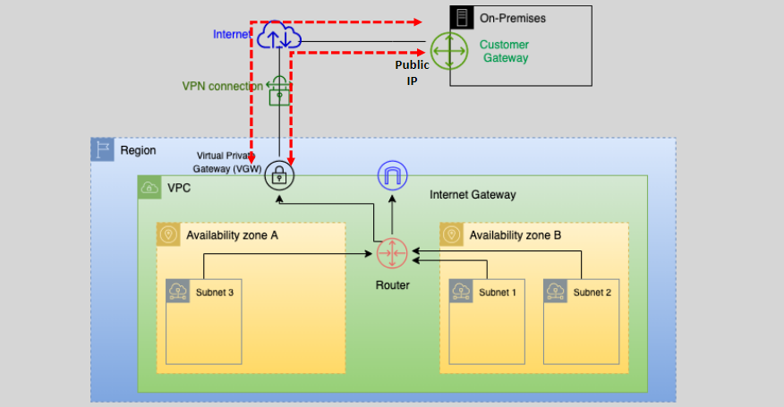

# **AWS VPN** 🌐🔒

AWS offers a secure and scalable way to connect your on-premises network to your AWS infrastructure using **AWS VPN services**. This includes **AWS Site-to-Site VPN**, which establishes a secure IPSec-encrypted connection between your on-premises network (data center) and your AWS Virtual Private Cloud (VPC).

## **Overview of AWS VPN Services** 🔍

AWS provides different types of VPN solutions, with **AWS Site-to-Site VPN** being the most commonly used for connecting on-premises networks to AWS. Here are the primary components of AWS VPN:

- **IPSec-Based Encryption**: AWS VPN establishes a **secure IPSec tunnel** between your on-premises VPN device (Customer Gateway) and AWS’s **Virtual Private Gateway (VGW)**. This ensures that data is encrypted end-to-end during transit.

- **Internet-Based Connection**: AWS VPN runs over the internet and uses public IP addresses. The connection relies on the internet for transmission, so the **quality of the connection** can vary depending on internet traffic and congestion. While AWS guarantees a secure tunnel, the **latency** can be impacted by external factors outside AWS's control.

- **NAT Traversal**: AWS VPN supports **NAT Traversal** to handle cases where the Customer Gateway (on-premises VPN device) is behind a Network Address Translation (NAT) device. This enables the tunnel to be established even when the Customer Gateway uses private IP addresses.

### **Pricing of AWS Site-to-Site VPN** 💵

AWS VPN services have regional pricing based on the region you choose for your VPN connection. Key aspects of the pricing include:

- **Site-to-Site VPN Connection**: Typically, the cost for each VPN connection is around **\$0.05 per hour**.

- **Data Transfer**: Data transfer charges are incurred when data is transferred **out of AWS**. Depending on the region, **data transfer out** costs may vary.

**Tip**: To optimize your costs, consider minimizing unnecessary data transfer out from AWS and try to keep traffic within the same region or availability zone whenever possible.

## **Steps to Implement AWS Site-to-Site VPN** ⚙️

### **1. Set Up Customer Gateway (CGW)** 🖥️

The **Customer Gateway** is your on-premises VPN device, such as a physical router or firewall. To start:

- **Configure the Customer Gateway**: Configure it to establish an IPSec VPN tunnel with AWS. You will need to specify parameters such as:
  - **IPSec tunnel settings** (encryption and hashing algorithms).
  - **Pre-shared key** for authentication.
  - **Public IP address** of your on-premises device.

### **2. Set Up Virtual Private Gateway (VGW)** 🌐

The **Virtual Private Gateway** is the AWS-side VPN device. You will need to:

- **Create a Virtual Private Gateway (VGW)**: In the AWS Management Console, create a VGW and attach it to your VPC. This serves as the entry point for the VPN connection into your AWS network.

### **3. Create Site-to-Site VPN Connection** 🔗

Once the VGW and CGW are ready:

- **Configure the VPN Connection**: Establish a **Site-to-Site VPN connection** between the Customer Gateway (on-premises VPN device) and the Virtual Private Gateway (AWS). During this process:

  - **Specify the public IP addresses** of the CGW and VGW.
  - Choose whether to use **static routing** or **dynamic BGP routing**.

- **Download Configuration**: AWS provides configuration files that are tailored for specific customer gateway devices, making it easier to configure the on-premises device.

### **4. Set Up Routing** 📡

To route traffic between your on-premises network and AWS:

- **Static Routing**: Manually configure the route tables on both the **on-premises side** and the **AWS side** to point the traffic destined for each other’s IP range through the VPN connection.

- **Dynamic Routing with BGP**: Configure **BGP** to allow automatic propagation of routes between the on-premises network and AWS VPC.

### **5. Monitor and Test VPN Connection** 🧪

- **Testing**: Once the connection is established, test connectivity using tools like **ping** or **traceroute** to verify the tunnel is up and data can flow securely.
- **Monitoring**: Use **CloudWatch** and **AWS VPN CloudHub** to monitor the performance and health of your VPN connection.

## **Benefits of AWS VPN** ✅

1. **Secure Communication**: The VPN connection encrypts all traffic between your on-premises network and AWS, ensuring **confidentiality** and **data integrity**.

2. **Cost-Effective**: Compared to dedicated **leased lines**, Site-to-Site VPN is a more affordable option for securely connecting your on-premises network to AWS.

3. **Flexible Routing**: AWS VPN supports both **static** and **dynamic BGP routing**, providing flexibility depending on the complexity of your network setup.

4. **Scalable**: Easily scale the VPN connection to accommodate more traffic or add additional tunnels for **high availability** and redundancy.

5. **NAT Traversal**: With **NAT Traversal** support, you can establish VPN tunnels even when your on-premises gateway is behind a NAT device.

## **Considerations for AWS VPN Implementation** ⚠️

1. **Internet Dependency**: The connection is dependent on the public internet, so **latency and quality** may vary. It's important to monitor the connection for performance issues, especially for real-time applications.

2. **Bandwidth Limitations**: AWS Site-to-Site VPN offers **up to 1.25 Gbps** of throughput per tunnel. If you need higher bandwidth, you may need to consider using **AWS Direct Connect**.

3. **Cost Considerations**: Be mindful of data transfer costs when transmitting large amounts of data out of AWS. You can reduce this by using **VPC endpoints** or **transferring data within the same region**.

## **Use Cases for AWS Site-to-Site VPN** 🎯

- **Hybrid Cloud**: When extending on-premises infrastructure into the cloud, AWS Site-to-Site VPN ensures a secure connection between your on-premises data center and AWS VPC.
- **Disaster Recovery**: AWS VPN can be a key component of a disaster recovery plan, ensuring that your on-premises systems can securely access AWS-hosted applications and resources.
- **Remote Access**: AWS VPN is ideal for secure access to AWS services from remote offices or mobile workers, using IPSec tunnels to ensure secure communication.

## **Conclusion** 📚

**AWS Site-to-Site VPN** is an essential tool for connecting on-premises networks to AWS securely. Whether you are using **static routing** or **dynamic routing** with BGP, the VPN service ensures encrypted, reliable communication over the internet. It's an affordable and flexible solution for hybrid cloud environments, offering secure connectivity without the complexity and cost of dedicated physical links.
