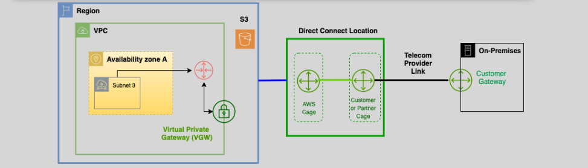
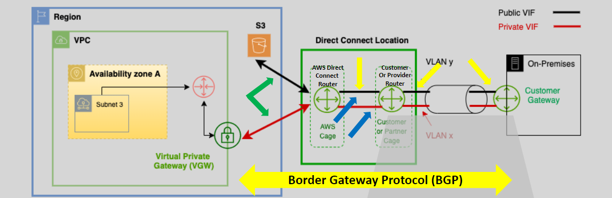
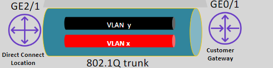
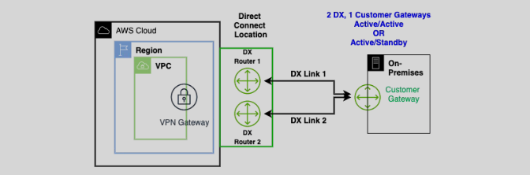
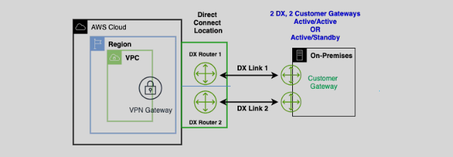
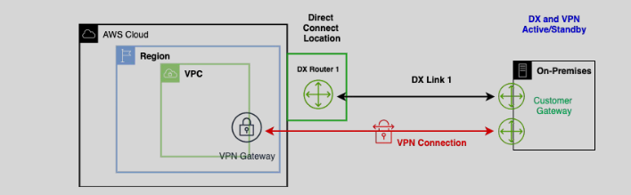
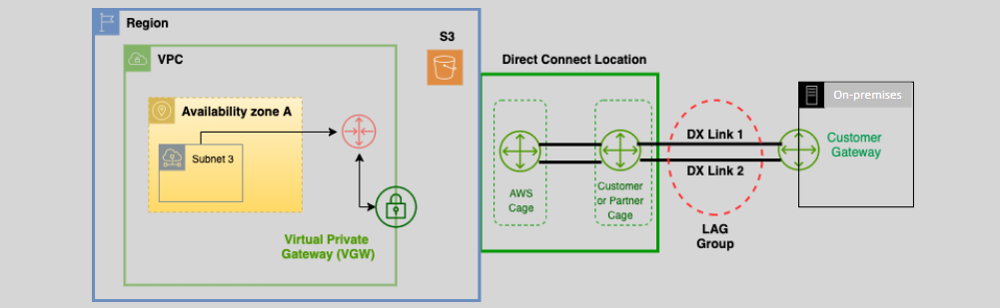

# **AWS Direct Connect** 🔌

**AWS Direct Connect** is a cloud service that creates a **private, dedicated connection** from your on-premises network (such as a data center) to AWS. Unlike typical internet-based connections, **Direct Connect** bypasses the public internet for **better performance, reliability, and security**.

## **Key Features of AWS Direct Connect** 🏆

1. **Private Connection** 🌐:

   - **Direct Connect** provides a **private link** from your infrastructure to AWS, reducing the need for public internet traffic.
   - This ensures **lower latency** and **better performance**.

2. **Improved Performance** 🚀:

   - With **Direct Connect**, you get a **faster** and more **consistent** connection compared to using the internet.

3. **Cost and Provisioning** 💵:

   - While **Direct Connect** is generally more **expensive** and takes **longer to provision**, it is an ideal solution for enterprises needing better connectivity.

4. **Not Encrypted by Default** 🔒:

   - **Direct Connect** provides a **private** connection, but it does not automatically **encrypt** your data. For encryption, you can use **IPSec VPN** or other methods.

5. **Virtual Interfaces (VIFs)** 🔑:

   - **VIFs** are logical connections that define how traffic flows from your on-premises network to AWS.
     - **Private VIF**: Connects to your **VPC**, allowing private communication with AWS resources like EC2.
     - **Public VIF**: Connects to **AWS public services** like S3 and DynamoDB.

   **Note**: A **VIF** uses **VLAN tags** to ensure traffic flows correctly between the two ends.

## **Components of AWS Direct Connect** ⚙️

### **1. Dedicated Connections** 🔌

- A **dedicated physical link** from your on-premises network to AWS via a **telecom provider**.
- Provides **low-latency**, **consistent bandwidth**, and **private communication**.
- Speeds range from **1 Gbps to 10 Gbps**, depending on the customer's needs.

### **2. Virtual Interfaces (VIFs)** 🔑

- **Virtual Interfaces** (VIFs) are used to control traffic flow between AWS and your on-premises network.

  **Private VIF**:

  - Used to access private AWS resources like **EC2**, **RDS**, etc.
  - Does not go over the public internet, ensuring security and privacy.

  **Public VIF**:

  - Provides access to **AWS public services** like **S3**, **DynamoDB**.
  - Allows you to directly reach AWS’s **public endpoints** without routing traffic over the internet.

- **VIFs** use **VLAN tags** to specify and control the type of traffic flowing through the connection.

  

## **Creating AWS Direct Connect** 🛠️

1. **Set Up a Direct Connect Location** 🌐:

   - Choose from multiple AWS Direct Connect locations worldwide.
   - Select the location closest to your on-premises network to minimize latency.

2. **Request and Provision the Connection** 🔄:

   - Go to the AWS **Management Console** and request a **Direct Connect** connection.
   - AWS assigns a **port** at your chosen location, and a **telecom provider** connects your on-premises network to AWS. This process may take a few weeks.

3. **Configure Virtual Interfaces (VIFs)** 💻:

   - Once the connection is established, configure **Private VIF** for accessing your **VPC** and **Public VIF** for connecting to **AWS public services**.

4. **Configure BGP** 🌍:
   - **BGP (Border Gateway Protocol)** helps exchange routing information between AWS and your on-premises network, ensuring traffic flows smoothly and efficiently.

## **High Availability and Fault Tolerance** 🛡️

AWS **Direct Connect** supports **high availability** configurations to ensure your connection remains reliable.

- **2DX, 1 Customer Gateway (Active/Active or Active/Standby)**

  - Provides redundancy and ensures the connection stays up even if one link fails.
    

* **2DX, 2 Customer Gateways (Active/Active or Active/Standby)**

  - Increases fault tolerance by adding another gateway, ensuring zero downtime.
    

- **1DX, 1 VPN**

  - A backup VPN connection provides additional redundancy in case the Direct Connect link fails.
    

## **Link Speeds & Link Aggregation Groups (LAG)** 💰

- **LAG** improves throughput by aggregating multiple **Direct Connect** links into a single logical connection.

  

- **Link Aggregation Groups (LAGs)** allow you to combine up to **4 connections** of the same speed for improved reliability and bandwidth.

- **Speed Options**:
  - **1 Gbps** to **10 Gbps** speeds available.
  - LAG increases throughput by aggregating multiple **Direct Connect** links, making the connection faster and more reliable.

## **Conclusion** 📚

**AWS Direct Connect** offers a **private, dedicated connection** that provides **faster**, **more reliable**, and **secure** connections between your on-premises network and AWS. It’s an ideal choice for businesses with high-bandwidth needs, such as **large data transfers** and **enterprise applications**. By providing a **low-latency** and **private** network connection, it enhances performance and reliability compared to public internet connections.

With options like **VIFs**, **BGP routing**, and **Link Aggregation Groups**, **AWS Direct Connect** ensures scalability, flexibility, and high availability for your network infrastructure.
