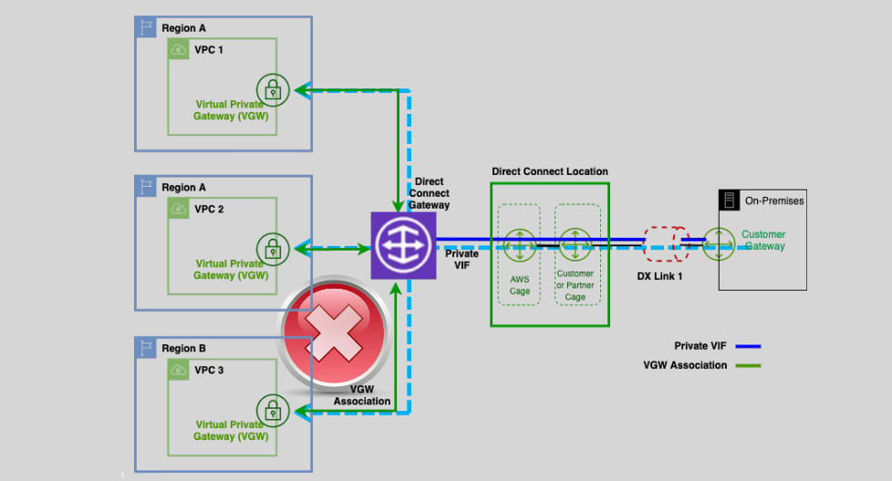
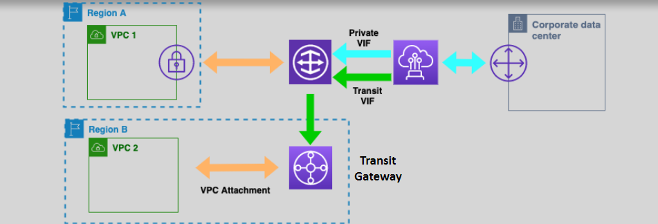
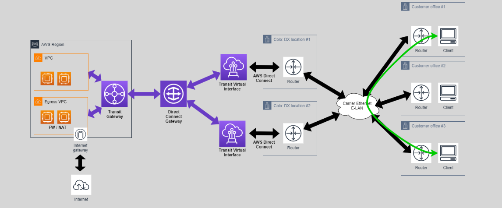

# **AWS Direct Connect Gateway** 🌐

**AWS Direct Connect Gateway** is a powerful tool for establishing secure and reliable connectivity between your **on-premises** environment and **AWS VPCs** across different **regions**. It enables seamless communication with your VPCs, regardless of their location, and supports multiple VPCs and regions in a centralized manner.

## **What is Direct Connect Gateway?** 🛣️ 🔌

**AWS Direct Connect Gateway** is a global resource designed to facilitate private and secure connectivity between your **on-premises data center** and **AWS VPCs**, even if those VPCs are in different AWS regions.

- **Global Connectivity**: Allows a single connection to reach multiple VPCs across regions.
- **Private Virtual Interface (VIF)**: You can connect to VPCs using a private VIF that is attached to a Direct Connect Gateway.
- **VPC and Transit Gateway Association**: Direct Connect Gateway can be associated with **Virtual Gateways (VGWs)** or **Transit Gateways** to connect multiple VPCs within a region.

## **How It Works** 🔧

1. **Direct Connect Gateway Setup**:

   - A **private VIF** is created from the **Direct Connect location** to the **Direct Connect Gateway**.
   - This enables the communication between your on-premises network and your **AWS VPCs** in multiple regions.

2. **VPC Connectivity**:

   - You can **attach VGWs** (Virtual Gateways) from multiple VPCs to the **Direct Connect Gateway**. Alternatively, you can use **Transit Gateways** to provide connectivity to VPCs from one central location.
   - This setup ensures seamless communication between your on-premises location and several VPCs across different AWS regions.

3. **Redundancy and High Availability**:
   - For high availability, AWS recommends using two **Transit VIFs** from two different **Direct Connect locations**. This provides fault tolerance and ensures your connection remains stable even if one Direct Connect location goes down.

## **Direct Connect Gateway Components** 🔑

1. **Private Virtual Interface (Private VIF)**:

   - A private VIF is required to connect your **on-premises network** to **AWS VPCs** through Direct Connect Gateway.
   - The Private VIF provides a **secure, dedicated link** to your VPC.

2. **Transit VIF**:

   - **Transit VIF** is required to connect **AWS Direct Connect** to **Transit Gateways** for multi-VPC communication.
   - This enables inter-region VPC peering and allows routing through a **centralized transit network**.

3. **Transit Gateway**:

   - A **centralized hub** that simplifies the routing of traffic between multiple VPCs and on-premises networks.
   - Multiple VPCs from different regions can be attached to the same transit gateway for seamless traffic routing.
     

## **Use Case and Benefits** 📈

- **Multiple VPC Connectivity**: Instead of managing several individual VPC connections, Direct Connect Gateway allows you to **centralize and simplify** the connection process. You can connect to **tens or even hundreds of VPCs** using a single Direct Connect link.
- **Reduced Latency and Improved Performance**: By using **private connections**, Direct Connect Gateway ensures that traffic between your on-premises environment and AWS is fast, reliable, and free from the delays introduced by the public internet.
- **Cost Efficiency**: Using Direct Connect Gateway allows you to bypass data transfer costs associated with internet-based connections.

## **Pricing** 💸

- **Data Transfer**: The cost for **data transfer** depends on the region, and data is charged per **GB**.
- **Direct Connect Charges**: You will incur **hourly charges** for maintaining the Direct Connect link and additional charges for the **Transit VIF**.

## **Service Quotas** ⚖️

Here are some key limits for **Direct Connect Gateway**:

| **Service**                             | **Quota**                       |
| --------------------------------------- | ------------------------------- |
| **Transit Gateways per account**        | 5 per account                   |
| **VPCs per Transit Gateway**            | 5 per VPC                       |
| **Unique Transit Gateway Attachments**  | 5 per VPC                       |
| **VIFs per Direct Connect connection**  | 50 per connection               |
| **VGWs per Direct Connect Gateway**     | 10 VGWs per gateway             |
| **Transit VIFs per Direct Connect**     | 1 per Direct Connect connection |
| **Transit Gateways per Direct Connect** | 3 per Direct Connect gateway    |

## **Summary** 📝

- **AWS Direct Connect Gateway** is a powerful and efficient solution for connecting on-premises networks to multiple AWS VPCs across regions.
- With features like **high availability**, **centralized management**, and **low latency**, it provides a cost-effective and reliable way to scale your hybrid cloud architecture.
- **Private VIFs** and **Transit VIFs** make it possible to connect your **VPCs** and **on-premises locations**, and you can use **Transit Gateways** to manage traffic between multiple VPCs.
- With **AWS Direct Connect Gateway**, you can simplify your network architecture and improve both the performance and reliability of your AWS services.
