# IAM

## Notes

### **Hidden Availability Zones (AZs)**

**Why Hidden AZs Exist:**

- _Capacity Management_: AWS may hide certain AZs to manage capacity and ensure optimal performance.
- _Maintenance or Issues_: AZs might be hidden due to ongoing maintenance or issues.

**How to Enable/Disable AZs:**

- From **AWS Management Console**: Go to the **VPC Dashboard > Settings > Zones**.

**Considerations:**

- You can enable it by `opt-in`
- enabling hidden az will cost you some fees
- if you want disable a enabled az you must call aws support.

### **VPC Rules**

1. There is a default VPC is created automatically in each AWS region when an AWS account created
1. VPC is confined to a single AWS region (you can't stretch vpc between regions)
1. VPC spans all AZs in a region and can have one or more subnets

### **VPC Components**

#### **1. CIDR Block**

1. The VPC's main CIDR Block cannot be changed after it has been created
1. We can expand the VPC address pool by adding up to 4 additional secondary CIDR blocks, with some limitation

#### **2. Subnets**

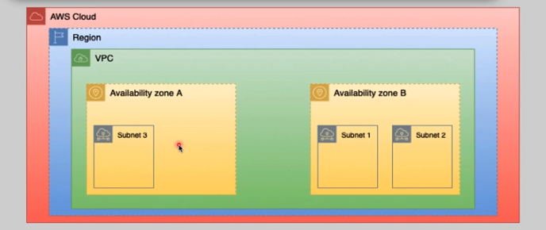

1. we can configure multiple subnets per VPC
1. in each AZ we can have one or more subnets
1. A subnet `cannot` stretch between AZs
1. Subnet in a VPC cannot overlap

#### **3. Implied Router**

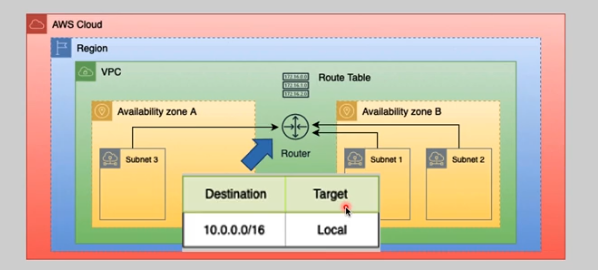

1. The implied router is used to communicate among the subnets in a VPC and between the VPC and the outside world (inside/outside of AWS).
1. We cannot access or login to implied router, it is fully managed by AWS.
1. Routing among VPC subnets is guaranteed by default.

#### **4. Route Tables**

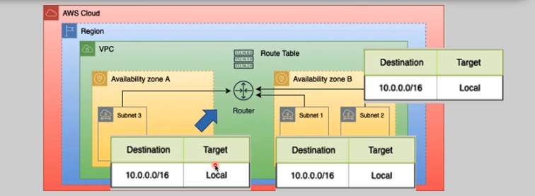

1. each VPC has a default route table, than main route table.
1. A subnet can attach to one route table at a time.
1. A route table can be used by more than one subnet at the same time.
1. we can create custom route tables as required.
1. Routing among VPC subnets is guaranteed by default.

#### **5. Internet Gateway (IGW)**

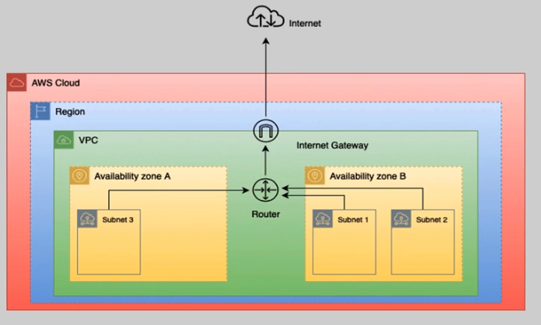

1. IGW is hz scaled, redundant and highly available.
1. Fully managed by AWS
1. It will never become a traffic bottleneck.
1. `Only one IGW` can be attached to a VPC at a time.
1. IGWs support both IPv4 and IPv6.

#### **6. Virtual Private Gateway (VGW)**

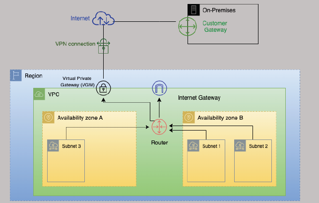

1. IGW is hz scaled, redundant and highly available.
1. Fully managed by AWS
1. `Only one VGW` can be attached to a VPC at a time.
1. `Only one IGW` can be attached to a VPC at a time.
1. It is used for Hybrid Cloud Connectivity

#### **7. Security Groups**

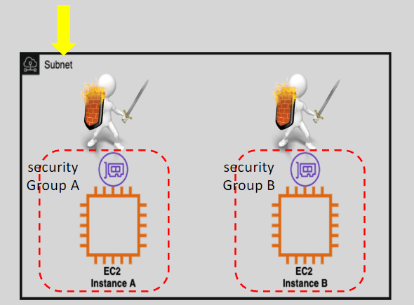
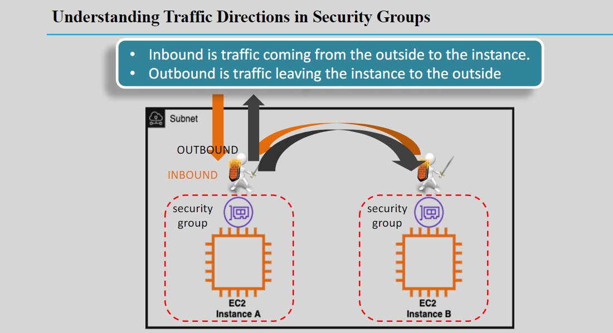
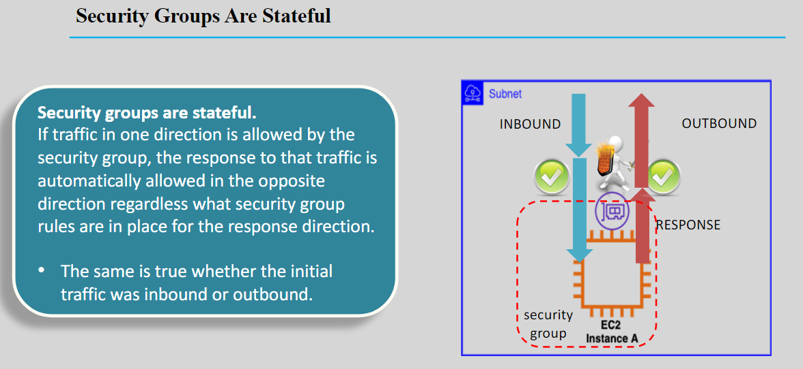
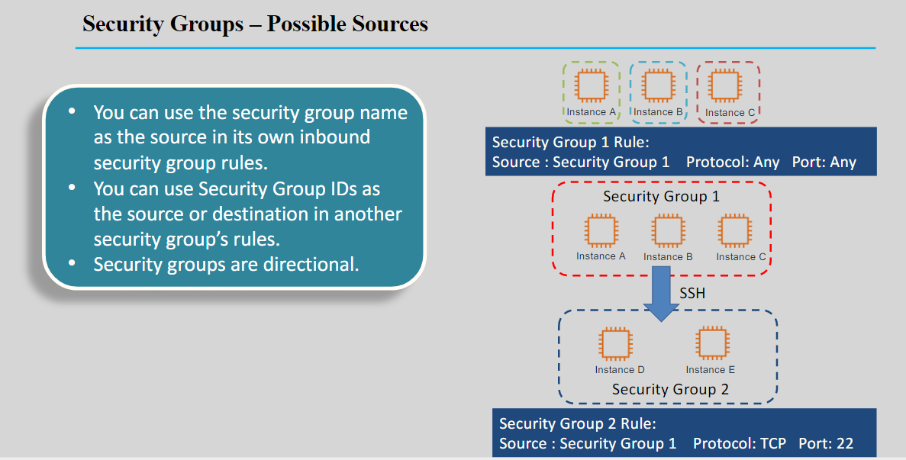

1. NSG is a **virtual firewall** that applies at the instance's ENI level.
1. NSGs are `stateful`.
1. **NSG is Whitelisting type**
1. **No deny rules:** In a NSG we can configure permit rules only.
1. **Order is not critical:** All rules are in NSG are evaluated to find a permit.
1. Up to 16 (5 is default) NSGs can be attached per ec2 ENI
1. It has an implicit deny rule at the end.
1. Changes made take effect immediately.

#### **8. Network Access Control List (Network ACLs)**

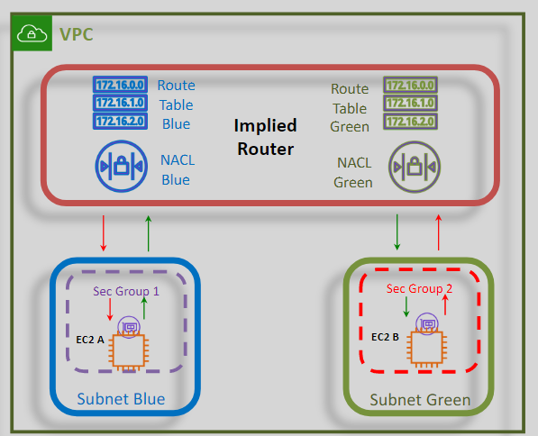

1. A Network ACL functions at a subnet level.
1. It is applied at the implied router level.
1. NACLs are `stateless`.
1. It can include permit and deny rules.
1. Each NACL rule has a sequence number.
1. Rules are evaluated from lowest to
   highest sequence number.
1. It ends with an explicit deny any rule

### **Hybrid Cloud Connectivity**

**There is two main hybrid cloud connectivity options:**

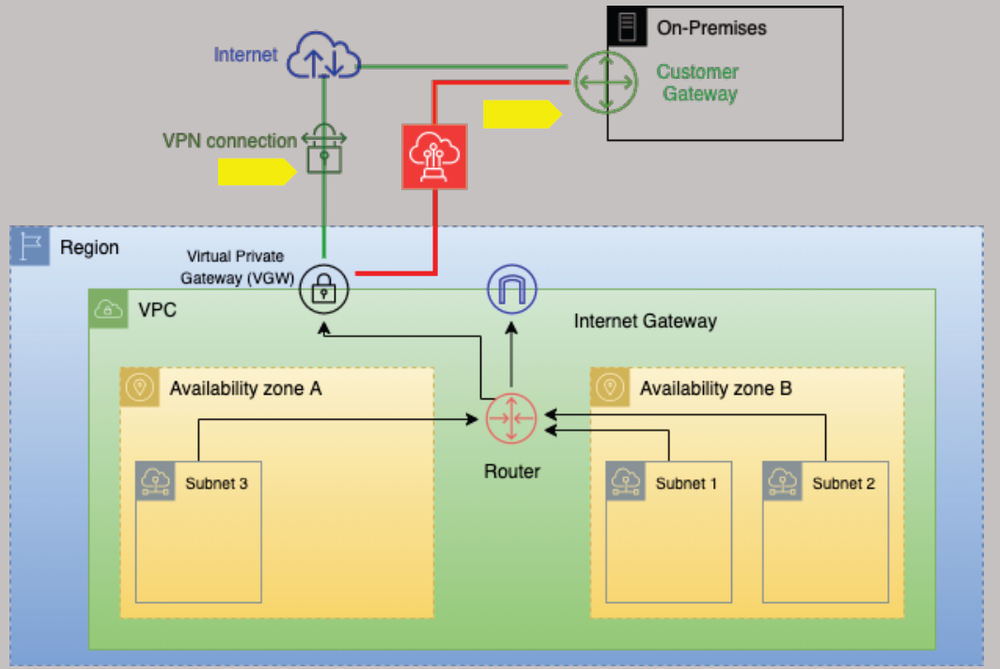

#### **1. A Virtual Private Network (VPN)**

1. Over the internet
1. Quick to deploy
1. Cost effective
1. Secure
1. Not reliable (some times be slow)

#### **2. Direct Connect (DX) connection**

1. Over fiber cable
1. Long lead times
1. Low latency and high bandwidth
1. Private but not secure

#### **Notes**

> You can use combination of these methods to make your connection more secure and fast.

### **NSGs vs NACLs**

| **Feature**              | **Security Groups**                                                                                | **Network Access Control Lists (NACLs)**                                                  |
| ------------------------ | -------------------------------------------------------------------------------------------------- | ----------------------------------------------------------------------------------------- |
| **Operation Level**      | Operates at the Instance (ENI) level as the first layer of defense (from EC2 instance perspective) | Operates at the subnet level as a second layer of defense (from EC2 instance perspective) |
| **Supported Rules**      | Supports allow rules only                                                                          | Supports allow and deny rules                                                             |
| **Filtering Scope**      | Filtering applies to instances communicating within a subnet                                       | Filtering does not apply to instances communicating within a subnet                       |
| **Statefulness**         | Is Stateful                                                                                        | Is Stateless                                                                              |
| **Rule Evaluation**      | All rules are evaluated before a decision is made                                                  | Rules are processed in order until a match is found (from lower to higher rule number)    |
| **Scope of Application** | Applies only to instances where the security group is associated/applied                           | Applies to all instances in the subnet(s) where the NACL is applied                       |

## Questions

### What is IDentity Center

AWS Identity Center, also known as **AWS IAM Identity Center**, is a service that helps you **manage workforce access to AWS applications and resources**. It allows you to connect your existing identity provider (like Okta, Google Workspace, or Microsoft Active Directory) to AWS, providing a **single sign-on (SSO) experience** for your users.

Here are some key features:

- **Centralized Management**: Manage user access to multiple AWS accounts and applications from a single place.
- **Single Sign-On**: Users can access AWS services with one set of credentials.
- **Integration with AWS Applications**: Seamlessly integrates with AWS managed applications like Amazon QuickSight and Amazon SageMaker Studio.
- **Improved Security and Visibility**: Provides better control and visibility over user access, making it easier to audit and monitor activities.

We recommend that you use Identity Center to provide console access to a person. With Identity Center, you can centrally manage user access to their AWS accounts and cloud applications.

### What is Credential Report

The credentials report lists all your IAM users in this account and the status of their various credentials. After a report is created, it is stored for up to four hours.

### What is IPAM (IP Access Manager)?

IP Access Manager

### What is NAT

### Public Subnet vs Private Subnet in a VPC

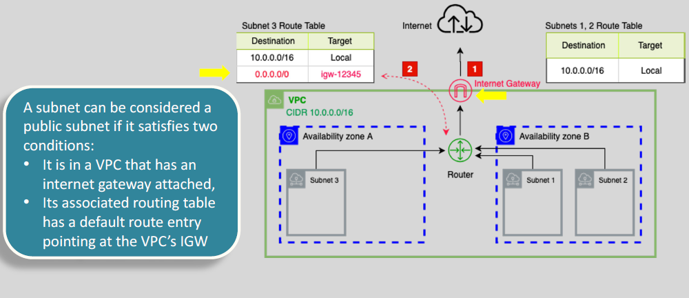

### What is ASN (autonomous system number)?

An **Autonomous System Number (ASN)** is a unique identifier used for routing internet traffic between different networks. In AWS, ASNs are used in services like **AWS Direct Connect** and **Virtual Private Cloud (VPC)** to manage BGP (Border Gateway Protocol) routing.

Thin of **Autonomous System Number (ASN)** as an `ID for a group of IPs range` that are managed by one organization.

**Key Points:**

- **VPC**: ASNs help in advertising your IP address ranges with your own ASN instead of AWS's default ASN.
- **AWS Direct Connect**: You can configure a private ASN for your Virtual Private Gateway or Direct Connect gateway.
