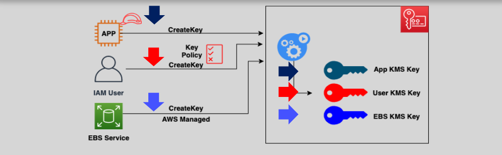
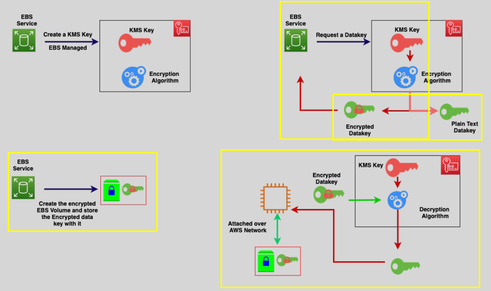

# **AWS KMS: Secure Your Cloud with Centralized Key Management** 🔐

In the cloud-first world, securing data is paramount. **AWS Key Management Service (KMS)** simplifies encryption management and **provides robust security** for your data by enabling you to **create, store, and manage cryptographic keys**. With AWS KMS, your encryption keys are fully managed, ensuring seamless integration and compliance across AWS services.

In this guide, we’ll explore **how AWS KMS works**, its **key features**, and how it helps you manage **sensitive data** securely in your cloud infrastructure. By the end of this guide, you’ll be equipped with the knowledge to leverage **KMS** for **encryption**, **compliance**, and **best practices** for securing your cloud data.

## **What is AWS KMS and Why Should You Use It?** 🔒

**AWS KMS (Key Management Service)** provides a **centralized solution** to create, store, and manage encryption keys for securing data. It simplifies the process of managing keys, ensuring **consistent security practices** while enabling compliance with regulatory standards.

### **Key Features of AWS KMS:**

- **FIPS 140-2 Compliant**: AWS KMS meets **federal standards** for cryptographic operations, ensuring **enterprise-level security** for sensitive data.
- **Highly Available & Durable**: Built to provide **resilient** and **reliable** key storage, AWS KMS ensures that your keys are available whenever needed across multiple regions.
- **Integration with AWS Services**: AWS KMS seamlessly integrates with services like **S3**, **EBS**, **RDS**, and others, simplifying the **encryption** process for your data.
- **CloudTrail Integration**: With CloudTrail, you can track **key usage** for **auditing and compliance**, ensuring transparency in key management.
- **Affordable**: AWS KMS offers **cost-effective** key management, costing **\$1/month** for each key you create. There's **no charge** for keys automatically created by AWS services.

## **KMS Keys: The Heart of Data Security in AWS** 🔑

At the core of **AWS KMS** are the **encryption keys**, which are used to **encrypt and decrypt** your data. These keys play a crucial role in ensuring that sensitive information is protected.

### **Types of KMS Keys:**

1. **Symmetric Keys:**  
   Symmetric keys are the **most commonly used keys** for encrypting and decrypting data. These keys use the same key for both encryption and decryption, making them **ideal for most AWS services**.

   - AWS recommends using **symmetric keys** for services like **S3**, **EBS**, and **RDS** to ensure efficient and cost-effective encryption.

2. **Asymmetric Keys:**  
   Asymmetric keys use a **public-private key pair**. These keys are typically used for **digital signatures**, **key exchange**, and **secure authentication**.
   - Useful for secure communication between systems or for signing messages and data.

### **Key Usage:**

- **IAM Roles** and **Users**: IAM roles and users can request **KMS keys** to encrypt and decrypt data.
- **AWS Services**: Many AWS services like **S3**, **EBS**, and **RDS** can automatically use **KMS keys** for encryption, ensuring seamless data protection.

## **Who Can Create and Manage KMS Keys?** 👨‍💻

- **IAM Users**: Authorized IAM users can create and manage KMS keys within AWS.
- **IAM Roles**: IAM roles are also able to manage KMS keys, allowing applications to automate key management processes.
- **AWS Services**: Some AWS services, such as **EBS**, can automatically create and use KMS keys to manage encryption on your behalf.

## **AWS Managed vs. Customer Managed KMS Keys** 🛠️

AWS KMS offers two types of keys: **AWS Managed Keys** and **Customer Managed Keys**, each suited to different use cases.

### **AWS Managed KMS Keys:**

- **Automatically created and managed** by AWS services.
- Ideal for customers who prefer **automated management** of their encryption keys.
- **Automatic key rotation** every 3 years.
- **No customer management** required—AWS handles everything.

### **Customer Managed KMS Keys:**

- **Created and managed** by the customer, providing **full control** over the lifecycle of the keys.
- Allows customers to **delete**, **rotate**, **grant access**, and **manage** keys themselves.
- Offers **greater flexibility** for **custom encryption needs**.
- **Automatic key rotation** is optional, but AWS recommends rotating keys at least once a year.

### **Key Comparison: Managed vs. Customer Managed KMS Keys:**

| **Feature**                            | **AWS Managed KMS Key** | **Customer Managed KMS Key**      |
| -------------------------------------- | ----------------------- | --------------------------------- |
| **Customer can view Key metadata**     | Yes                     | Yes                               |
| **Customer can manage the KMS Key**    | No                      | Yes                               |
| **Used only for the customer account** | Yes                     | Yes                               |
| **Automatic rotation of keys**         | Required every 3 years  | Optional - every 1 year if chosen |

---

## **Full Process of Encrypting and Decrypting Data in EBS with AWS KMS** 🔑🔐

This **step-by-step process** explains how the encryption and decryption work, ensuring that **EBS**, **KMS**, and **EC2** each have a clear role.

### **Step 1: Create a KMS Key**

- You start by creating a **symmetric KMS key** in **AWS KMS**.
- This key will be used for encrypting and decrypting the **data key**.
- You choose this key when you create an **EC2 instance** with an **EBS volume**, so **EBS** can encrypt and decrypt the data on the volume.

---

### **Step 2: Encrypt the EBS Volume**

- When creating a new **EBS volume** or an **EC2 instance**, you choose to encrypt the **EBS volume** using the **KMS key**.
- **EBS** requests **KMS** to generate a **data key** (a symmetric key). This **data key** will be used to encrypt the data on the volume.
- **EBS** uses the **data key** to **encrypt the data** that is being written to the volume.
- The **data key** is **encrypted** using the **KMS key** and **stored alongside the encrypted data** on the volume (but it is encrypted itself).
- The **KMS key** never leaves **KMS**. Only the **encrypted data key** is stored with the encrypted data in **EBS**.

---

### **Step 3: EC2 Reads the Encrypted Data**

1. **EC2 Instance Sends Request**:

   - When the **EC2 instance** needs to **read data** from the **EBS volume**, it sends a request to **EBS**.
   - **EBS** knows that the data is encrypted and that it needs to decrypt it before returning it to **EC2**.

2. **EBS Sends the Encrypted Data Key to KMS**:

   - **EBS** retrieves the **encrypted data key** from the volume (which is stored with the encrypted data).
   - **EBS** sends the **encrypted data key** to **KMS** for decryption.

3. **KMS Decrypts the Data Key**:

   - **KMS** uses the **KMS key** (which is securely stored in **KMS**) to **decrypt** the **data key**.
   - **KMS** then returns the decrypted **data key** to **EBS**.

4. **EBS Decrypts the Data Using the Data Key**:
   - **EBS** uses the decrypted **data key** to **decrypt the data** on the volume.
   - The decrypted data is then sent back to the **EC2 instance**.

---

### **Step 4: EC2 Writes Data to the Encrypted EBS Volume**

1. **EC2 Writes Data to EBS**:

   - The **EC2 instance** creates new data (e.g., saving a file or writing application data).
   - **EC2** sends this **unencrypted data** to **EBS**.

2. **EBS Encrypts the Data**:

   - **EBS** **encrypts the new data** using the **data key** (the same key that was used for encrypting data earlier).
   - **EBS** now has the **data key** (which was previously decrypted by **KMS**).

3. **EBS Re-encrypts the Data Key**:
   - After encrypting the new data, **EBS** **re-encrypts** the **data key** using the **KMS key**.
   - This **re-encrypted data key** is stored alongside the newly encrypted data on the **EBS volume**.

---

### **Step 5: Temporary Storage of the Data Key in EBS**

- **EBS** stores the **decrypted data key** in **its memory** temporarily for **encryption** and **decryption** purposes.
- If **EBS** loses this key (e.g., due to a restart), it will need to **request the decrypted data key from KMS** again.

---

### **Step 6: Access Control and Key Management**

- **IAM (Identity and Access Management)**: The access to the **KMS key** is controlled through **IAM roles and policies**.
- Only authorized users or services (with the right IAM permissions) can request and use the **KMS key** to encrypt or decrypt data.

- **KMS Key Rotation**: You can rotate the **KMS key** periodically. If you rotate the **KMS key**, **EBS** will need to start using the new key for encryption and decryption processes.

---

### **Summary of the Entire Encryption and Decryption Process**

1. **Create a KMS key** for encryption and decryption.
2. **Encrypt the EBS volume** using the **KMS key**:
   - **EBS** generates a **data key** (symmetric) and uses it to encrypt the data.
   - The **data key** is stored **encrypted** on the volume.
3. When the **EC2 instance reads** the data:
   - **EBS** sends the **encrypted data key** to **KMS**.
   - **KMS** decrypts it and returns the decrypted **data key** to **EBS**.
   - **EBS** uses the **decrypted data key** to decrypt the data and sends it to **EC2**.
4. When the **EC2 instance writes** data:
   - **EBS** uses the **data key** to encrypt the data and stores the encrypted data alongside the **re-encrypted data key**.
5. **EBS stores** the **decrypted data key** temporarily in **its memory**.
   - If **EBS** restarts, it will **request the decrypted data key from KMS** again.

---

### **Key Points:**

- **Encryption and decryption** are **handled by EBS**, but **KMS** is responsible for managing and decrypting the **data key**.
- The **data key** is stored **encrypted** on the **EBS volume**.
- **EBS** stores the **decrypted data key temporarily** in its memory to handle encryption and decryption.
- **KMS** is only contacted when **EBS needs to decrypt the data key** (e.g., when the key is lost or after a restart).

## **Best Practices for Using AWS KMS** 📊

1. **Centralized Key Management**:  
   Leverage **AWS KMS** to manage encryption keys across **AWS services** like **S3**, **EBS**, and **RDS** to simplify data protection.

2. **Key Rotation**:  
   Regularly rotate keys to enhance security. For **Customer Managed KMS Keys**, set up an automatic key rotation policy, ideally every year.

3. **Granular Access Control**:  
   Use **IAM roles** and **policies** to define who can access and manage KMS keys, ensuring that only authorized entities can use the keys.

4. **Enable CloudTrail**:  
   **CloudTrail** helps you **audit and monitor key usage**, ensuring that all operations involving KMS keys are logged for security and compliance purposes.

5. **Multi-Region Keys**:  
   **Multi-region KMS keys** allow you to replicate keys across different regions, making data encryption and access easier and more reliable globally.

## **Conclusion: Take Control of Your Cloud Security with AWS KMS** 🔑

**AWS KMS** is the backbone of data security in the cloud, offering **centralized key management** for **sensitive data**. With **symmetric** and **asymmetric keys**, **AWS KMS** makes encryption seamless and efficient.

- Use **AWS Managed Keys** for automated encryption or **Customer Managed Keys** for full control over your encryption lifecycle.
- Integrate with **S3**, **RDS**, **EBS**, and other AWS services for streamlined data encryption.
- Follow best practices like **key rotation**, **IAM policies**, and **CloudTrail monitoring** to maintain a secure and compliant cloud environment.
