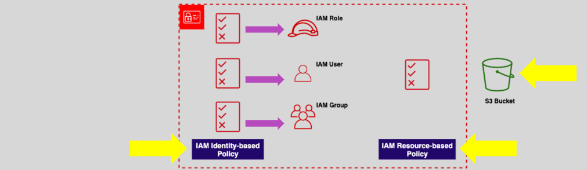

# **Understanding IAM Policies in AWS** 🔑

**AWS IAM Policies** are essential for managing **access control** within your AWS environment. They define **who** can access your resources, and what **actions** they are allowed to perform. In this topic, we’ll break down the key aspects of IAM Policies, explore how they work, and highlight important features and best practices.


## **What Are IAM Policies?** 📝

IAM Policies are **JSON documents** that define **permissions** for an **identity** (such as an IAM user, role, or federated user) or a **resource**. These policies specify which **actions** are allowed or denied on specific resources.

## **Key Components of IAM Policies** 🧩

### **IAM Principals** 🔑

IAM policies are attached to **principals**, which can be:

- **IAM Users**: Individual AWS accounts.
- **IAM Roles**: Assigned to AWS resources or services.
- **Federated Users**: External identities that are granted temporary access.
- **Applications**: AWS services or third-party applications using your AWS resources.

#### Important Note:

- **IAM Groups** cannot be IAM **Principals**, although policies can be attached to groups for the users within them.

### **Policy Attachment** 🔗



- **IAM Policy Attachment**: Policies must be attached to either an **identity** or a **resource**.

  - **Identity-based policies** are attached to users, roles, or federated users.
  - **Resource-based policies** are attached directly to resources like **S3 buckets**, **Lambda functions**, etc.

- **Multiple Policies**: An **identity** can have more than one policy attached. This gives you flexibility in managing access for a user or service.

## **Types of IAM Policies** ⚙️


There are three main types of policies in AWS:

1. **AWS Managed Policies**: Predefined, managed by AWS.

   - Example: `AmazonS3ReadOnlyAccess`.

2. **Customer Managed Policies**: Custom policies created by you to meet specific requirements.

3. **Inline Policies**: Policies embedded directly in a user, group, or role.
   - **Note**: Inline policies are unique to a single identity, whereas managed policies can be reused across multiple identities.

### **Policy Evaluation Logic** 🔍

IAM policies use a **default deny** model and evaluate requests in a specific way:

1. **Default Deny**: By default, **all requests are denied** until explicitly allowed by a policy.

2. **Explicit Allow**: If a policy explicitly allows an action, it will be granted even if a general **deny** is in place.

3. **Explicit Deny**: If a policy explicitly denies an action, that denial **overrides any allows**. Deny always takes precedence over allow.

#### Example:

- **Allow**: "You can read from S3."
- **Deny**: "You cannot delete objects from S3."
- If a request tries to delete an S3 object, even if there's an allow for read access, the deny will override it.

### **Policy Storage** 📂

- **Stored as JSON Documents**: Policies are **stored** as **JSON documents** in AWS, which define what actions are allowed or denied.

Example policy format:

```json
{
  "Version": "2012-10-17",
  "Statement": [
    {
      "Effect": "Allow",
      "Action": "s3:GetObject",
      "Resource": "arn:aws:s3:::mybucket/*"
    }
  ]
}
```

- **Key Components of a Policy**:
  - **Version**: The version of the policy language (always `2012-10-17` for AWS).
  - **Statement**: Contains the policy details, including actions, resources, and the effect (allow or deny).
  - **Effect**: Whether the action is allowed or denied.
  - **Action**: The AWS actions this policy allows or denies.
  - **Resource**: The resources that the policy applies to (e.g., an S3 bucket).

## **IAM Policy Evaluation Process** 🔄

The IAM policy evaluation process determines whether a request is allowed or denied based on the attached policies. Here's how AWS evaluates policies:

1. **Check all policies**: AWS checks all policies attached to the identity (user, role, etc.) and to the resource.

2. **Default Deny**: All requests are **denied by default** unless explicitly allowed.

3. **Allow or Deny Evaluation**: AWS applies the **explicit allow** first, and if there’s any conflict, it checks for **explicit deny**.

4. **Final Decision**: The final decision is made based on the evaluation of all policies.

## **Example: Common IAM Policy Use Cases** 🎯

- **Allowing EC2 instances to access S3**:

  - **Policy**: Attach an **IAM role** to an EC2 instance that allows it to interact with S3.

- **Restricting S3 bucket access**:

  - **Policy**: Attach a **resource-based policy** to an S3 bucket to restrict who can access it.

- **Limiting user permissions**:
  - **Policy**: Create a **customer-managed policy** that grants users access to only specific resources in a region.

## **Best Practices for IAM Policies** ⚡

1. **Use Managed Policies**: Whenever possible, use **AWS managed policies** to save time and reduce the chance of errors.

2. **Grant Least Privilege**: Always grant the **minimum permissions** necessary for users and roles to perform their tasks.

3. **Monitor and Review**: Regularly **audit** your IAM policies and use **CloudTrail** to log and review access.

4. **Use Policy Versioning**: For **customer-managed policies**, use **versioning** to keep track of changes and prevent mistakes.

5. **Avoid Using Inline Policies**: While inline policies are useful in some cases, they are harder to manage and audit. **Managed policies** are usually better for most use cases.

## **Conclusion** 🎉

**IAM Policies** are the backbone of security in AWS. Understanding how policies are structured, evaluated, and applied will help you control access to AWS resources effectively. By attaching policies to **users**, **roles**, or **resources**, and following **best practices**, you can ensure that your AWS environment remains secure, efficient, and manageable.
