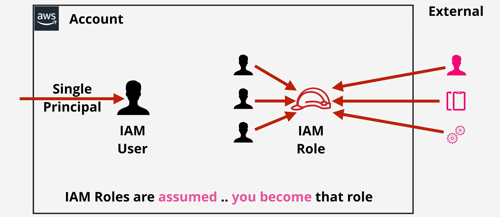
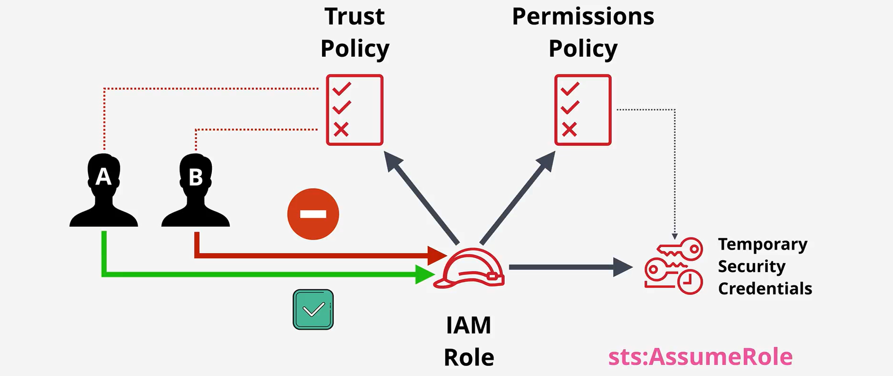

# **IAM Roles in AWS** 🎭

**IAM Roles** are a key component of AWS’s **Identity and Access Management (IAM)** service. They allow you to securely grant temporary access to your AWS resources without using permanent access credentials like Access Key IDs and Secret Access Keys. Unlike IAM users, **IAM roles** are not tied to a specific identity but are used for delegating permissions to **users**, **services**, or **applications** that need them.



## **What Is an IAM Role?** 🔑

An **IAM Role** is an **AWS identity** with **permissions** that can be assumed by trusted entities such as **IAM users**, **AWS services**, or **external applications**. Roles are temporary identities that allow users or services to perform specific actions on AWS resources. Unlike IAM Users, which have **permanent access credentials**, IAM roles only provide **temporary credentials** when assumed.

### **Key Features of IAM Roles**:

- **Temporary Credentials**: IAM roles provide **temporary access** to AWS services for a set period of time.
- **No Permanent Access Keys**: Unlike IAM users, IAM roles do not have permanent credentials such as Access Key IDs and Secret Access Keys.
- **Assumed by Entities**: IAM roles are assumed by entities that need access to AWS resources, such as IAM users, AWS services (like EC2), or external applications.
- **Flexible and Secure**: IAM roles allow you to manage permissions for a wide variety of use cases, such as granting access to AWS resources or managing cross-account access.

## **Who Can Assume an IAM Role?** 👥

An **IAM Role** can be assumed by:

1. **IAM Users**: A user can assume a role to get temporary permissions for specific tasks.
2. **AWS Services**: AWS services (e.g., **EC2**, **Lambda**, **RDS**) can assume roles to access other AWS resources on your behalf.
3. **Federated Users**: External users authenticated by an identity provider (such as Google, Microsoft, or Active Directory) can assume a role using **web identity federation**.
4. **Applications**: Applications (either inside or outside AWS) can also assume a role using temporary credentials to interact with AWS resources.

## **How IAM Roles Work** 🔄



### **Key Components of IAM Roles:**

1. **Permissions Policies**: IAM roles define what actions are allowed or denied through attached **permissions policies**.

   - Example: An EC2 role may allow `s3:GetObject` permission to read from an S3 bucket.

2. **Trust Policies**: IAM roles are associated with a **trust policy**, which specifies which entities are allowed to assume the role. The trust policy defines the **trusted principal** (IAM user, AWS service, federated user, etc.) that can assume the role.

### **How to Assume an IAM Role:**

1. **Creating an IAM Role**:

   - You create a role and specify a trust policy that defines who can assume it.

2. **Assuming the Role**:

   - The entity (such as an **IAM user**, **EC2 instance**, or **external app**) assumes the role and receives **temporary credentials** for a defined session.
   - The entity can then use these temporary credentials to access resources (e.g., access an S3 bucket, execute Lambda functions).

3. **Role Session Duration**:
   - IAM roles provide temporary security credentials that expire after a **defined period** (from **15 minutes to 12 hours**).
   - After expiration, the credentials are no longer valid, and the entity needs to re-assume the role.

## **Types of IAM Roles** ⚙️

IAM roles can be used in various ways depending on the scenario:

1. **Service Role**: These roles are assumed by AWS services to perform actions on your behalf.

   - **Example**: An **EC2 role** may be assigned to an EC2 instance to allow it to access **S3** or **DynamoDB**.

2. **Cross-Account Role**: These roles allow one AWS account to access resources in another account.

   - **Example**: Account A creates a role that Account B’s user or service can assume to access resources in Account A.

3. **Federated Role**: These roles are assumed by external users authenticated through **SAML** or **web identity federation** (e.g., using **Google**, **Facebook**, or **Active Directory**).
   - **Example**: A **corporate user** authenticates through a company’s **Active Directory**, which is mapped to an IAM role that grants them temporary AWS access.

## **Trust Policy** 🛡️

Each IAM role has a **trust policy**, which specifies the **trusted entities** that are allowed to assume the role.

### **Example of Trust Policy**:

Here’s a trust policy that allows an **EC2 instance** to assume the role:

```json
{
  "Version": "2012-10-17",
  "Statement": [
    {
      "Effect": "Allow",
      "Principal": {
        "Service": "ec2.amazonaws.com"
      },
      "Action": "sts:AssumeRole"
    }
  ]
}
```

In this case, the role is **trusted** by the **EC2 service** and allows it to assume the role.

## **IAM Roles vs. IAM Users** 🤔

- **IAM Users**: Permanent identities with **access keys** (access key ID and secret key) and continuous access to AWS resources.
- **IAM Roles**: Temporary identities with **no permanent access keys**. IAM roles provide **temporary security credentials** for a specific session.

| **Feature**            | **IAM User**                          | **IAM Role**                                               |
| ---------------------- | ------------------------------------- | ---------------------------------------------------------- |
| **Access**             | Permanent credentials                 | Temporary credentials                                      |
| **Credentials**        | Access Key ID and Secret Access Key   | No permanent credentials                                   |
| **Trust Relationship** | Tied to a specific person/application | Can be assumed by users, services, or federated identities |
| **Duration**           | Unlimited access                      | Time-limited (e.g., 15 minutes to 12 hours)                |

## **Use Cases for IAM Roles** 🌟

### **1. EC2 Role**:

You can assign an IAM role to an **EC2 instance**, allowing it to interact with other AWS services like **S3** or **DynamoDB** without needing permanent credentials.

Example: An EC2 instance needs to access an S3 bucket to read objects. You assign the instance an IAM role with `s3:GetObject` permissions.

### **2. Lambda Role**:

AWS **Lambda functions** can assume roles to interact with AWS resources like **DynamoDB**, **S3**, or **SNS**.

Example: A Lambda function needs to write to a DynamoDB table. You assign the Lambda function a role with `dynamodb:PutItem` permissions.

### **3. Cross-Account Access**:

An IAM role can be created in one account and assumed by users or services from another AWS account.

Example: Account A allows Account B to access an S3 bucket. Account A creates a role that Account B can assume to read from the bucket.

## **Best Practices for Using IAM Roles** ⚡

1. **Principle of Least Privilege**: Assign only the permissions necessary for the role to perform its task. This reduces the risk of accidental or malicious misuse.

2. **Regularly Rotate and Review Roles**: Periodically review roles to ensure they are still necessary and apply the **least privilege principle**.

3. **Use Role Assumption for Cross-Account Access**: For multi-account setups, use IAM roles to securely manage cross-account access to resources.

4. **Monitor Role Usage with CloudTrail**: Use **AWS CloudTrail** to log and monitor all role assumptions to detect suspicious activities.

## **Summary** 📚

- **IAM Roles** are a flexible way to assign permissions to AWS entities like users, services, and external apps.
- Roles are **temporary** and grant **temporary credentials**, ensuring a **secure** way to manage permissions without relying on permanent access keys.
- Trust policies define **who** can assume the role, and permission policies define **what actions** are allowed.
- IAM roles are used in various scenarios, such as granting EC2 instances access to S3, allowing cross-account access, or enabling federated identities.
