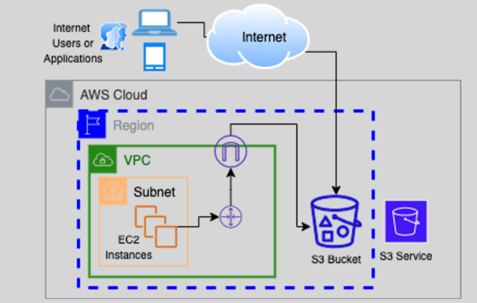

# **AWS Simple Storage Service (S3)** 🌟

**AWS S3** is your **go-to cloud storage service**. With **unlimited storage**, high durability, and an easy-to-use interface, **S3** is perfect for storing all kinds of data, from personal photos to enterprise-level backups.

## **Why Choose S3?** 💡

- **Unlimited Storage**: There are no limits to how much data you can store! Whether you need to store a few files or petabytes of data, **S3 scales with you**.

- **Flexible Object Sizes**: You can store objects as small as 0 bytes or as large as **5TB** — making S3 perfect for everything from small text files to large video files.

## **S3 Buckets: Where Your Data Lives** 🗂️

- **What are Buckets?** Think of **S3 buckets** as **storage folders** in the cloud. You organize and store your objects (data files) inside these buckets.
- **Region-Specific**: Buckets are confined to **AWS regions** for better performance. Your data stays in the region unless you set it up to move elsewhere.

## **Ownership and Access Control** 🔐

- **Bucket Ownership**: When you create a bucket, **your AWS account owns it**. You can’t transfer ownership between accounts, but you can easily manage permissions and access.

- **No VPC Required**: S3 doesn’t require a **VPC** to function, which means your data is accessible from anywhere — great for easy access and scalability.

## **High Durability & Redundancy** 🔄

- **Durable and Redundant**: **S3** ensures your data is always available. Your data is stored **redundantly in multiple locations** within the same region, protecting it from failure.

## **How to Access Your S3 Data** 🔍

Each object in S3 has a **unique identifier** that you use to access it:

1. **Service Endpoint**: The URL used to access S3.
2. **Bucket Name**: The storage container for your data.
3. **Object Key (Name)**: A unique name given to each file.
4. **Object Version**: If versioning is enabled, each object can have multiple versions.

## **In Summary: Why S3 Rocks** 🚀

- **Scalable**: No need to worry about storage limits; scale your data as you go.
- **Durable**: S3 is built to **keep your data safe** by storing it in multiple locations within a region.
- **Accessible**: S3 is easy to use, with a **simple web interface** and robust access controls.
