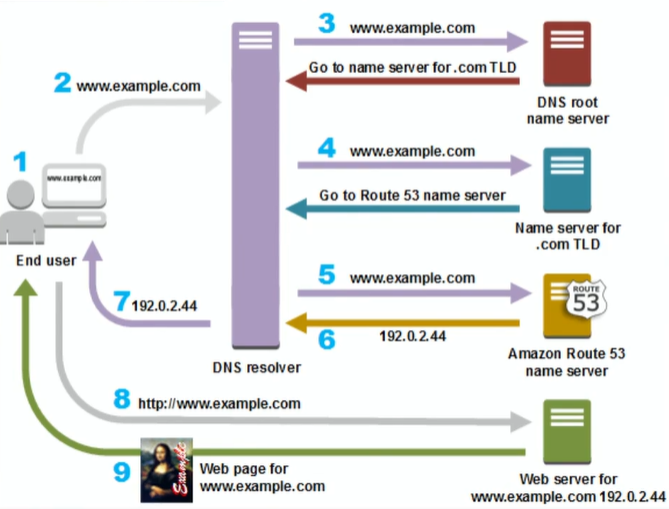
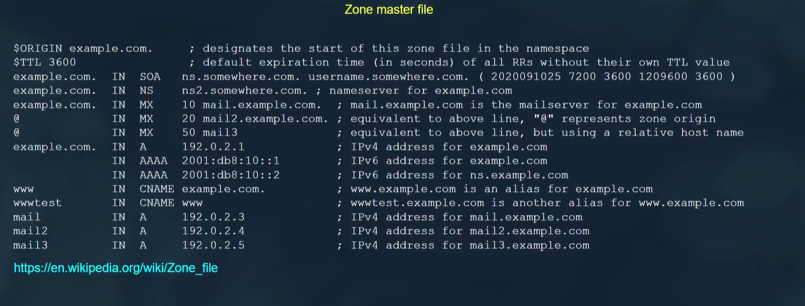
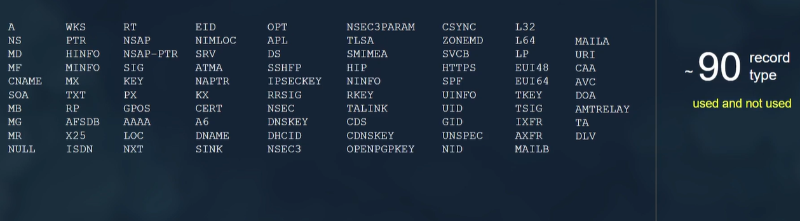
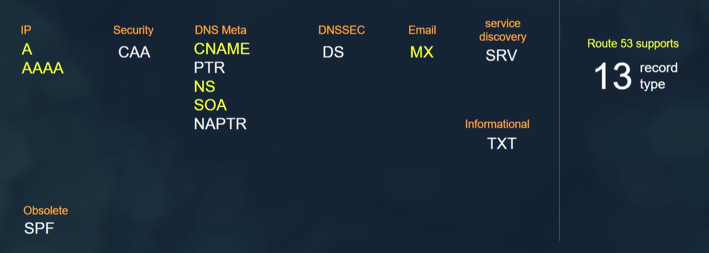

# AWS Route53

## Functions

1. Register Domain
1. Route Traffic
1. Health Check

## Records Types

- **`TTL` (Time to Live)**: determines how long DNS information is cached, influencing the speed of DNS updates and the frequency of DNS queries.
- **`@` Keyword** : In DNS records, the **@** symbol is a shorthand notation used to represent the root domain, or the domain name itself, without any subdomains. For example, if your domain is **example.com**, the **@** symbol refers to **example.com**.
- **`IN` Keyword**: stands for "Internet." It is a class specification indicating that the DNS record pertains to the Internet. Most DNS records use the "IN" class, as it is the standard and most common class for DNS data on the public Internet.

### 1. A Record (Address Record)

- **Purpose**: Maps a domain name to an IPv4 address.
- **Example**: `example.com` -> `192.0.2.1`

### 2. AAAA Record (IPv6 Address Record)

- **Purpose**: Maps a domain name to an IPv6 address.
- **Example**: `example.com` -> `2001:0db8:85a3:0000:0000:8a2e:0370:7334`

### 3. CNAME Record (Canonical Name Record)

- **Purpose**: Alias one domain name to another. It maps a domain name to another domain name instead of an IP address.
- **Example**: `www.example.com` -> `example.com`

### 4. MX Record (Mail Exchange Record)

- **Purpose**: Directs email to mail servers for a domain. It includes a priority value to allow multiple mail servers.
- **Example**: `example.com` -> `mail.example.com` (priority 10)

### 5. TXT Record (Text Record)

- **Purpose**: Holds arbitrary text data, often used for verification purposes and to store configuration settings like SPF, DKIM, and DMARC records for email.
- **Example**: `example.com` -> `v=spf1 include:_spf.example.com ~all`

### 6. SRV Record (Service Record)

- **Purpose**: Defines the location (hostname and port) of servers for specified services.
- **Example**: `_sip._tcp.example.com` -> `10 5 5060 sipserver.example.com`

### 7. NS Record (Name Server Record)

- **Purpose**: Specifies the authoritative name servers for a domain.
- **Example**: `example.com` -> `ns1.example.com`, `ns2.example.com`

### 8. PTR Record (Pointer Record)

- **Purpose**: Maps an IP address to a domain name, used for reverse DNS lookups.
- **Example**: `192.0.2.1` -> `example.com`

### 9. SOA Record (Start of Authority Record)

- **Purpose**: Provides authoritative information about a DNS zone, including the primary name server, email of the domain administrator, domain serial number, and timers for refreshing the zone.
- **Example**: Contains data like `ns1.example.com`, `hostmaster.example.com`, and other settings.

### 10. CAA Record (Certification Authority Authorization Record)

- **Purpose**: Specifies which certificate authorities (CAs) are allowed to issue certificates for a domain.
- **Example**: `example.com` -> `0 issue "letsencrypt.org"`

Understanding these record types will help you manage DNS settings effectively and troubleshoot any domain-related issues.

## Routing Policies

### 1. Simple Routing

- **Description**: Directs traffic based on specified routes without any additional considerations like load balancing or geographical location.
- **Use Case**: Basic routing within a VPC or between VPCs.

### 2. Weighted Routing

- **Description**: Distributes traffic across multiple resources based on assigned weights. Higher weights receive more significant proportions of traffic.
- **Use Case**: A/B testing, canary releases, or distributing traffic among different versions of an application.

### 3. Geolocation Routing

- **Description**: Routes traffic based on the geographical location of the request. Users are directed to resources based on their geographic location.
- **Use Case**: Serving content tailored to specific regions, complying with data sovereignty laws, or optimizing latency based on user location.

### 4. Latency-Based Routing

- **Description**: Routes traffic to the resource with the lowest network latency based on the requester's location.
- **Use Case**: Improving user experience by directing traffic to the nearest resources to reduce latency and improve responsiveness.

### 5. Failover Routing

- **Description**: Automatically routes traffic from an unhealthy or failed resource to a healthy backup resource.
- **Use Case**: Ensuring high availability and fault tolerance by redirecting traffic to standby resources in the event of failures or outages.

### 6. Multivalue Answer Routing

- **Description**: Provides multiple IP addresses in response to DNS queries, allowing for load balancing across multiple resources.
- **Use Case**: Load balancing traffic across multiple endpoints to improve fault tolerance and availability.

### 7. IP-Based Routing

- **Description**: Routes traffic based on specific IP addresses or IP address ranges.
- **Use Case**: Controlling access to resources based on IP addresses or routing traffic between different IP address ranges.

These routing policies offer flexibility and control over how traffic is routed within AWS environments, allowing administrators to tailor routing decisions based on various factors such as geographic location, network latency, or application requirements.
