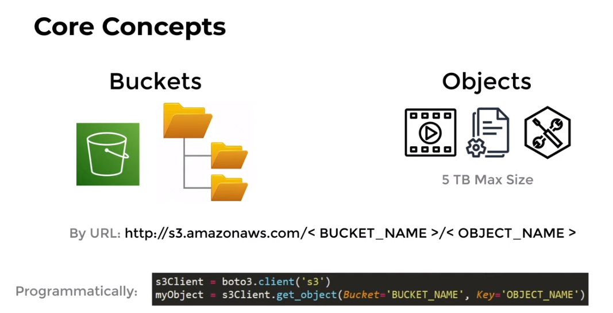
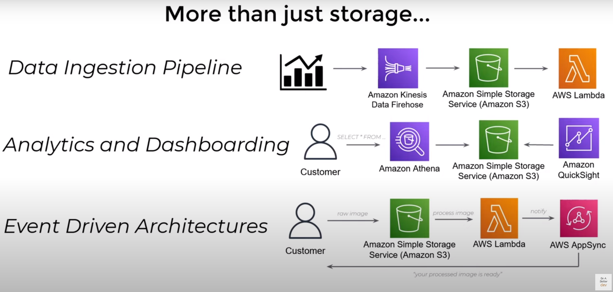
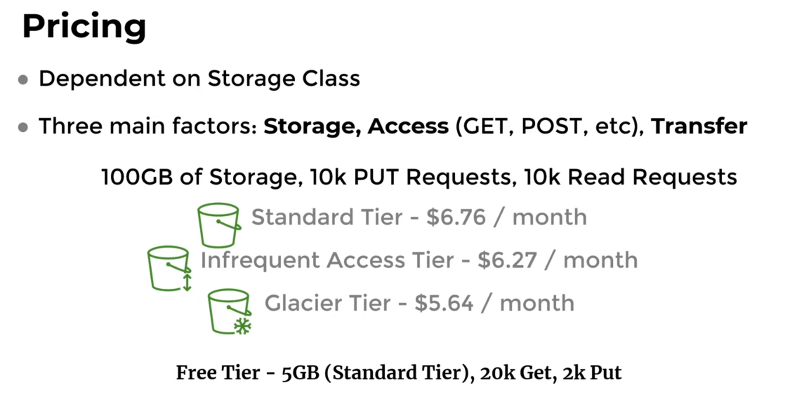

# AWS S3 (Simple Storage Service)

## What is Amazon S3?

- Amazon S3 is a scalable object storage service provided by AWS. It is designed for storing and retrieving any amount of data from anywhere on the web. S3 is widely used for its durability, scalability, and security.
- Buckets are containers for data stored in S3.

### Key Features of Amazon S3

1. **Object Storage**:
   - unlimited storage data
   - it is not file system
   - files not related to each other
   - each file can be accessible from http request.
   - each object is copied to all other AZ in same region as default.

1. **Scalability**:
   - Automatically scales to handle large amounts of data and high request rates.

1. **Durability and Availability**:
   - Stores data across multiple devices in multiple facilities.
   - Provides 99.999999999% (11 nines) of durability.

1. **Security**:
   - **Encryption**: Supports encryption of data at rest and in transit.
   - **Access Control**: Fine-grained access control with AWS Identity and Access Management (IAM), bucket policies, and Access Control Lists (ACLs).

1. **Storage Classes**:
   - **Standard**: For frequently accessed data.
   - **Intelligent-Tiering**: Automatically moves data between two access tiers when access patterns change.
   - **Standard-IA**: For infrequently accessed data.
   - **One Zone-IA**: For infrequently accessed data stored in a single Availability Zone.
   - **Glacier**: For archival storage with retrieval times from minutes to hours.
   - **Glacier Deep Archive**: For long-term archival with retrieval times of 12 hours or more.

1. **Lifecycle Management**:
   - Automatically transitions objects to different storage classes or deletes them after a specified period.

1. **Versioning**:
   - Keeps multiple versions of an object, allowing you to recover from accidental deletions or overwrites.

1. **Data Transfer**:
   - **Multipart Upload**: Allows you to upload large objects in parts.
   - **Transfer Acceleration**: Speeds up content delivery by using Amazon CloudFront's globally distributed edge locations.
   - **AWS Snowball**: For transferring large amounts of data using physical devices.

1. **Logging and Monitoring**:
   - **S3 Access Logs**: Logs detailed records of requests made to your S3 buckets.
   - **AWS CloudTrail**: Logs API calls made on your account.
   - **Amazon CloudWatch**: Monitors S3 performance and usage metrics.

## Use Cases for Amazon S3

1. **Backup and Restore**:
   - Store and retrieve backup copies of your data.

2. **Data Archiving**:
   - Archive data that is infrequently accessed, using Glacier or Glacier Deep Archive.

3. **Content Storage and Distribution**:
   - Store and deliver static content like images, videos, and documents for web applications.

4. **Big Data Analytics**:
   - Store large datasets and use AWS analytics tools like Amazon Athena, Amazon EMR, and Amazon Redshift Spectrum to analyze the data directly in S3.

5. **Disaster Recovery**:
   - Store copies of critical data for disaster recovery.

## How to Use Amazon S3

1. **Create a Bucket**:
   - A bucket is a container for storing objects (files). Each bucket has a unique name across all AWS accounts.

2. **Upload Objects**:
   - Use the AWS Management Console, AWS CLI, SDKs, or APIs to upload objects to your bucket.

3. **Set Permissions**:
   - Define who can access your bucket and objects using bucket policies, IAM roles, and ACLs.

4. **Manage Data**:
   - Use versioning, lifecycle policies, and replication to manage your data.

5. **Access Data**:
   - Retrieve data using the AWS Management Console, AWS CLI, SDKs, APIs, or by generating pre-signed URLs for temporary access.

### Example Scenario

- **Host a Static Website**:
  - **Steps**:
    1. Create an S3 bucket.
    2. Upload your website's HTML, CSS, and JavaScript files.
    3. Configure the bucket to host a static website.
    4. Set permissions to make your files publicly accessible.
    5. Access your website via the bucket's endpoint.

When creating an Amazon S3 bucket, there are several configuration options and settings you can customize to suit your needs. Here's a detailed explanation of these options:

## Creating an S3 Bucket from Console

### 1. Bucket Type

Amazon S3 supports two types of buckets. You can't change the bucket type after you have created the bucket.

#### General Purpose Buckets

- **Default Type**: This is the standard type of bucket.
- **Use Cases**: Suitable for most use cases like storing backups, hosting websites, or archiving data.
- **Storage Structure**: Flat structure, but you can use folders (prefixes) to organize your files.
- **Storage Classes Supported**: Supports most S3 storage classes (Standard, Intelligent-Tiering, Standard-IA, One Zone-IA, Glacier, Glacier Deep Archive).
- **Redundancy**: Data is stored across a minimum of three Availability Zones (AZs) within the selected AWS Region, providing high durability and availability.
- **Naming**: Bucket names must be globally unique and follow specific naming rules (e.g., no uppercase letters, no underscores).
- **Example Scenario**: Use this for typical cloud storage needs, like storing documents, backups, and media files. You benefit from high durability and availability since data is replicated across multiple AZs.

#### Directory Buckets

- **Specialized Type**: Designed for performance-critical applications needing very low latency.
- **Use Cases**: Ideal for applications requiring fast access times, such as high-performance computing, real-time data processing.
- **Storage Structure**: Organizes data hierarchically into directories.
- **Storage Classes Supported**: Only supports the S3 Express One Zone storage class.
- **Redundancy**: Data is stored in a single Availability Zone (AZ), which provides low-latency access but less redundancy compared to General Purpose Buckets.
- **Naming**: Bucket names must be unique within the chosen AZ. The AZ ID is automatically included in the bucket name’s suffix for uniqueness.
- **Example Scenario**: Use this for applications where fast data access is crucial, such as real-time analytics or high-frequency trading platforms. Data access is quicker because it is stored in a single AZ, but you have less redundancy.

### 2. Bucket Name and Region

- **Bucket Name**: Must be unique across all AWS accounts and follow specific naming conventions (e.g., no uppercase letters, no underscores, etc.).
- **Region**: Choose the AWS Region where the bucket will be created. Data stored in the bucket will be physically located in the selected region.

### 3. Object Ownership

- **ACLs Disabled (Recommended)**: All objects in this bucket are owned by this account, access to this bucket and it's objects is specified using only polices.

- **ACLs Enabled**: objects in this bucket can be owned by other aws accounts, access to this bucket and it's objects is specified using ACLs.

### 4. Block Public Access Settings

- **Block All Public Access**: Prevents public access to the bucket and objects.
- **Block Public Access to Buckets and Objects Granted Through New ACLs**: Blocks public access granted through new ACLs.
- **Block Public Access to Buckets and Objects Granted Through Any ACLs**: Blocks public access granted through any ACLs.
- **Block Public Access to Buckets and Objects Granted Through New Public Bucket Policies**: Blocks public access granted through new bucket policies.
- **Block Public and Cross-Account Access to Buckets and Objects Through Any Public Bucket Policies**: Blocks public and cross-account access granted through any bucket policies.

### 5. Bucket Versioning

Versioning is a means of keeping multiple variants of an object in the same bucket. You can use versioning to preserve, retrieve, and restore every version of every object stored in your Amazon S3 bucket. With versioning, you can easily recover from both unintended user actions and application failures.

### 6. Tags

- **Add Tags**: Attach key-value pairs to your bucket for organization and cost tracking.

### 7. Default Encryption

Amazon S3 encrypts an object before saving it to disk and decrypts it when you download the object. Encryption doesn't change the way that you access data as an authorized user. It only further protects your data.

- **Amazon S3-Managed Keys (SSE-S3)**: Encrypts data at rest using keys managed by Amazon S3.
- **AWS Key Management Service (SSE-KMS)**: Encrypts data using keys managed by AWS KMS.
- **Customer-Provided Keys (SSE-C)**: Encrypts data using keys provided by the customer.

### 8. Advanced Settings

- **Object Lock**: Enables write-once-read-many (WORM) protection to prevent objects from being deleted or modified for a fixed period or indefinitely.
  - **Default Retention Mode**: Choose between Governance or Compliance modes.
  - **Default Retention Period**: Specify the default retention period for objects.

### 9. Access Control List (ACL) (if enabled)

- **Set Permissions**: Use ACLs to grant read/write permissions to specific AWS accounts or groups (e.g., Authenticated Users group, All Users group).
- **Grant Permissions**: Set permissions for the bucket owner, objects, and other AWS accounts.

### 10. Bucket Policy

**Edit Bucket Policy**: Define a JSON-based bucket policy to specify access permissions for the bucket and its objects. This is useful for setting fine-grained permissions and cross-account access.

### 11. Cross-Region Replication (CRR)

**Enable Replication**: Automatically replicates objects to a bucket in another AWS Region. This can be configured later after creating the bucket.

### 12. Logging

**Enable Logging**: Stores access logs in a specified target bucket. These logs contain details about requests made to the bucket.

### 13. Object Lock Configuration

  **Enable Object Lock**: Enable this feature to prevent objects from being deleted or overwritten for a fixed period or indefinitely, ensuring compliance with data retention policies.

### conclusion

When creating an S3 bucket, you have various options to configure it according to your requirements:

- **Basic Settings**: Bucket name and region.
- **Ownership and Access Control**: Object ownership, ACLs, and public access settings.
- **Data Management**: Versioning, tags, and default encryption.
- **Advanced Features**: Object lock, cross-region replication, logging, and bucket policies.

## Storage Classes

- allows you reduce cost but with certain sacrifices.

### Frequently Accessed Objects

These storage classes are optimized for data that is frequently accessed and require high performance and low latency.

- **S3 Standard**
  - **Storage Cost**: ~$0.023 per GB per month.
  - **Request Pricing**: GET, SELECT, and all other requests: $0.0004 per 1,000 requests; PUT, COPY, POST, or LIST requests: $0.005 per 1,000 requests.
  - **Use Case**: Content distribution, dynamic websites, data analytics, mobile and gaming applications.

### Infrequently Accessed Objects

These storage classes are designed for data that is not accessed frequently but still requires rapid access when needed.

- **S3 Standard-IA (Infrequent Access)**
  - **Storage Cost**: ~$0.0125 per GB per month.
    - **Min Storage Duration**: 30 days.
  - **Request Pricing**: GET, SELECT, and all other requests: $0.001 per 1,000 requests; PUT, COPY, POST, or LIST requests: $0.01 per 1,000 requests.
  - **Retrieval Fee**: ~$0.01 per GB.
  - **AZ**: >= 3 az.
  - **Use Case**: Long-term storage, backups, disaster recovery.

- **S3 One Zone-IA (One Zone-Infrequent Access)**
  - **Storage Cost**: ~$0.01 per GB per month.
  - **Min Storage Duration**: 30 days.
  - **Request Pricing**: Same as S3 Standard-IA.
  - **Retrieval Fee**: ~$0.01 per GB.
  - **AZ**: 1 az.
  - **Use Case**: Data that can be recreated easily, data that doesn’t require multi-AZ resilience.

### Intelligent Tiering

This storage class automatically moves data between two access tiers (frequent and infrequent) based on changing access patterns, optimizing costs.

- **S3 Intelligent-Tiering**
  - **Storage Cost**: Frequent Access tier: ~$0.023 per GB per month; Infrequent Access tier: ~$0.0125 per GB per month.
  - **Monitoring and Automation Fee**: ~$0.0025 per 1,000 objects.
  - **Request Pricing**: Same as S3 Standard.
  - **Use Case**: Data with unpredictable or changing access patterns, cost optimization without performance impact.

### Archiving Objects

These storage classes are ideal for long-term archival of data that is rarely accessed.

- **S3 Glacier**
  - **Storage Cost**: ~$0.004 per GB per month.
  - **Request Pricing**: $0.05 per 1,000 lifecycle transition requests; $0.10 per 1,000 retrieval requests.
  - **Retrieval Fee**: Expedited: $0.03 per GB; Standard: $0.01 per GB; Bulk: $0.0025 per GB.
  - **Use Case**: Long-term backups, regulatory archives, data archiving where retrieval time can be minutes to hours.

- **S3 Glacier Deep Archive**
  - **Storage Cost**: ~$0.00099 per GB per month.
  - **Request Pricing**: $0.05 per 1,000 lifecycle transition requests; $0.10 per 1,000 retrieval requests.
  - **Retrieval Fee**: Standard: $0.02 per GB; Bulk: $0.0025 per GB.
  - **Use Case**: Long-term archival with rare access, compliance archives, data that can tolerate 12-hour retrieval times.

### Local Storage

For applications requiring low latency and local storage on-premises.

- **S3 Outposts**
  - **Storage Cost**: Pricing varies based on the specific configuration and capacity of the Outposts.
  - **Request Pricing**: Same as S3 Standard.
  - **Use Case**: Applications requiring local data residency and low latency access.

## Notes

### What is ACLs

- it is legacy way to manage permissions to your s3 buckets and objects
- aws recommend to use bucket policies over ACLs
