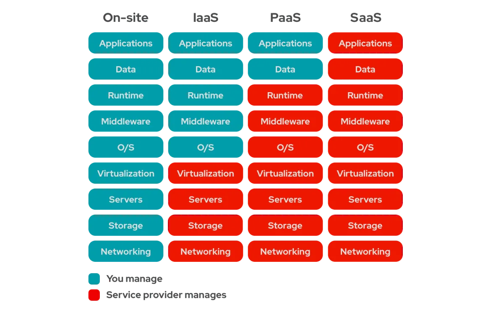

# IaaS vs. PaaS vs. SaaS

There are 3 main types of cloud computing as-a-service options and each one covers a degree of management for you: infrastructure-as-a-service (IaaS), platform-as-a-service (PaaS), and software-as-a-service (SaaS).

## Comparison

| **Aspect**           | **Onsite**                                                        | **IaaS (Infrastructure as a Service)**                                                          | **PaaS (Platform as a Service)**                                                          | **SaaS (Software as a Service)**                                                                    |
| -------------------- | ----------------------------------------------------------------- | ----------------------------------------------------------------------------------------------- | ----------------------------------------------------------------------------------------- | --------------------------------------------------------------------------------------------------- |
| **Definition**       | Traditional IT infrastructure located on-premises.                | Cloud service providing virtualized computing resources over the internet.                      | Cloud service offering a platform for developing, running, and managing applications.     | Cloud service delivering software applications over the internet.                                   |
| **Control**          | Full control over hardware, software, and network infrastructure. | Control over operating systems, storage, and deployed applications; provider manages hardware.  | Control over applications and data; provider manages runtime, middleware, and OS.         | Minimal control; provider manages everything including applications, data, runtime, and middleware. |
| **Cost**             | High initial capital expenditure and ongoing maintenance costs.   | Pay-as-you-go model; lower upfront costs, ongoing operational costs.                            | Pay-as-you-go model; lower upfront costs, ongoing operational costs.                      | Subscription-based model; lower upfront costs, ongoing subscription fees.                           |
| **Scalability**      | Limited by physical infrastructure and capacity.                  | High scalability; resources can be scaled up or down as needed.                                 | High scalability; resources can be scaled up or down as needed.                           | High scalability; resources can be scaled up or down as needed.                                     |
| **Maintenance**      | Internal team responsible for maintenance and updates.            | Provider manages infrastructure maintenance; customer manages applications and data.            | Provider manages platform maintenance; customer manages applications and data.            | Provider manages everything; customer only uses the software.                                       |
| **Deployment Speed** | Can be time-consuming due to hardware and software procurement.   | Fast deployment; resources can be provisioned quickly.                                          | Fast deployment; platform is ready for development.                                       | Fast deployment; software is available immediately.                                                 |
| **Security**         | Internal security measures and protocols.                         | Shared responsibility; provider secures infrastructure, customer secures applications and data. | Shared responsibility; provider secures platform, customer secures applications and data. | Shared responsibility; provider secures everything, customer secures access.                        |
| **Use Cases**        | Traditional IT setups, legacy systems.                            | Web hosting, virtual machines, storage solutions.                                               | Application development, testing environments, web hosting.                               | Office productivity tools, CRM systems, email services.                                             |

## Azure Services and Their Types

| **Azure Service**            | **Type** |
| ---------------------------- | -------- |
| **Azure Virtual Machines**   | IaaS     |
| **Azure App Service**        | PaaS     |
| **Azure SQL Database**       | PaaS     |
| **Azure Blob Storage**       | **PaaS** |
| **Azure Functions**          | PaaS     |
| **Azure Active Directory**   | **PaaS** |
| **Microsoft 365**            | SaaS     |
| **Azure Kubernetes Service** | PaaS     |
| **Azure DevOps**             | SaaS     |
| **Azure Cosmos DB**          | PaaS     |
| **Azure Table Storage**      | **PaaS** |
| **Azure Logic Apps**         | PaaS     |
| **Azure Synapse Analytics**  | PaaS     |
| **Power BI**                 | SaaS     |

**Explanation:**

- **Azure Virtual Machines (VMs)**: IaaS - Provides virtualized computing resources.
- **Azure App Service**: PaaS - Allows building, hosting, and managing web apps.
- **Azure SQL Database**: PaaS - Fully managed relational database service.
- **Azure Blob Storage**: **PaaS** - Scalable object storage service for unstructured data.
- **Azure Functions**: PaaS - Event-driven serverless compute service.
- **Azure Active Directory (Microsoft Entra ID)**: **PaaS** - Provides identity and access management.
- **Microsoft 365**: SaaS - Suite of productivity tools and services.
- **Azure Kubernetes Service (AKS)**: PaaS - Managed Kubernetes orchestration service.
- **Azure DevOps**: SaaS - Provides development and collaboration tools.
- **Azure Cosmos DB**: PaaS - Globally distributed, multi-model database service.
- **Azure Table Storage**: **PaaS** - NoSQL key-value store for large datasets.
- **Azure Logic Apps**: PaaS - Automates workflows and integrates apps, data, and services.
- **Azure Synapse Analytics**: PaaS - Analytics service that combines big data and data warehousing.
- **Power BI**: SaaS - Business analytics service providing interactive visualizations and insights.
