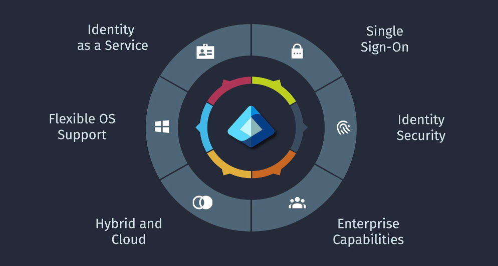
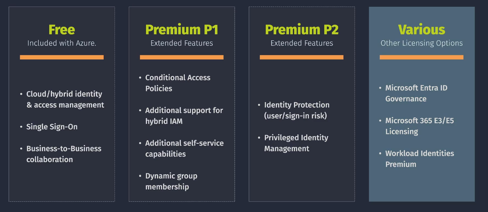

# Entra ID

**Azure Entra ID** is Microsoft's cloud-based identity and access management service. It enables employees to sign in and access resources such as:

- **Internal Resources:** Apps on your corporate network and intranet.
- **External Resources:** Microsoft 365, the Azure portal, and thousands of other SaaS applications.

**Entra ID** is Microsoft's cloud-based identity and access management service, previously known as **Azure Active Directory (Azure AD)**. It helps organizations manage and secure user access to various applications and resources. Here's a simple breakdown of what Entra ID does:

1. **User Management**:

   - **Sign-In**: Allows employees to sign in once and access multiple apps without needing to log in separately to each one (Single Sign-On).
   - **Identity Verification**: Ensures that the right people are accessing the right resources through features like multi-factor authentication (MFA).

2. **Access Control**:

   - **Permissions**: Administrators can define who has access to specific applications and data within the organization.
   - **Conditional Access**: Sets rules for accessing resources based on conditions like location, device type, or user role.

3. **Security**:

   - **Threat Protection**: Detects and responds to potential security threats to protect user identities and data.
   - **Compliance**: Helps organizations meet various regulatory requirements by managing and auditing access controls.

4. **Integration**:

   - **Apps and Services**: Integrates with thousands of third-party applications and Microsoft services, making it easier to manage access across different platforms.
   - **Customization**: Supports custom applications and can be tailored to fit the specific needs of an organization.

5. **Collaboration**:
   - **External Access**: Facilitates secure collaboration with partners, suppliers, and other external users by managing their access to company resources.

## Entra ID Licenses

Entra ID offers various licensing plans to cater to different organizational needs. These licenses provide different levels of features related to identity and access management, security, and compliance.

For detailed and the most current information, it's always best to refer directly to the [Microsoft Entra ID Licensing Documentation](https://learn.microsoft.com/en-us/entra/fundamentals/licensing).

## Azure Subscription Relationship

Azure Subscription is the foundation for using Azure services. It acts as a container that holds related resources and allows you to manage and organize them. Here's how it relates to Entra ID:

- **Tenant Association**: Each Azure subscription is linked to a single Entra ID tenant, which provides identity and access management for the subscription. The tenant is where users are created and managed.

- **Subscription to Tenant**:

  - **One-to-One**: Each Azure subscription is linked to one and only one Entra ID tenant. This tenant acts as the identity provider and manages access to the subscription’s resources.

- **Tenant to Subscription**:

  - **One-to-Many**: A single Entra ID tenant can be associated with multiple Azure subscriptions. This allows organizations to organize resources logically, manage costs efficiently, and apply consistent security policies across all subscriptions under the same tenant.

- **Billing**: Subscriptions define the billing model and payment method for the Azure services consumed under it.

- **Resource Organization**: Resources such as virtual machines, databases, and storage accounts are organized within a subscription, which helps in managing costs and access controls.

- **Access Management**: Using Entra ID, administrators can control who has access to resources within a subscription by assigning roles and permissions.

- **Multiple Subscriptions**: Organizations can have multiple subscriptions for different departments or projects, each with its own billing and access control settings.
