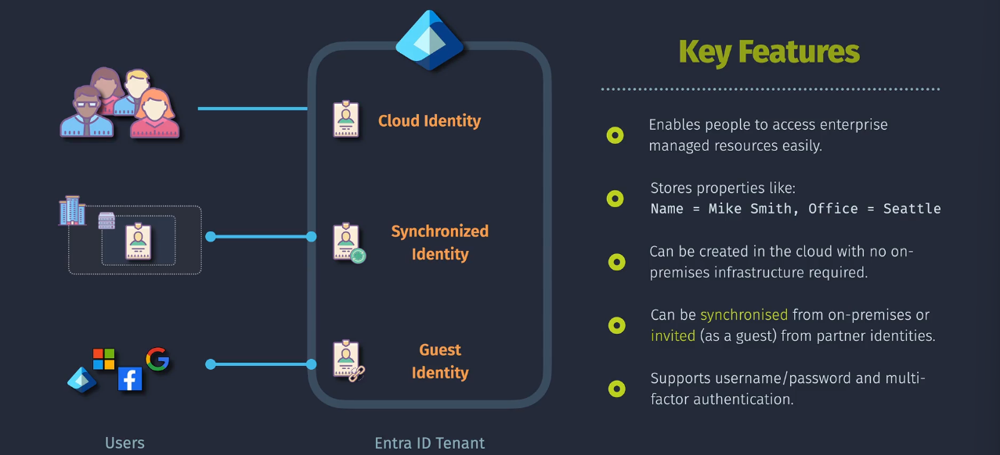

# Identities

## User Identities

- Enables people to access enterprise managed resources easily
- can be created in the cloud only (with no on-premises infrastructure required)
- can be synchronized from on-premises or invited (as a guest) from partner identities

## Application Identities

## Managed Identities

## Groups

## Administrative Units
