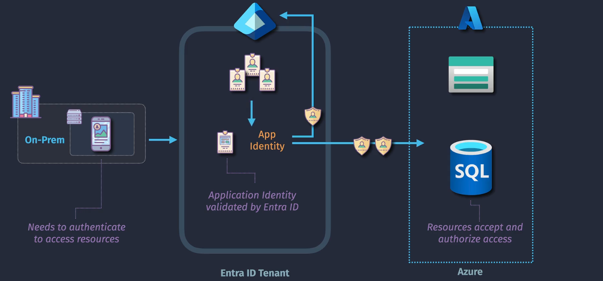
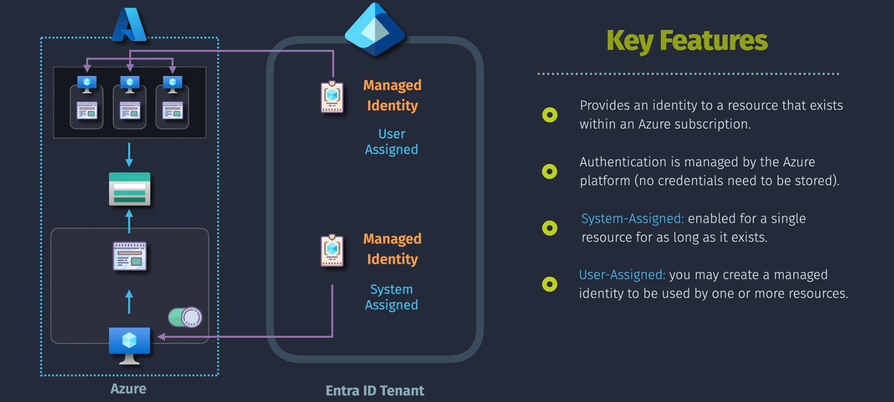

# 📑 Application Registrations in Your Entra ID Organization

## **Introduction**

**Application Registrations** in Azure Entra ID enable you to integrate external or internal applications with your organization's identity and access management system. This integration allows applications to authenticate, authorize, and securely access your organization's resources.

- Helps control both access to an app, and the access an app has to other resources.
- The app itself can reside anywhere, inside or outside of azure.
- Application must registered within an Entra ID tenant (Application Registration).

## **Key Components of Application Registrations**

### 1. **Application ID (Client ID)**

- **Description:** A unique identifier assigned to each registered application.
- **Use Case:** Used by applications to identify themselves when requesting access to resources.

### 2. **Redirect URIs**

- **Description:** URLs where authentication responses are sent and received by the application.
- **Use Case:** Define where your application expects to receive authentication tokens after sign-in.

### 3. **Certificates & Secrets**

- **Client Secret:**
  - **Description:** A password-like string used by the application to authenticate.
  - **Use Case:** Used in confidential client flows where the application can securely store the secret.
- **Certificates:**
  - **Description:** Public key infrastructure (PKI) certificates used for authentication.
  - **Use Case:** Provide a more secure alternative to client secrets, especially for high-security applications.

### 4. **API Permissions**

- **Description:** Define what resources and operations the application can access.
- **Types:**
  - **Delegated Permissions:** Access on behalf of a signed-in user.
  - **Application Permissions:** Access without a user context, suitable for background services or daemons.

### 5. **Roles and Scopes**

- **Description:** Define specific permissions and access levels for applications.
- **Use Case:** Control granular access to resources based on roles and scopes assigned to the application.

## **Authentication Methods**

Azure Entra ID offers several authentication methods for applications to securely interact with your organization's resources:

### 1. **Client Secrets**

- **Usage:** Suitable for web apps, confidential clients.
- **Pros:** Easy to implement.
- **Cons:** Requires secure storage; secrets can expire or be compromised.
- **Best Practices:** Regularly rotate client secrets and store them securely using Azure Key Vault.

### 2. **Certificates**

- **Usage:** Suitable for high-security applications.
- **Pros:** More secure; certificates can be rotated regularly.
- **Cons:** Requires certificate management.
- **Best Practices:** Use certificates over client secrets for enhanced security and automate certificate rotation.

### 3. **Managed Identities**

- **Usage:** Ideal for Azure services interacting with other Azure resources.
- **Pros:** No credentials to manage; seamless integration with Azure services.
- **Cons:** Limited to Azure resources; not suitable for on-premises applications.

## **App Registrations vs. Enterprise Applications**

### **App Registrations**

- **Purpose:**

  - **Development Focused:** Used by developers to **register and configure** applications that will integrate with Azure Entra ID for authentication and authorization.

- **Represents:**

  - **Application Object:** The **global configuration** and definition of an application within your Azure Entra ID tenant.

- **Key Components Managed:**

  - **Application ID (Client ID):** Unique identifier for the application.
  - **Redirect URIs:** URLs where authentication responses are sent.
  - **Certificates & Secrets:** Credentials used for authenticating the application.
  - **API Permissions:** Define what APIs the application can access.
  - **Roles and Scopes:** Specific permissions and access levels for the application.

- **Use Cases:**

  - **Custom Applications:** Web apps, mobile apps, desktop applications developed by your organization.
  - **API Services:** Backend services or APIs requiring Azure AD integration.
  - **Third-Party Integrations:** Applications needing OAuth 2.0 or OpenID Connect protocols for authentication.

- **Access Point in Azure Portal:**
  - **Azure Portal** > **Azure Active Directory** > **App registrations**

### **Enterprise Applications**

- **Purpose:**

  - **Administration Focused:** Used by IT administrators to **manage and configure** how applications are accessed and utilized within the organization.

- **Represents:**

  - **Service Principal:** An **instance** of an application within your Azure Entra ID tenant, representing how the application is used by your organization.

- **Key Components Managed:**

  - **Single Sign-On (SSO) Settings:** Configure how users authenticate to the application.
  - **User and Group Assignments:** Control which users or groups have access to the application.
  - **Provisioning Settings:** Automate user account creation and management within the application.
  - **Access Policies:** Define security policies like Conditional Access for the application.

- **Use Cases:**

  - **SaaS Applications:** Microsoft 365, Salesforce, GitHub, and other third-party SaaS solutions.
  - **Integrated Applications:** Applications from the Azure AD App Gallery that your organization uses.
  - **Internal Tools:** Custom applications deployed and used internally by your teams.

- **Access Point in Azure Portal:**
  - **Azure Portal** > **Azure Active Directory** > **Enterprise applications**

### **Lifecycle Relationship**

1. **App Registration:**

   - **Action:** Register an application via **App Registrations**.
   - **Result:** Creates an **Application Object** in your Azure Entra ID tenant.

2. **Enterprise Application:**
   - **Action:** Once an application is registered, a **Service Principal** is automatically created in the **Enterprise Applications** section.
   - **Result:** Allows administrators to manage how the application is accessed and used within the organization.

### **Roles and Responsibilities**

- **Developers:**

  - Handle **App Registrations** to set up application configurations, authentication methods, and API integrations.

- **IT Administrators:**
  - Manage **Enterprise Applications** to control user access, enforce security policies, assign roles, and monitor application usage.

### **Security and Access Control**

- **App Registrations:**

  - Focus on defining **how** an application authenticates and what resources it can access.

- **Enterprise Applications:**
  - Focus on **who** in the organization can access the application and **how** they authenticate (e.g., via SSO, Conditional Access).

### **Integration with Azure AD App Gallery**

- **App Registrations:**

  - Primarily for **custom** and **in-house** applications that your organization develops or integrates.

- **Enterprise Applications:**
  - Includes both **custom applications** (from App Registrations) and **pre-integrated applications** from the **Azure AD App Gallery**, providing a centralized management interface for all applications your organization uses.

## **Managed Identities in Detail**

**Managed Identities** provide an identity for applications to use when connecting to resources that support Azure AD authentication. They eliminate the need for developers to manage credentials, enhancing security and simplifying identity management.

### **Types of Managed Identities**

#### 1. **System-Assigned Managed Identity**

- **Description:** An identity automatically created and managed by Azure for a specific service instance.
- **Characteristics:**
  - **Lifecycle Tied to Resource:** The identity is created when the resource is created and deleted when the resource is deleted.
  - **Unique to Resource:** Each resource can have only one system-assigned managed identity.
- **Use Cases:**
  - Azure Virtual Machines accessing Azure Key Vault.
  - Azure App Services accessing Azure SQL Database.

#### 2. **User-Assigned Managed Identity**

- **Description:** An identity created as a standalone Azure resource and can be assigned to multiple services.
- **Characteristics:**
  - **Independent Lifecycle:** Exists independently of the resources it's assigned to.
  - **Reusable Across Resources:** Can be shared among multiple resources.
- **Use Cases:**
  - Centralized identity for multiple applications accessing the same resources.
  - Reusing identities across different environments (e.g., development, staging, production).

### **Setting Up Managed Identities**

#### **System-Assigned Managed Identity**

1. **Navigate to the Azure Portal:**
   - Select the resource (e.g., Virtual Machine, App Service).
2. **Enable Managed Identity:**
   - Go to the **Identity** section.
   - Toggle **System-assigned** to **On**.
   - Click **Save** to create the identity.

#### **User-Assigned Managed Identity**

1. **Create a Managed Identity:**
   - In the Azure Portal, navigate to **Managed Identities**.
   - Click **+ Add** to create a new user-assigned managed identity.
2. **Assign to Resources:**
   - Select the resource (e.g., Virtual Machine, App Service).
   - Go to the **Identity** section.
   - Under **User-assigned**, click **Add** and select the created managed identity.

### **Benefits of Managed Identities**

- **Enhanced Security:** Eliminates the need to store credentials in code or configuration files.
- **Simplified Management:** Azure handles the lifecycle and rotation of credentials automatically.
- **Seamless Integration:** Easily integrate with Azure services that support Azure AD authentication.

Certainly! Here's a concise summary highlighting the **differences between App Registrations and Enterprise Applications** in Azure Entra ID. This section is designed to provide a clear and straightforward comparison to help you understand their distinct roles and functionalities.

## **Best Practices for Application Registrations**

1. **Use Managed Identities Whenever Possible:**

   - Prefer managed identities over client secrets or certificates to enhance security and reduce credential management overhead.

2. **Regularly Rotate Secrets and Certificates:**

   - Implement automated processes to rotate client secrets and certificates to minimize the risk of credential compromise.

3. **Apply the Principle of Least Privilege:**

   - Assign only the necessary permissions required for the application to function, reducing potential security vulnerabilities.

4. **Monitor and Audit Application Activities:**

   - Utilize Azure Monitor and Azure AD logs to track application access and activities, ensuring compliance and identifying potential issues.

5. **Securely Store Credentials:**

   - If using client secrets or certificates, store them securely using services like Azure Key Vault.

6. **Define Clear Naming Conventions:**

   - Use consistent and descriptive names for application registrations to simplify management and identification.

7. **Grant Admin Consent Carefully:**
   - Review and approve API permissions diligently to ensure applications have only the access they need.

## 💡 Key Takeaways

1. **Managed Identities Enhance Security:**

   - **System-Assigned:** Automatically managed and tied to the lifecycle of a specific Azure resource.
   - **User-Assigned:** Reusable across multiple resources and managed independently.

2. **Simplified Credential Management:**

   - Eliminates the need to manually manage and rotate credentials, reducing the risk of credential leaks.

3. **Seamless Integration with Azure Services:**

   - Managed identities integrate effortlessly with Azure services, enabling secure and efficient resource access.

4. **Adhere to Best Practices:**

   - Implement the principle of least privilege, regularly rotate secrets and certificates, and monitor application activities to maintain a secure environment.

5. **Flexible Authentication Methods:**
   - Choose the appropriate authentication method (client secrets, certificates, or managed identities) based on your application's security requirements and operational needs.
