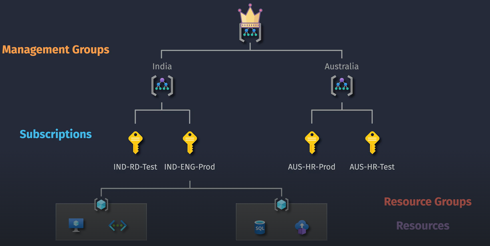
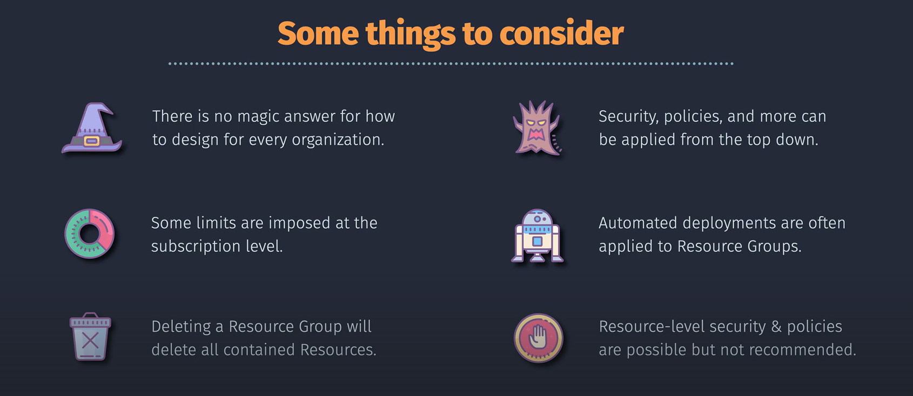

# Azure Hierarchy



## 📑 Table of Contents

1. [🔑 What is an Azure Tenant (Organization)?](#h1)
2. [👤 Azure Accounts and Multiple Tenants](#h2)
3. [📂 Management Groups](#h3)
4. [💳 Subscriptions](#h4)
5. [📁 Resource Groups](#h5)
6. [🛠️ Resources](#h6)
7. [🔄 Putting It All Together: Azure Hierarchy](#h7)
8. [🛡️ Additional Concepts](#h8)
9. [💡 Tips for Managing Azure Hierarchy](#h9)
10. [📌 Summary](#h10)

## 🏢 What is an Azure Tenant (Organization)? <a id='h1'></a>

**Azure Tenant**, synonymous with **Organization** in Azure, is the foundational entity that represents your entire organization within Azure. It’s essentially a dedicated instance of **Entra ID**.

- **Purpose**:
  - Manages identities (users, groups, applications) through Entra ID.
  - Controls access to Azure resources.
- **Key Points**:
  - **Single Tenant**: Typically, an organization has one tenant.
  - **Isolation**: Ensures data and resources are isolated from other tenants.
- **Analogy**: Think of a tenant as your organization’s unique identifier in the Azure ecosystem, similar to a company’s domain.

## 🪪 Azure Accounts and Multiple Tenants <a id='h2'></a>

**Azure Account** (also known as a **Microsoft Account** or **Work/School Account**) is the identity you use to sign in to Azure. A single account can be associated with **multiple tenants (organizations)**, providing flexibility but also introducing complexity.

- **Purpose**:
  - Provides access to one or more Azure tenants.
- **Key Points**:
  - **Single Account, Multiple Tenants**: Switch between different tenants (organizations) using the same Azure account.
  - **Access Management**: Permissions and roles are specific to each tenant.
- **Use Cases**:
  - **Consultants** managing resources for multiple clients.
  - **Employees** working across different departments or subsidiaries with separate tenants.
- **Example**:
  - Your Azure account (e.g., john.doe@company.com) can access both **Tenant A** (Finance) and **Tenant B** (HR).

## 👑 Management Groups <a id='h3'></a>

**Management Groups** help organize multiple Azure subscriptions into a hierarchy for unified policy and access management.

- **Purpose**:
  - Apply policies and access controls across multiple subscriptions.
- **Usage**:
  - Organize by department, region, or project.
- **Example**:
  - **Root Management Group**: Top-level group containing all other management groups.
  - **Child Management Groups**: Specific to departments like **Finance**, **HR**, **IT**.

## 🔑 Subscriptions <a id='h4'></a>

**Subscriptions** are billing and resource management containers within Azure. They link your usage of Azure services to your billing account.

- **Purpose**:
  - Isolate resources for different projects, departments, or environments.
- **Usage**:
  - Each subscription has its own billing and resource quotas.
- **Example**:
  - **IT-Prod Subscription**: For production resources.
  - **IT-Dev Subscription**: For development resources.

## 📁 Resource Groups <a id='h5'></a>

**Resource Groups** are logical containers that hold related Azure resources, making it easier to manage them collectively.

- **Purpose**:
  - Group resources that share the same lifecycle.
- **Usage**:
  - Typically used for a single application, project, or workload.
- **Example**:
  - **WebApp-RG**: Contains the web server, database, and storage for a web application.

## 🛠️ Resources <a id='h6'></a>

**Resources** are the individual services and components you use within Azure, such as Virtual Machines, Databases, and Storage Accounts.

- **Purpose**:
  - Actual Azure services you deploy and use.
- **Usage**:
  - Each resource is part of a resource group and subscription.
- **Example**:
  - **Virtual Machine**: Runs your application.
  - **SQL Database**: Stores your data.

## 🔄 Putting It All Together: Azure Hierarchy <a id='h7'></a>

```plaintext
Azure Account (e.g., alice@contoso.com)
│
├── Tenant A (Contoso Organization)
│   │
│   ├── 👑 Corporate Management Group
│   │   ├── 👑 IT Management Group
│   │   │   ├── 🔑 IT Subscription 1
│   │   │   │   ├── 📁 DevOps Resource Group
│   │   │   │   │   ├── 🛠️ Dev VM
│   │   │   │   │   └── 🛠️ Dev SQL Database
│   │   │   │   └── 📁 ProdOps Resource Group
│   │   │   │       ├── 🛠️ Prod VM
│   │   │   │       └── 🛠️ Prod Storage Account
│   │   │   └── 🔑 IT Subscription 2
│   │   │       └── 📁 Network Resource Group
│   │   │           ├── 🛠️ Virtual Network
│   │   │           └── 🛠️ Firewall
│   │   └── 👑 Finance Management Group
│   │       ├── 🔑 Finance Subscription 1
│   │       │   └── 📁 Accounting Resource Group
│   │       │       ├── 🛠️ Accounting App
│   │       │       └── 🛠️ SQL Database
│   │       └── 🔑 Finance Subscription 2
│   │           └── 📁 Reporting Resource Group
│   │               ├── 🛠️ BI Tools
│   │               └── 🛠️ Data Lake
│   │
└── Tenant B (Fabrikam Organization)
    │
    ├── 👑 HR Management Group
    │   ├── 🔑 HR Subscription 1
    │   │   ├── 📁 HR Resource Group
    │   │   │   ├── 🛠️ HR VM
    │   │   │   └── 🛠️ Payroll Database
    │   │   └── 📁 Training Resource Group
    │   │       ├── 🛠️ Training Portal
    │   │       └── 🛠️ Learning Management System
    │   ├── 🔑 HR Subscription 2
    │   │   └── 📁 Recruitment Resource Group
    │   │       ├── 🛠️ Candidate Database
    │   │       └── 🛠️ Interview Scheduling App
    │   └── 🔑 HR Subscription 3
    │       └── 📁 Benefits Resource Group
    │           ├── 🛠️ Benefits Portal
    │           └── 🛠️ Wellness App
```

In this diagram:

- **Tenant A** (Contoso Organization) has nested management groups under the Corporate Management Group.
- **Tenant B** (Fabrikam Organization) does not have nested management groups, and its subscriptions are directly under the HR Management Group.

## 🛡️ Additional Concepts <a id='h8'></a>

### **Role-Based Access Control (RBAC)**

- **Purpose**: Manage who has access to Azure resources.
- **How It Fits**:
  - Assign roles at different hierarchy levels (management group, subscription, resource group, or resource).
  - Permissions cascade down the hierarchy.
- **Example**: Assigning a "Contributor" role to a team at the subscription level gives them access to all resource groups and resources within that subscription.

### **Azure Policies**

- **Purpose**: Enforce organizational standards and compliance.
- **How It Fits**:
  - Apply policies at management groups or subscriptions to ensure all contained resources adhere to specific rules.
- **Example**: Enforcing that all virtual machines must use specific security configurations across every subscription.

## 💡 Tips for Managing Azure Hierarchy <a id='h9'></a>



1. **Plan Your Structure**:

   - Align the hierarchy with your organization’s structure (departments, projects, regions).
   - Consider how multiple tenants (organizations) will interact with your Azure account.

2. **Use Naming Conventions**:

   - Implement consistent naming for management groups, subscriptions, resource groups, and resources.
   - **Example**: `Finance-Prod-Subscription`, `HR-Test-RG`.

3. **Leverage Tags**:

   - Use tags to add metadata to resources for better organization and cost tracking.
   - **Example**: Tag resources with `Project: Alpha`, `Environment: Production`.

4. **Implement RBAC and Policies**:

   - Secure your resources by assigning appropriate roles and enforcing policies at the right hierarchy levels.
   - Regularly review and update access permissions.

5. **Regularly Review and Optimize**:

   - Periodically assess your hierarchy to ensure it meets your organization’s needs.
   - Optimize for cost, performance, and security.

6. **Manage Multiple Tenants Carefully**:
   - Clearly separate resources and access controls between different tenants.
   - Use **Azure Lighthouse** for managing multiple tenants efficiently if needed.

## 📌 Summary <a id='h10'></a>

**Azure Hierarchy** helps organize and manage your cloud resources effectively. Here’s a quick recap, including handling multiple organizations (tenants) per account:

1. **🏢 Tenant (Organization)**: Your organization’s unique instance in Azure, managed through Entra ID.
2. **💳 Azure Account**: Your single sign-in identity that can access multiple tenants.
3. **👑 Management Groups**: Organize multiple subscriptions for unified management within a tenant.
4. **🔑 Subscriptions**: Billing and resource containers within management groups.
5. **📁 Resource Groups**: Logical containers for related resources within subscriptions.
6. **🛠️ Resources**: Individual Azure services and components you use.
7. **🔄 Hierarchy Flow**:
   - **Single Tenant**: Tenant > Management Groups > Subscriptions > Resource Groups > Resources.
   - **Multiple Tenants**: Azure Account > Tenant A & Tenant B > (Each Tenant follows the hierarchy above).
8. **🛡️ Additional Concepts**: RBAC and Azure Policies enhance security and compliance.

**Key Takeaways:**

- **Azure Account** can access **multiple tenants** (organizations), each with its own isolated hierarchy.
- **Tenants** are the core boundary for managing resources, policies, and access within an organization.
- **Management Groups**, **Subscriptions**, **Resource Groups**, and **Resources** provide a scalable and organized way to manage resources within each tenant.
- Proper planning, naming conventions, tagging, and the use of RBAC and policies are essential for effective Azure management.
