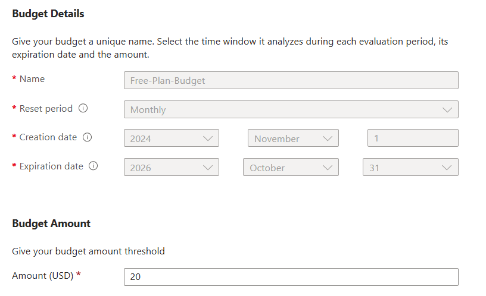
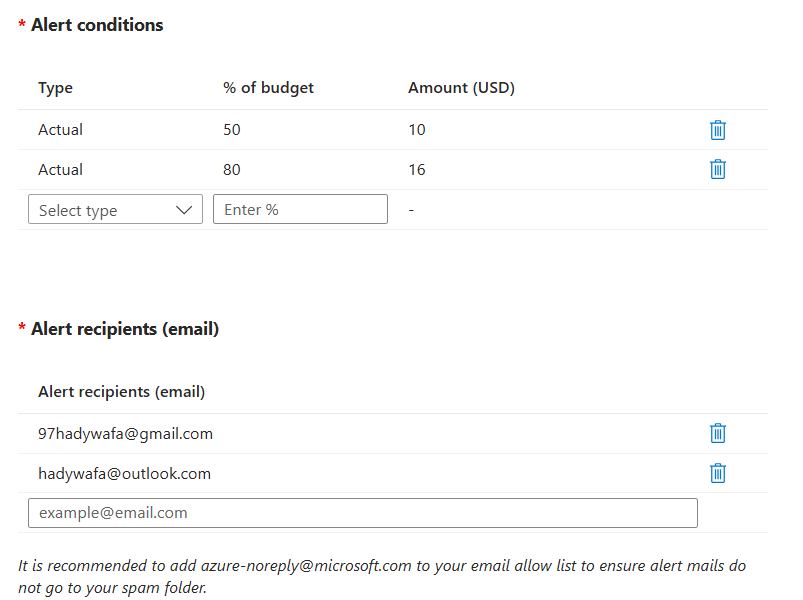

# Azure Subscriptions

## **1. Productivity and Collaboration Subscriptions**

These focus on tools for work, communication, and personal use.

| **Subscription**             | **What It Offers**                                                                                        | **Includes Microsoft Entra ID?**        |
| ---------------------------- | --------------------------------------------------------------------------------------------------------- | --------------------------------------- |
| **Microsoft 365 Personal**   | Premium Office apps (Word, Excel, PowerPoint), 1 TB OneDrive storage, personal email (Outlook).           | Yes, Free Tier only                     |
| **Microsoft 365 Family**     | Same as Personal but for up to 6 users, each with 1 TB OneDrive storage.                                  | Yes, Free Tier only                     |
| **Microsoft 365 Business**   | Business email, Office apps (web/desktop), Teams, SharePoint. Plans include Basic, Standard, and Premium. | Yes, Premium P1 or P2 depending on plan |
| **Microsoft 365 Enterprise** | E3 includes advanced collaboration features. E5 adds advanced security, compliance, and analytics.        | Yes, Premium P1 (E3), Premium P2 (E5)   |

## **2. Cloud Services Subscriptions**

These provide access to infrastructure, platform, and software services.

| **Subscription**               | **What It Offers**                                                                                               | **Includes Microsoft Entra ID?** |
| ------------------------------ | ---------------------------------------------------------------------------------------------------------------- | -------------------------------- |
| **Azure Free Account**         | \$200 credit for 30 days, 12 months of free tier services (e.g., VMs, databases, storage), always-free services. | Yes, Free Tier only              |
| **Azure Pay-As-You-Go**        | Pay for actual usage of Azure resources like VMs, storage, and databases.                                        | Yes, Free Tier only              |
| **Azure Reserved Instances**   | Discounted rates for pre-committed resources over 1 or 3 years.                                                  | Yes, Free Tier only              |
| **Azure Enterprise Agreement** | Customized pricing and terms for organizations with significant Azure usage.                                     | Yes, Free Tier only              |

## **3. Identity and Access Management Subscriptions**

These focus on managing user identities and access to applications.

| **Subscription**              | **What It Offers**                                                                 | **Included in Other Subscriptions?**               |
| ----------------------------- | ---------------------------------------------------------------------------------- | -------------------------------------------------- |
| **Microsoft Entra Free Tier** | Basic identity and access management, single sign-on (SSO), Azure portal access.   | Yes, included in all Azure and Microsoft 365 plans |
| **Microsoft Entra P1**        | Conditional Access, group-based access, advanced security for enterprise apps.     | Included in Microsoft 365 E3 and Business Premium  |
| **Microsoft Entra P2**        | All P1 features plus Identity Protection and Privileged Identity Management (PIM). | Included in Microsoft 365 E5                       |

## **4. Development and Business Applications**

These cater to developers, businesses, and analytics professionals.

| **Subscription**                | **What It Offers**                                                                                                                                | **Includes Microsoft Entra ID?**           |
| ------------------------------- | ------------------------------------------------------------------------------------------------------------------------------------------------- | ------------------------------------------ |
| **Visual Studio Subscriptions** | Access to Visual Studio IDE, Azure credits, and other developer tools.                                                                            | Yes, Free Tier only                        |
| **Dynamics 365**                | CRM and ERP business apps (e.g., Sales, Customer Service, Finance).                                                                               | Yes, Premium features depending on license |
| **Power Platform**              | Tools for building apps (Power Apps), automating workflows (Power Automate), creating dashboards (Power BI), and chatbots (Power Virtual Agents). | Yes, Free Tier only                        |

## **5. Gaming and Consumer Services**

These subscriptions target entertainment and security for individuals.

| **Subscription**        | **What It Offers**                                                                              | **Includes Microsoft Entra ID?** |
| ----------------------- | ----------------------------------------------------------------------------------------------- | -------------------------------- |
| **Xbox Game Pass**      | Access to a library of games, online multiplayer (Xbox Live Gold), and cloud gaming (Ultimate). | No                               |
| **Microsoft Defender**  | Security for devices across Windows, macOS, iOS, and Android.                                   | No                               |
| **OneDrive Standalone** | Paid storage options without requiring Microsoft 365.                                           | No                               |

## **Relationship Between Azure, Entra ID, and Microsoft 365**

1. **Azure Free Account:**

   - Automatically creates a **Microsoft Entra ID tenant** (Free Tier) to manage user identities and access.
   - No direct Microsoft 365 access unless you subscribe separately.

2. **Microsoft 365:**

   - Includes **Microsoft Entra ID** with varying tiers (Free, P1, or P2) depending on the plan.
   - Allows you to log into the Azure portal but does **not** include access to Azure resources.

3. **Microsoft Entra ID (Standalone):**
   - Can be purchased separately or is included in certain Microsoft 365 and Azure plans.

## Azure Free Account

### **Free Azure Account Features**

When you create a free Azure account, you receive:

1. **\$200 Credit for 30 Days:**
   - Use it to explore any Azure services, including virtual machines, databases, and app hosting.
2. **12 Months of Free Popular Services:**
   - Includes free tiers for services like virtual machines, databases, storage, and more.
3. **Always-Free Services:**
   - Services like App Services (1 GB storage) and Functions (1 million requests/month).

### **Entra ID Access in Free Azure Account**

A free Azure account includes a **Free Tier of Microsoft Entra ID (Azure AD)** for managing identities and access. Here’s what’s included:

- **Core Features:**

  - **User Management:** Create and manage users and groups.
  - **Basic Single Sign-On (SSO):** Integrate with Microsoft and third-party applications.
  - **Authentication:**
    - Support for basic multi-factor authentication (MFA) using security defaults.
  - **Azure Portal Access:** Use the Entra ID tenant to log into the Azure Portal and manage Azure resources.

- **Limitations:**
  - No advanced features like conditional access, identity protection, or dynamic groups.
  - For advanced features, you need to upgrade to **Entra ID Premium P1 or P2** (either standalone or bundled with higher Microsoft 365 plans).

### Check your current Azure credit

1. **Sign in to the Azure portal** [https://portal.azure.com](https://portal.azure.com)
2. **Search for "Cost Management + Billing"** and click on the search result.
3. **Select the billing account** for which you want to track the credit balance. Make sure it's of type **Microsoft Customer Agreement**.
4. **On the left-hand side**, select **Payment methods** and then **Azure credits**.
5. **Check the balance section** to see your **current balance** and **estimated balance**.

You're correct that **Azure Free Account** includes **Microsoft Entra ID (formerly Azure Active Directory)** at the **Free Tier** level. Let me refine and categorize Microsoft subscriptions more systematically based on their **purpose** and what they offer.

### Create Budget limit

