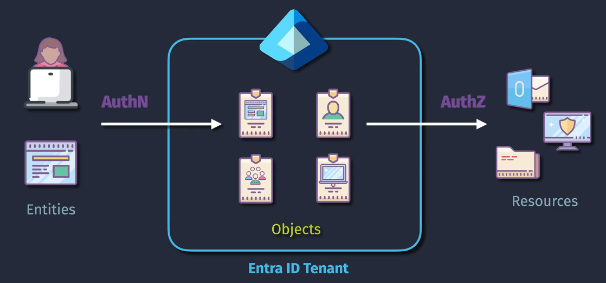

# Entra ID

**Entra ID** is Microsoft's cloud-based identity and access management service, previously known as **Azure Active Directory (Azure AD)**. It enables employees to sign in and access resources such as:

- **Internal Resources:** Apps on your corporate network and intranet.
- **External Resources:** Microsoft 365, the Azure portal, and thousands of other SaaS applications.
  

## Key Features

Here's a simple breakdown of what Entra ID does:

### 1. Single Sign-On (SSO)

- **Unified Access**: Provides a seamless sign-in experience across thousands of cloud applications, on-premises apps, and custom applications.
- **Convenience and Security**: Reduces the number of login prompts by allowing users to sign in once and gain access to multiple applications.

### 2. Identity as a Service (IDaaS)

- **Scalability**: Scales with your business needs, handling identity management for millions of users.
- **Integration**: Supports integration with various SaaS applications, providing a unified identity management solution.

### 3. Identity Security

- **Multifactor Authentication (MFA)**: Enhances security by requiring additional verification steps beyond just passwords.
- **Conditional Access**: Uses policies to enforce access controls based on user, device, location, and risk.
- **Identity Protection**: Protects user identities with advanced threat detection and mitigation features.

### 4. Enterprise Capabilities

- **Application Management**: Simplifies the management of access to applications through a central portal.
- **Directory Services**: Provides comprehensive directory services for user and group management.
- **Privileged Identity Management**: Controls, monitors, and audits access to critical resources.

### 5. Operating System Support

- **Wide OS Support**: Compatible with various operating systems including Windows, macOS, iOS, and Android.
- **Cross-Platform**: Ensures users can access resources securely from any device, regardless of the operating system.

### 6. Hybrid and Cloud Integration

- **Hybrid Identity**: Supports integration with on-premises Active Directory, enabling a hybrid identity solution.
- **Azure AD Connect**: Synchronizes on-premises directories with Microsoft Entra ID, allowing seamless management of hybrid environments.
- **Cloud-First Approach**: Designed for cloud environments, offering a scalable and resilient identity management solution.

## Entra ID Licenses

Entra ID offers various licensing plans to cater to different organizational needs. These licenses provide different levels of features related to identity and access management, security, and compliance.

| Feature                                                | Microsoft Entra ID Free - Security defaults (enabled for all users) | Microsoft Entra ID Free - Global Administrators only    | Office 365 | Microsoft Entra ID P1 | Microsoft Entra ID P2 |
| ------------------------------------------------------ | ------------------------------------------------------------------- | ------------------------------------------------------- | ---------- | --------------------- | --------------------- |
| Protect Microsoft Entra tenant admin accounts with MFA | ✅                                                                  | ✅ (Microsoft Entra Global Administrator accounts only) | ✅         | ✅                    | ✅                    |
| Mobile app as a second factor                          | ✅                                                                  | ✅                                                      | ✅         | ✅                    | ✅                    |
| Phone call as a second factor                          |                                                                     |                                                         | ✅         | ✅                    | ✅                    |
| SMS as a second factor                                 |                                                                     | ✅                                                      | ✅         | ✅                    | ✅                    |
| Admin control over verification methods                |                                                                     | ✅                                                      | ✅         | ✅                    | ✅                    |
| Fraud alert                                            |                                                                     |                                                         |            | ✅                    | ✅                    |
| MFA Reports                                            |                                                                     |                                                         |            | ✅                    | ✅                    |
| Custom greetings for phone calls                       |                                                                     |                                                         |            | ✅                    | ✅                    |
| Custom caller ID for phone calls                       |                                                                     |                                                         |            | ✅                    | ✅                    |
| Trusted IPs                                            |                                                                     |                                                         |            | ✅                    | ✅                    |
| Remember MFA for trusted devices                       |                                                                     | ✅                                                      | ✅         | ✅                    | ✅                    |
| MFA for on-premises applications                       |                                                                     |                                                         |            | ✅                    | ✅                    |
| Conditional Access                                     |                                                                     |                                                         |            | ✅                    | ✅                    |
| Risk-based Conditional Access                          |                                                                     |                                                         |            |                       | ✅                    |
| Self-service password reset (SSPR)                     | ✅                                                                  | ✅                                                      | ✅         | ✅                    | ✅                    |
| SSPR with writeback                                    |                                                                     |                                                         |            | ✅                    | ✅                    |

This table summarizes the various features available across different tiers of Microsoft Entra ID (formerly Azure Active Directory) and Office 365. If you need further assistance or additional details, feel free to ask!

For detailed and the most current information, it's always best to refer directly to the [Microsoft Entra ID Licensing Documentation](https://learn.microsoft.com/en-us/entra/fundamentals/licensing).

## Azure Subscription Relationship

Azure Subscription is the foundation for using Azure services. It acts as a container that holds related resources and allows you to manage and organize them. Here's how it relates to Entra ID:

- **Tenant Association**: Each Azure subscription is linked to a single Entra ID tenant, which provides identity and access management for the subscription. The tenant is where users are created and managed.

- **Subscription to Tenant**:

  - **One-to-One**: Each Azure subscription is linked to one and only one Entra ID tenant. This tenant acts as the identity provider and manages access to the subscription’s resources.

- **Tenant to Subscription**:

  - **One-to-Many**: A single Entra ID tenant can be associated with multiple Azure subscriptions. This allows organizations to organize resources logically, manage costs efficiently, and apply consistent security policies across all subscriptions under the same tenant.

- **Billing**: Subscriptions define the billing model and payment method for the Azure services consumed under it.

- **Resource Organization**: Resources such as virtual machines, databases, and storage accounts are organized within a subscription, which helps in managing costs and access controls.

- **Access Management**: Using Entra ID, administrators can control who has access to resources within a subscription by assigning roles and permissions.

- **Multiple Subscriptions**: Organizations can have multiple subscriptions for different departments or projects, each with its own billing and access control settings.
