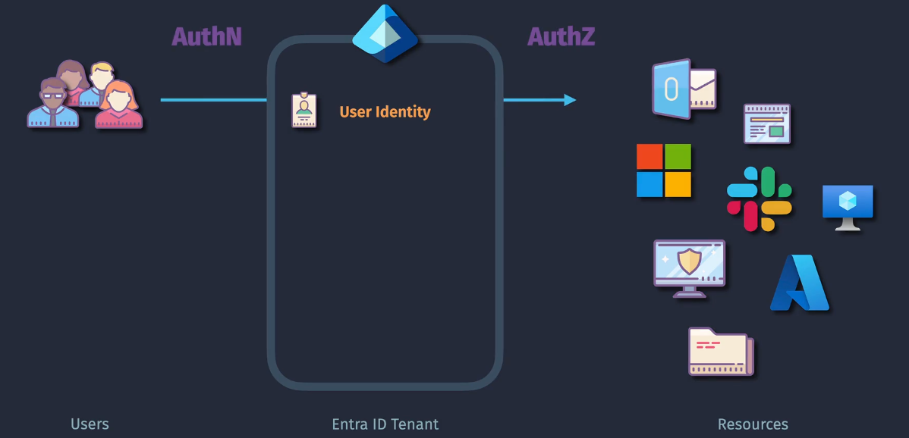
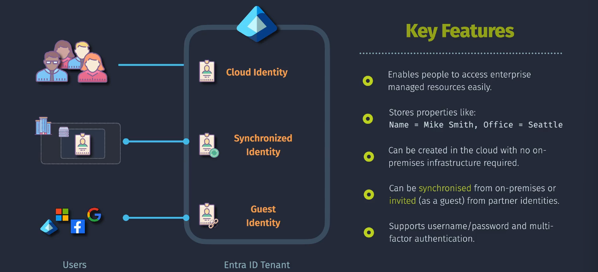

# Microsoft Entra ID Identities

Microsoft Entra ID identities are designed to provide secure and flexible access to resources for a wide range of users, from employees and students to external collaborators and automated services. By supporting various identity types, Microsoft Entra ID ensures that organizations can manage access effectively while maintaining security and compliance.

## Entra ID Identities Types

### User Identities

1. **Work or School Accounts**

   - **Description**: Managed by organizations or educational institutions.
   - **Usage**: For employees or students to access organizational or educational resources.
   - **Example**: An employee at Contoso using their corporate email (`alice@contoso.com`) to sign in to company applications.

2. **Personal Microsoft Accounts**

   - **Description**: Managed by individuals for personal use.
   - **Usage**: For accessing personal Microsoft services like Outlook, OneDrive, and Xbox.
   - **Example**: A user signing in to their personal OneDrive account.

3. **Guest Accounts**

   - **Description**: Temporary access for external users.
   - **Usage**: For collaboration with external partners or vendors.
   - **Example**: A consultant being granted temporary access to a project management tool within an organization.

4. **Hybrid Identities**

   - **Description**: Synchronized from on-premises Active Directory.
   - **Usage**: For accessing both on-premises and cloud resources.
   - **Example**: A user logging into their Windows workstation and Office 365 with the same credentials.

### Applications Identities

1. **Application Identities**

   - **Description**: Representations of applications within Microsoft Entra ID.
   - **Usage**: For applications to authenticate and access resources.
   - **Example**: An application using an application identity to access a database.

2. **Managed Identities**

   - **Description**: Automatically managed identities for Azure resources.
   - **Types**:
     - **System-assigned**: Tied to the lifecycle of an Azure resource.
     - **User-assigned**: Can be assigned to multiple resources.
   - **Usage**: For applications to access resources without managing credentials.
   - **Example**: An Azure virtual machine using a system-assigned managed identity to access a storage account.
