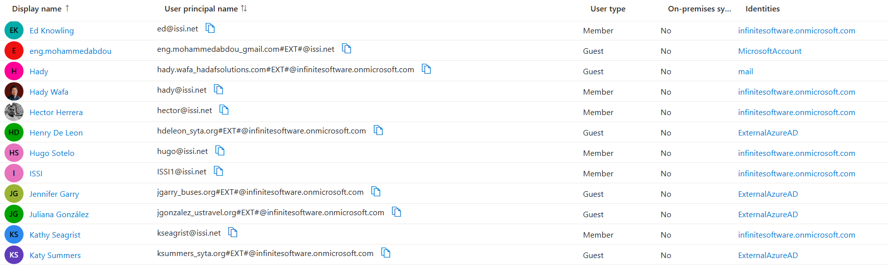

# Entra ID User Identities

## Types of Users in Entra ID

### 1. **🔒 Internal Users (Organization)**

- **Description:** Users who are part of your organization's Entra ID tenant.
- **Identifiers:**
  - **Default Domain:** `xxx@infinitesoftware.onmicrosoft.com`
  - **Custom Domain:** `brigit@issi.net` (after registering a custom domain)
  - **Custom Domain:** `BuyerInfo@tianguis.com` (after registering a custom domain)
- **Characteristics:**
  - **Full Access:** Based on assigned roles and permissions within the tenant.
  - **Managed Internally:** Created and managed directly within your Entra ID tenant.
- **Use Cases:**
  - Employees accessing internal applications, email, and resources.
  - Users requiring comprehensive access based on their roles.

### 2. **🌐 ExternalAzureAD**

- **Description:** Users from **other Entra ID (Azure AD) organizations** invited to collaborate with your organization.
- **Identifiers:**
  - **Example UPN:** `brome_buses.org#EXT#@infinitesoftware.onmicrosoft.com`
    - can login from his organization account `brome@buses.org`
  - **Example UPN:** `sbedolla_cie.com.mx#EXT#@issi.net` (after registering a custom domain)
    - can login from his organization account `sbedolla@cie.com`
- **Characteristics:**
  - **Guest Access:** Limited access to specific resources or applications as defined by your organization.
  - **Federated Authentication:** Authenticate using their home organization's Entra ID credentials.
  - **Managed via Azure AD B2B:** Utilizes Business-to-Business (B2B) collaboration for secure external access.
- **Use Cases:**
  - Partners, contractors, or consultants needing access to collaborative projects.
  - External teams working on shared documents or applications.

### 3. **📧 MicrosoftAccount**

- **Description:** **Personal Microsoft accounts** used by individuals outside your organization to access resources as guests.
- **Identifiers:**

  - **Example UPN:** `ahmed.abdou_hadafsolutions.net#EXT#@infinitesoftware.onmicrosoft.com`
    - Can login from his Personal Microsoft account that was created with `ahmed.abdou@hadafsolutions.net` UserName
  - **Example UPN:** `brigit.hassan_gmail.com#EXT#@issi.net` (after registering a custom domain)
    - Can login from his Personal Microsoft account that was created with `brigit.hassan@gmail` UserName

- **Characteristics:**
  - **Personal Credentials:** Users authenticate using their personal Microsoft Account credentials (e.g., Outlook.com, Live.com, or accounts linked to other email providers like Gmail).
  - **Limited Access:** Similar to Guest Users, with permissions defined by your organization.
  - **Managed via Azure AD B2B:** Facilitates secure collaboration without requiring a separate organizational account.
- **Use Cases:**
  - Freelancers or independent contractors using personal email accounts.
  - External collaborators preferring to use their existing Microsoft accounts for access.

### 4. **✉️ mail**

- **Description:** **External users** with any email provider (e.g., Gmail, Yahoo) invited to access your organization without needing a Microsoft Account.
- **Identifiers:**

  - **Example UPN:** `hady.wafa_hadafsolutions.com#EXT#@infinitesoftware.onmicrosoft.com`
    - Can login from his Personal mail account `hady.wafa@hadafsolutions.net`
  - **Example UPN:** `hadywafa97@gmail#EXT#@your-tenant.onmicrosoft.com`
    - Can login from his Personal mail account `hadywafa97@gmail`

- **Characteristics:**
  - **Passwordless Authentication:** Users authenticate using a **one-time code** sent to their email.
  - **No Microsoft Account Needed:** Simplifies access for users without requiring them to create or manage a Microsoft Account.
  - **Managed via Azure AD B2B:** Facilitates secure collaboration without additional account setups.
- **Use Cases:**
  - Freelancers or independent contractors using personal email accounts.
  - External collaborators who prefer not to use a Microsoft Account for access.

## 🔧 User Lifecycle Management

Managing the lifecycle of user identities involves creating, updating, and deleting user accounts to ensure they have appropriate access throughout their association with the organization.

### ➕ Creating Users

- **Manual Creation:**
  - **Azure Portal:** Administrators can manually create users through the Entra ID section.
  - **Microsoft 365 Admin Center:** Create users within the Microsoft 365 environment.
- **Bulk Creation:**
  - **CSV Import:** Import multiple users using a CSV file.
  - **PowerShell Scripts:** Automate user creation with scripts.
- **Automated Provisioning:**
  - **HR Systems Integration:** Sync users from HR systems like SAP or Workday using Azure AD Connect or third-party tools.

### ✏️ Updating Users

- **Profile Information:**
  - Update user attributes such as name, email, job title, department, and contact information.
- **Role Assignments:**
  - Modify user roles and permissions based on changing responsibilities.
- **Authentication Methods:**
  - Update or enforce new authentication methods like MFA or passwordless options.
- **Group Memberships:**
  - Add or remove users from groups to adjust access levels.

### 🗑️ Deleting Users

- **Soft Delete:**
  - **Recycle Bin:** Deleted users are moved to the recycle bin for a specified period (typically 30 days) before permanent deletion.
- **Permanent Deletion:**
  - **Permanently Remove:** After the retention period, users are permanently deleted from the tenant.
- **Considerations:**
  - **Resource Ownership:** Reassign resources owned by the deleted user to prevent access issues.
  - **Licenses:** Release or reassign licenses held by the deleted user.
