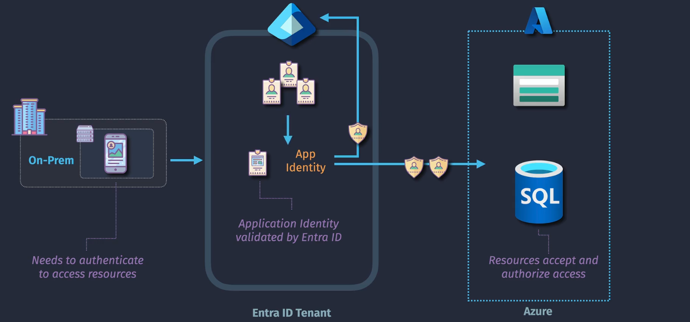
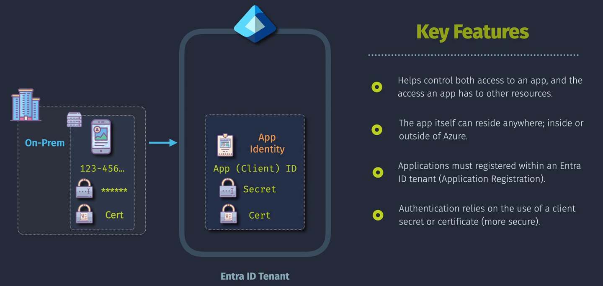

# Application Registrations

**Application Registrations** in Azure Entra ID enable you to integrate external or internal applications with your organization's identity and access management system. This integration allows applications to authenticate, authorize, and securely access your organization's resources.

## **Key Components of Application Registrations**

### 1. **Application ID (Client ID)**

- **Description:** A unique identifier assigned to each registered application.
- **Use Case:** Used by applications to identify themselves when requesting access to resources.

### 2. **Redirect URIs**

- **Description:** URLs where authentication responses are sent and received by the application.
- **Use Case:** Define where your application expects to receive authentication tokens after sign-in.

### 3. **Certificates & Secrets**

- **Client Secret:**
  - **Description:** A password-like string used by the application to authenticate.
  - **Use Case:** Used in confidential client flows where the application can securely store the secret.
- **Certificates:**
  - **Description:** Public key infrastructure (PKI) certificates used for authentication.
  - **Use Case:** Provide a more secure alternative to client secrets, especially for high-security applications.

### 4. **API Permissions**

- **Description:** Define what resources and operations the application can access.
- **Types:**
  - **Delegated Permissions:** Access on behalf of a signed-in user.
  - **Application Permissions:** Access without a user context, suitable for background services or daemons.

### 5. **Roles and Scopes**

- **Description:** Define specific permissions and access levels for applications.
- **Use Case:** Control granular access to resources based on roles and scopes assigned to the application.

## **App Registrations vs. Enterprise Applications**

### **App Registrations**

- **Purpose:**

  - **Development Focused:** Used by developers to **register and configure** applications that will integrate with Azure Entra ID for authentication and authorization.

- **Represents:**

  - **Application Object:** The **global configuration** and definition of an application within your Azure Entra ID tenant.

- **Key Components Managed:**

  - **Application ID (Client ID):** Unique identifier for the application.
  - **Redirect URIs:** URLs where authentication responses are sent.
  - **Certificates & Secrets:** Credentials used for authenticating the application.
  - **API Permissions:** Define what APIs the application can access.
  - **Roles and Scopes:** Specific permissions and access levels for the application.

- **Use Cases:**

  - **Custom Applications:** Web apps, mobile apps, desktop applications developed by your organization.
  - **API Services:** Backend services or APIs requiring Azure AD integration.
  - **Third-Party Integrations:** Applications needing OAuth 2.0 or OpenID Connect protocols for authentication.

- **Access Point in Azure Portal:**
  - **Azure Portal** > **Azure Active Directory** > **App registrations**

### **Enterprise Applications**

- **Purpose:**

  - **Administration Focused:** Used by IT administrators to **manage and configure** how applications are accessed and utilized within the organization.

- **Represents:**

  - **Service Principal:** An **instance** of an application within your Azure Entra ID tenant, representing how the application is used by your organization.

- **Key Components Managed:**

  - **Single Sign-On (SSO) Settings:** Configure how users authenticate to the application.
  - **User and Group Assignments:** Control which users or groups have access to the application.
  - **Provisioning Settings:** Automate user account creation and management within the application.
  - **Access Policies:** Define security policies like Conditional Access for the application.

- **Use Cases:**

  - **SaaS Applications:** Microsoft 365, Salesforce, GitHub, and other third-party SaaS solutions.
  - **Integrated Applications:** Applications from the Azure AD App Gallery that your organization uses.
  - **Internal Tools:** Custom applications deployed and used internally by your teams.

- **Access Point in Azure Portal:**
  - **Azure Portal** > **Azure Active Directory** > **Enterprise applications**

### **Lifecycle Relationship**

1. **App Registration:**

   - **Action:** Register an application via **App Registrations**.
   - **Result:** Creates an **Application Object** in your Azure Entra ID tenant.

2. **Enterprise Application:**
   - **Action:** Once an application is registered, a **Service Principal** is automatically created in the **Enterprise Applications** section.
   - **Result:** Allows administrators to manage how the application is accessed and used within the organization.

### **Roles and Responsibilities**

- **Developers:**

  - Handle **App Registrations** to set up application configurations, authentication methods, and API integrations.

- **IT Administrators:**
  - Manage **Enterprise Applications** to control user access, enforce security policies, assign roles, and monitor application usage.

### **Security and Access Control**

- **App Registrations:**

  - Focus on defining **how** an application authenticates and what resources it can access.

- **Enterprise Applications:**
  - Focus on **who** in the organization can access the application and **how** they authenticate (e.g., via SSO, Conditional Access).

### **Integration with Azure AD App Gallery**

- **App Registrations:**

  - Primarily for **custom** and **in-house** applications that your organization develops or integrates.

- **Enterprise Applications:**
  - Includes both **custom applications** (from App Registrations) and **pre-integrated applications** from the **Azure AD App Gallery**, providing a centralized management interface for all applications your organization uses.
