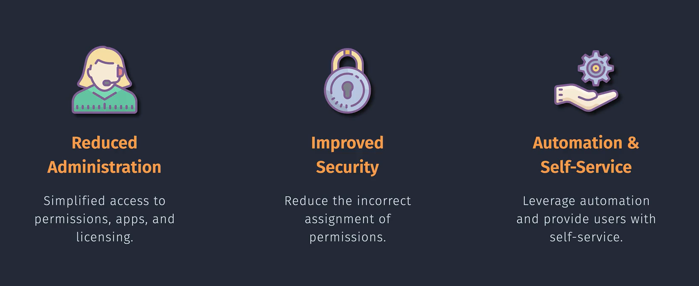
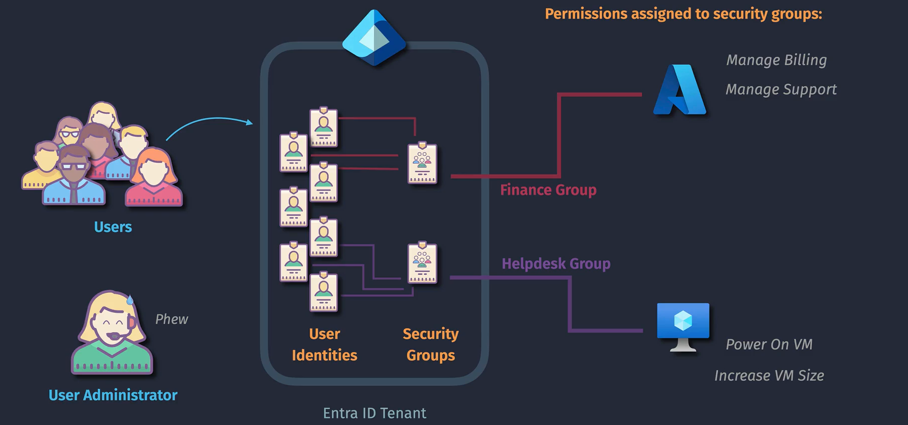
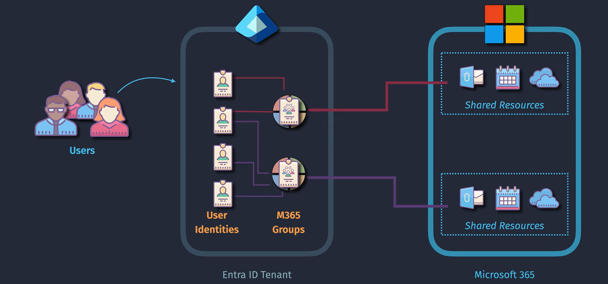
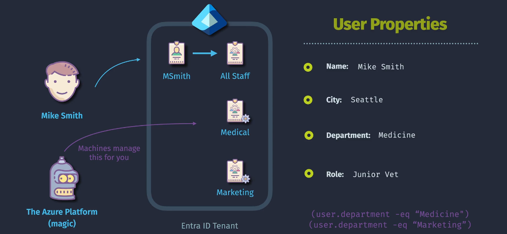
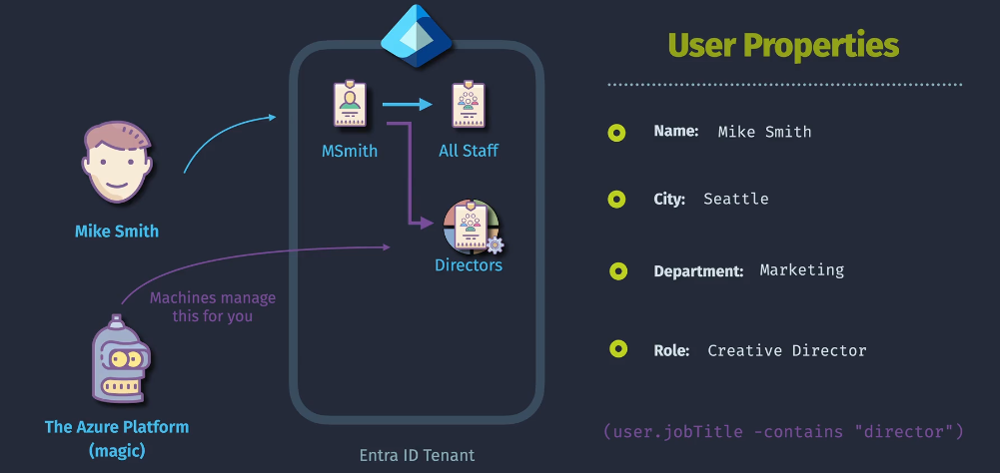
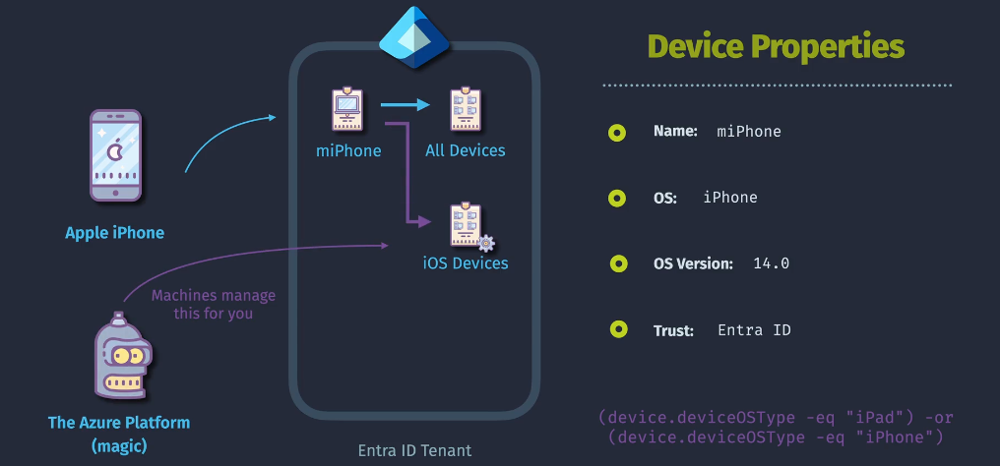

# Entra ID Groups

**Groups** in Azure Entra ID (formerly Azure Active Directory) are essential for organizing users, managing access to resources, and simplifying administrative tasks. By grouping users, you can efficiently assign permissions, enforce security policies, and streamline collaboration within your organization.

- **Centralized Management:** Groups provide a centralized way to manage user access and permissions.
- **Scalable Access Control:** Simplify the assignment of permissions by managing them at the group level rather than individually.
- **Enhanced Collaboration:** Facilitate teamwork by organizing users into meaningful groups based on roles, departments, or projects.

## **Types of Groups in Entra ID**

Azure Entra ID offers several types of groups to cater to different organizational needs:

### 1. **🔒 Security Groups**

- **Purpose:** Control access to resources such as applications, files, and folders.
- **Characteristics:**
  - **Access Management:** Assign permissions to a group rather than individual users.
  - **Role-Based Access Control (RBAC):** Implement RBAC by assigning roles to security groups.
- **Use Cases:**
  - Granting access to specific applications or Azure resources.
  - Managing permissions for on-premises resources integrated with Azure AD.

### 2. **📧 Microsoft 365 Groups**

- **Purpose:** Enhance collaboration by providing shared resources for group members.
- **Characteristics:**

  - **Shared Resources:** Includes a shared mailbox, calendar, SharePoint site, Planner, and OneNote notebook.
  - **Collaboration Tools:** Integrated with Microsoft 365 apps for seamless teamwork.

- **Use Cases:**

  - Project teams needing shared collaboration tools.
  - Departments requiring a centralized communication hub.

- **Notes:**
  - Require at least Entra ID Premium P1 Licensing

## **Group Membership Types**

Managing group memberships effectively is crucial for maintaining security and ensuring proper access control:

### 1. **🧑‍💻 Assigned**

- **Description:** Members are manually added and removed by administrators.

- **Characteristics:**

  - **Manual Management:** Suitable for small or infrequently changing groups.
  - **Predictable Membership:** Ideal for groups with a stable set of members.

- **Use Case**: Suitable for small teams or specific projects where precise control over membership is needed.
- **Example**: Manually adding each member of the HR department to a security group that grants access to HR resources.

### 2. **🩻 Dynamic**

#### 1. **Dynamic User**

- **Description:** is a Membership that automatically managed based on defined rules and user attributes.
  

- **Characteristics:**

  - **Automated Management:** Reduces administrative overhead by automatically adding/removing members.
  - **Attribute-Based:** Uses user properties (e.g., department, job title) to determine group membership.

- **Use Case**: Ideal for large organizations where user attributes (such as department, location, or job title) frequently change.
- **Example**: Automatically adding users from the "Sales" department to a group using a dynamic rule like `user.department -eq "Sales"`.

#### 2. **Dynamic MS 365**

- **Description:** is a Membership that dynamically determined based on user attributes similar to dynamic user membership but within the context of Microsoft 365 Groups. This allows for collaboration features like shared mailboxes, calendars, and document libraries.
  

- **Use Case:** Ideal for organizations that want to automate collaboration group memberships based on user attributes.

- **Example:** Automatically adding users from the "Marketing" department to a Microsoft 365 group using a dynamic rule like user.department -eq "Marketing".

#### 3. **Dynamic Device**

- **Description**: is a Membership that dynamically determined based on device attributes. Rules are defined to include devices whose attributes meet specified criteria.
  
- **Use Case**: Useful for managing devices based on attributes such as device type, operating system, or compliance status.
- **Example**: Automatically adding Windows 10 devices to a group using a dynamic rule like `device.operatingSystem -eq "Windows 10"`.

### **Notes:**

- Dynamic User and Dynamic M365 Groups Require at least Entra ID Premium P1 Licensing
- You cannot manually change the membership of dynamic groups
- Dynamic groups can be for devices or users (but not both at same time)

## **Creating and Managing Groups**

Efficient group management ensures that users have the appropriate access and that group memberships remain up-to-date.

### 1. **Creating Groups**

**Via Azure Portal:**

1. **Navigate to Azure Portal:**

   - Go to [Azure Portal](https://portal.azure.com/).
   - Select **Azure Entra ID** from the left-hand navigation pane.

2. **Create a New Group:**
   - Click on **Groups** > **New group**.
   - **Group Type:** Choose between **Security** or **Microsoft 365**.
   - **Group Name:** Provide a meaningful name.
   - **Group Description:** (Optional) Describe the purpose of the group.
   - **Membership Type:** Select **Assigned** for static or **Dynamic User** for dynamic users or **Dynamic Device** for dynamic devices.
   - Click **Create** to finalize.

### 2. **Assigning Members**

- **Static Groups:** Manually add or remove members through the group's **Members** section.
- **Dynamic Groups:** Define rules based on user attributes under the group's **Dynamic membership rules**.

### 3. **Managing Ownership**

- **Group Owners:** Assign one or more owners who have the ability to manage group memberships and settings.
- **Best Practices:** Ensure that each group has at least one owner to maintain management continuity.

## **Group-Based Access Management**

Utilizing groups to manage access simplifies permissions assignment and enhances security.

### 1. **Assigning Roles to Groups**

- **Role Assignment:** Assign Azure AD roles (e.g., Global Administrator, User Administrator) to groups to manage permissions collectively.
- **Benefits:** Streamlines role assignments and ensures consistency across group members.

### 2. **Application Access via Groups**

- **App Assignments:** Assign applications to groups to control which users can access specific applications.
- **Conditional Access:** Apply conditional access policies to groups to enforce security requirements like MFA.

## **Best Practices for Managing Groups**

Adhering to best practices ensures effective and secure group management within your organization.

### 1. **Naming Conventions**

- **Consistency:** Use clear and consistent naming conventions to easily identify group purposes.
- **Examples:** `HR-Team`, `IT-Admins`, `ProjectX-Members`.

### 2. **Minimizing Group Sprawl**

- **Avoid Over-Proliferation:** Limit the number of groups to reduce complexity and management overhead.
- **Consolidate When Possible:** Merge groups with similar purposes to streamline access control.

### 3. **Using Dynamic Groups Appropriately**

- **Suitability:** Implement dynamic groups for roles or departments with frequent membership changes.
- **Rule Accuracy:** Ensure that dynamic membership rules are accurately defined to prevent unauthorized access.

### 4. **Regular Audits**

- **Periodic Reviews:** Regularly audit group memberships and permissions to ensure they remain appropriate.
- **Automated Tools:** Utilize Azure AD access reviews to automate the auditing process.

### 5. **Implementing Security Measures**

- **Conditional Access:** Apply conditional access policies to groups to enforce security standards.
- **Multi-Factor Authentication (MFA):** Require MFA for groups accessing sensitive resources.

## **Comprehensive Summary Table**

| **Aspect**                       | **Security Groups**                               | **Microsoft 365 Groups**                                  |
| -------------------------------- | ------------------------------------------------- | --------------------------------------------------------- |
| **Purpose**                      | Control access to resources.                      | Enhance collaboration with shared resources.              |
| **Shared Resources**             | None (focus on security).                         | Shared mailbox, calendar, SharePoint, Planner, OneNote.   |
| **Membership Types**             | Static and Dynamic.                               | Typically dynamic for collaboration purposes.             |
| **Use Cases**                    | Granting access to applications, Azure resources. | Project teams, departments requiring collaboration tools. |
| **Access Control**               | Assign permissions to groups for resource access. | Use for assigning collaborative permissions.              |
| **Integration**                  | Integrates with RBAC for Azure resources.         | Integrates with Microsoft 365 apps for collaboration.     |
| **Access Point in Azure Portal** | **Groups** > **Security**.                        | **Groups** > **Microsoft 365**.                           |

## 💡 **Key Takeaways**

1. **Diverse Group Types for Varied Needs:**

   - **Security Groups** are ideal for controlling access to resources.
   - **Microsoft 365 Groups** facilitate collaboration with shared tools and resources.
   - **Mail-Enabled Security Groups** offer a combination of access control and email distribution.

2. **Efficient Access Management:**

   - Assign permissions and roles at the group level to simplify access management.
   - Utilize dynamic groups to automate membership based on user attributes, reducing administrative overhead.

3. **Enhanced Security Practices:**

   - Implement **Role-Based Access Control (RBAC)** to ensure users and groups have only the necessary permissions.
   - Enforce **Multi-Factor Authentication (MFA)** for groups accessing sensitive resources to bolster security.

4. **Streamlined Group Management:**

   - Adopt clear naming conventions to easily identify group purposes and manage memberships effectively.
   - Regularly audit groups and their permissions to maintain security and compliance.

5. **Leveraging Conditional Access:**

   - Apply conditional access policies to groups to enforce security requirements based on user context, device compliance, and location.

6. **Facilitating Collaboration and Communication:**
   - Use **Microsoft 365 Groups** to enhance teamwork with integrated collaboration tools.
   - Utilize **Mail-Enabled Security Groups** to efficiently distribute communications while managing access controls.

## 📌 Final Summary

Managing **Groups** in Azure Entra ID is pivotal for efficient access control, enhanced collaboration, and robust security within your organization. By understanding and leveraging the different types of groups—**Security Groups**, **Microsoft 365 Groups**, and **Mail-Enabled Security Groups**—you can tailor your group strategy to meet varied organizational needs.

### **Key Points:**

- **Security Groups:**

  - **Use:** Control access to applications, Azure resources, and other secured resources.
  - **Management:** Assign permissions and roles to groups to streamline access control.

- **Microsoft 365 Groups:**

  - **Use:** Facilitate collaboration with shared tools like mailboxes, SharePoint sites, and planners.
  - **Management:** Manage collaborative permissions and shared resources for project teams and departments.

### **Best Practices:**

- **Adopt Clear Naming Conventions:** Ensure groups are easily identifiable and their purposes are clear.
- **Implement Role-Based Access Control (RBAC):** Assign roles to groups to manage permissions efficiently.
- **Utilize Dynamic Groups:** Automate group memberships based on user attributes to reduce manual management.
- **Regularly Audit Groups:** Conduct periodic reviews of group memberships and permissions to maintain security and compliance.
- **Enforce Multi-Factor Authentication (MFA):** Strengthen security for groups accessing sensitive resources.
