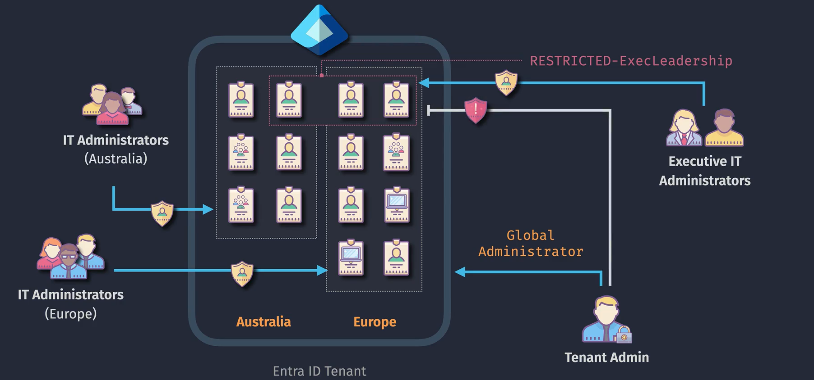
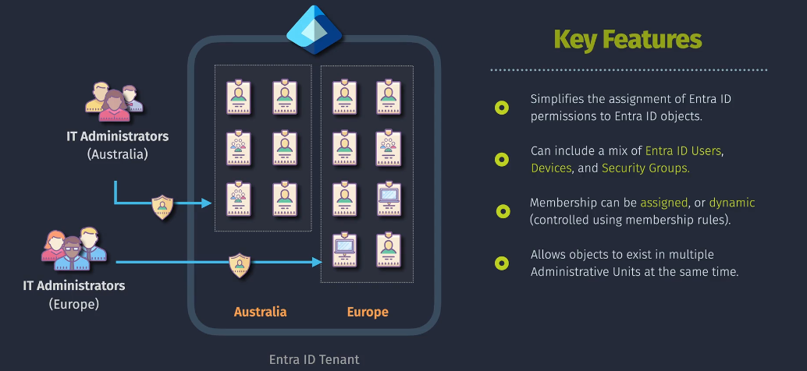

# Entra ID Administrative Units

**Administrative Units (AUs)** are organizational boundaries within Azure Entra ID that allow you to delegate administrative tasks to specific administrators for particular subsets of users and groups. This segmentation is especially beneficial for large organizations with multiple departments, regions, or business units.

While Security Groups manage access to resources, Administrative Units manage who can administer those groups and users, providing a layered approach to access and administration.

## **Key Characteristics:**

- **Scope Limitation:** Administrators assigned to an AU can manage only the users and groups within that AU.
- **Role-Based Delegation:** Assign Azure AD roles (e.g., User Administrator, Group Administrator) specifically within the context of an AU.
- **Flexible Organization:** Align AUs with your organizational structure, such as departments, regions, or projects.

## **Benefits of Administrative Units**

1. **Delegated Administration:**

   - **Empower Local Admins:** Allow department-specific administrators to manage their own users and groups without accessing the entire directory.
   - **Reduce Centralized Burden:** Decentralize administrative tasks, making management more efficient and scalable.

2. **Enhanced Security:**

   - **Least Privilege Principle:** Ensure administrators have only the permissions necessary for their specific AU.
   - **Minimize Risk:** Limit the potential impact of compromised administrative accounts to their respective AUs.

3. **Organizational Alignment:**
   - **Reflect Structure:** Mirror your organization's hierarchy or operational divisions within Azure Entra ID.
   - **Simplify Policies:** Apply policies and access controls that align with specific organizational units.

## 🔞 **Restricted Management Administrative Units Option**

- **What that option?**

  - **Restricted Management Administrative Units (AUs)** are specialized containers in Azure Entra ID that limit administrative permissions strictly to designated AU administrators.
  - **Purpose:** Enhance security by ensuring that only specific admins can manage users, groups, and resources within the AU, preventing broader administrative access.

- **When Not Enabled (Default mode)?**

  - **Global Administrators** and other high-level admin roles typically have access to manage all Administrative Units by default.
  - **Impact of Restriction:** When the **Restricted Management** option is enabled for an AU, even Global Administrators cannot manage that AU unless they are explicitly added as AU admins.

- **When Enabled?**

  - **When Creating an AU:** During the creation of an Administrative Unit, you can enable the **Restricted Management** option to confine management privileges.
  - **Result:** Only users assigned as AU administrators can perform management tasks within that AU, effectively isolating it from other administrative controls.

- **How to Disabled it?**
  - **Using PowerShell:**
    - **Assign Yourself as an AU Admin:** Utilize PowerShell scripts to add your Global Admin account as an AU administrator.
    - **Steps:**
      1.  Install and import the AzureAD or Microsoft Graph PowerShell module.
      2.  Connect to Azure AD using your Global Admin credentials.
      3.  Retrieve the AU’s Object ID.
      4.  Assign your account as an AU admin using appropriate cmdlets.
  - **Contacting Microsoft Support:**
    - If PowerShell methods are unsuccessful, reach out to Microsoft Support to regain access.

## **Creating and Managing Administrative Units**

### **Prerequisites:**

- **Azure AD Premium P1 or P2 License:** Administrative Units require Azure AD Premium licensing.
- **Global Administrator or Privileged Role Administrator Role:** Only users with these roles can create and manage AUs.

### **Steps to Create an Administrative Unit:**

1. **Navigate to Azure Portal:**

   - Go to [Azure Portal](https://portal.azure.com/).
   - Select **Azure Active Directory** from the left-hand navigation pane.

2. **Access Administrative Units:**

   - In the Azure AD pane, select **Administrative units**.

3. **Create a New Administrative Unit:**
   - Click on **+ New administrative unit**.
   - **Name:** Enter a meaningful name for the AU (e.g., "Sales Department", "Europe Region").
   - **Description:** (Optional) Provide a description to clarify the purpose of the AU.
   - Click **Create** to finalize.

### **Assigning Users and Groups to an Administrative Unit:**

1. **Select the Administrative Unit:**

   - From the **Administrative units** list, click on the AU you wish to manage.

2. **Add Members:**
   - Navigate to the **Members** section.
   - Click on **+ Add members**.
   - Select the users or groups you want to include in the AU.
   - Click **Select** to add them.

### **Assigning Administrators to an Administrative Unit:**

1. **Navigate to the AU:**

   - Select the desired AU from the **Administrative units** list.

2. **Assign Roles:**
   - Go to the **Administrators** section.
   - Click on **+ Add assignments**.
   - **Role:** Choose the appropriate Azure AD role (e.g., User Administrator, Group Administrator).
   - **Select Members:** Choose the users or groups to assign the role within this AU.
   - Click **Add** to assign the role.

## **Best Practices for Using Administrative Units**

1. **Align with Organizational Structure:**

   - **Logical Segmentation:** Create AUs that reflect your company's departments, regions, or business units to ensure intuitive management.

2. **Adhere to the Principle of Least Privilege:**

   - **Minimal Permissions:** Assign only the necessary roles and permissions to administrators within each AU to reduce security risks.

3. **Regularly Review AU Memberships and Assignments:**

   - **Access Reviews:** Periodically audit group memberships and role assignments to ensure they remain appropriate and compliant.

4. **Use Descriptive Naming Conventions:**

   - **Clarity:** Name AUs clearly to reflect their purpose, making it easier for administrators to understand their scope.

5. **Leverage Dynamic Memberships:**

   - **Automation:** Utilize dynamic group memberships within AUs to automatically manage memberships based on user attributes, reducing manual overhead.

6. **Implement Conditional Access Policies:**

   - **Enhanced Security:** Apply conditional access policies at the AU level to enforce security requirements tailored to specific organizational units.

7. **Document Administrative Boundaries:**
   - **Transparency:** Maintain clear documentation outlining the scope and responsibilities of each AU to ensure consistent management practices.

## Final Summary

While Security Groups manage access to resources, Administrative Units manage who can administer those groups and users, providing a layered approach to access and administration.

**Administrative Units** in Azure Entra ID provide a powerful mechanism for delegating administrative responsibilities within your organization. By segmenting users and groups into specific organizational units, you can:

- **Delegate Administration Effectively:** Assign administrative roles to specific segments without granting broader access, adhering to the principle of least privilege.
- **Enhance Security:** Limit the scope of administrative access to reduce potential security risks and maintain tighter control over sensitive resources.
- **Align with Organizational Structure:** Reflect your company's departments, regions, or business units within Azure Entra ID, ensuring that administrative tasks are logically organized and managed.
- **Streamline Management:** Utilize dynamic memberships and conditional access policies within AUs to automate and enforce security and access controls efficiently.

- **Azure AD Premium P1 or P2 License:** Administrative Units require Azure AD Premium licensing.

- **Global Administrator or Privileged Role Administrator Role:** Only users with these roles can create and manage AUs.

- **No Nested AU:** You cannot nest an AUs within another AUs.
