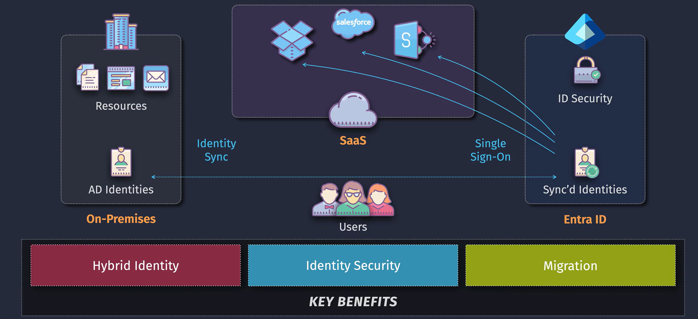
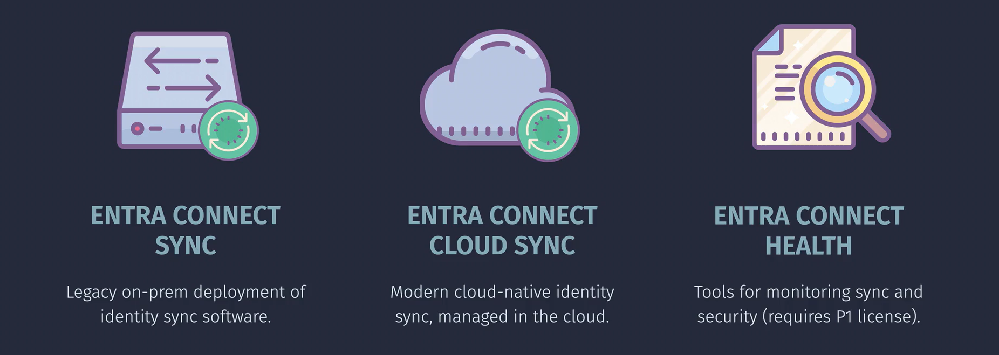
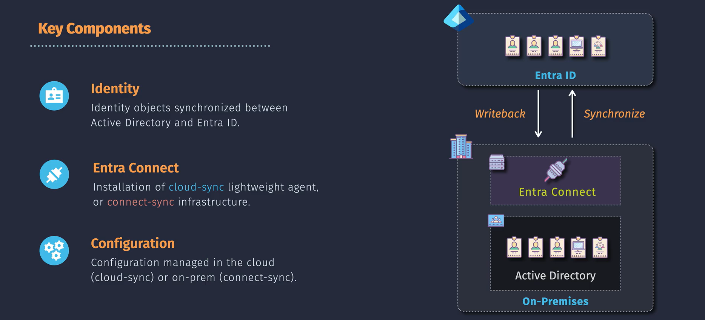

# Entra Connect

**Microsoft Entra Connect** is a tool that helps synchronize your on-premises directories (like Active Directory) with Microsoft Entra ID (formerly Azure Active Directory). This integration ensures that your users have a consistent identity across both on-premises and cloud environments, making it easier to manage access and enhance security.

## Sync Service Tools

### Entra Connect Sync

Entra Connect Sync is the primary tool for synchronizing your on-premises directory data with Microsoft Entra ID. It ensures that user identities, groups, and other directory objects are consistent across environments. Key features include:

- **Full synchronization** of on-premises users, groups, and contacts.
- **Password synchronization** to provide seamless sign-in experiences.
- **Writeback capabilities** to ensure changes in Microsoft Entra ID are reflected in the on-premises directory.

### Entra Connect Cloud Sync

Entra Connect Cloud Sync is a cloud-based synchronization service designed for simpler setups. It provides the same synchronization capabilities but with a focus on reducing the need for on-premises infrastructure. Key features include:

- **Lightweight synchronization** process managed entirely in the cloud.
- **Simplified management** with no on-premises servers required.
- **Scalability** to handle varying sizes of directories with ease.

### Comparison: Entra Connect Sync vs. Entra Connect Cloud Sync

| Feature                 | Entra Connect Sync                             | Entra Connect Cloud Sync                        |
| ----------------------- | ---------------------------------------------- | ----------------------------------------------- |
| **Infrastructure**      | Requires on-premises infrastructure            | Managed entirely in the cloud                   |
| **Management**          | Managed via on-premises tools                  | Managed via the Azure portal                    |
| **Scalability**         | Suitable for larger, more complex environments | Suitable for simpler, less complex environments |
| **Password Writeback**  | Supported                                      | Not currently supported                         |
| **Server Requirements** | Requires dedicated servers                     | No on-premises servers required                 |

### Entra Connect Health

Entra Connect Health is a monitoring and insights tool that helps you keep an eye on the health of your Entra Connect services. It provides:

- **Health monitoring** for your synchronization services.
- **Alerts and notifications** for potential issues.
- **Insights and reports** to help troubleshoot and maintain your synchronization setup.

## Key Components

## References

- [Microsoft Entra Connect Overview](https://learn.microsoft.com/en-us/azure/active-directory/hybrid/whatis-hybrid-identity)
- [Entra Connect Health](https://learn.microsoft.com/en-us/azure/active-directory/hybrid/how-to-connect-health-operations)
