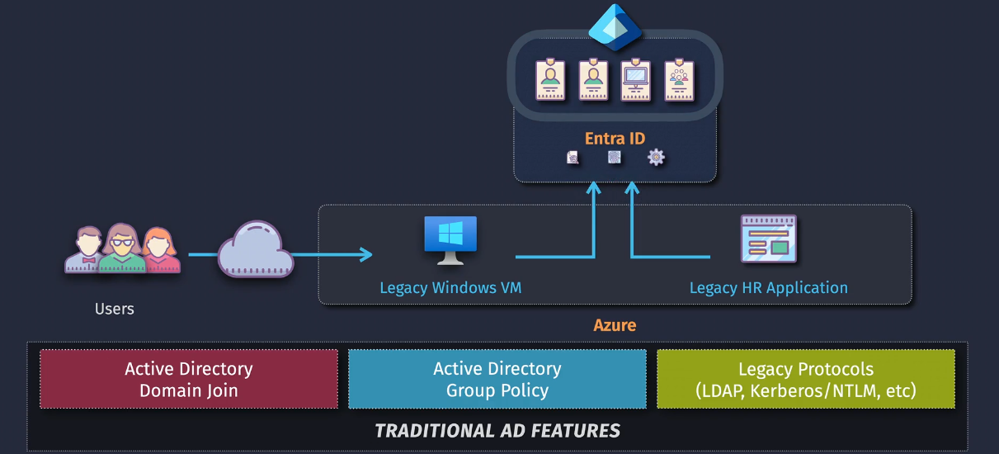
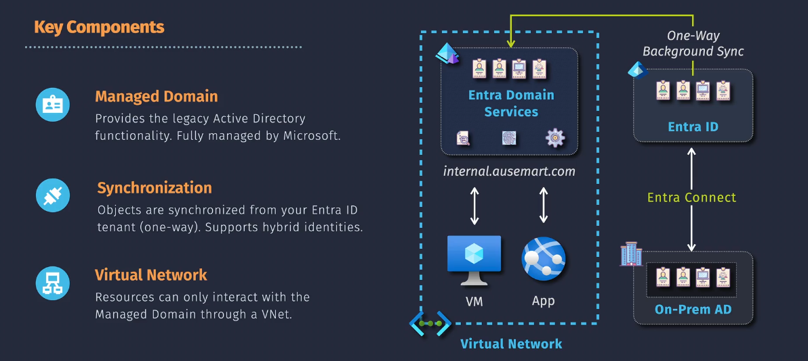

# Microsoft Entra ID Domain Services

**Microsoft Entra ID Domain Services** (formerly Azure Active Directory Domain Services) is a cloud-based service that provides traditional Active Directory (AD) services such as domain join, group policy, LDAP, and Kerberos/NTLM authentication. This managed service allows organizations to benefit from domain services without the need to deploy, manage, or patch domain controllers.

## Key Components

1. **Managed Domain**

   - **Description**: This is the core of Entra ID Domain Services. It provides traditional Active Directory (AD) features like domain join, group policy, LDAP, and Kerberos/NTLM authentication, all managed by Microsoft in the cloud. This eliminates the need for you to maintain your own domain controllers.

2. **Synchronization**

   - **Description**: Ensures that the identities and attributes in your on-premises Active Directory are synchronized with Microsoft Entra ID. This allows for seamless integration and consistency between your on-premises and cloud environments. Tools like Entra Connect are often used for this purpose.

3. **Virtual Network**
   - **Description**: The managed domain controllers are deployed within an Azure Virtual Network (VNet). This VNet provides network isolation and security, ensuring that only authorized resources can connect to the domain services. It also allows you to control and manage network traffic to and from the managed domain.

## Real-World Use Case

Imagine your organization has an old HR application running on-premises that requires AD for user authentication. With Entra ID Domain Services, you can:

- Move the application to the cloud without changing its authentication requirements.
- Users can log in to this application using their existing Entra ID credentials.
- IT teams can manage everything from one place, reducing the complexity and improving security.

In summary, Microsoft Entra ID Domain Services bridges the gap between cloud and on-premises environments, providing a unified and seamless experience for users and simplifying IT management.

## Why It Was Created

Before Entra ID Domain Services:

- Organizations used on-premises Active Directory (AD) to manage user identities and resources.
- This required setting up and maintaining physical domain controllers, which was complex and resource-intensive.
- Users could access cloud resources through Entra ID but had trouble accessing on-premises legacy services.

### Problems Solved by Entra ID Domain Services

1. **Complex Management**: Reduces the burden of managing domain controllers by providing a managed service.
2. **High Costs**: Eliminates the need for physical servers, reducing costs.
3. **Scalability Issues**: Provides easy scalability without the need for additional hardware.
4. **Security Risks**: Ensures servers are always updated and secure.
5. **Migration Difficulties**: Facilitates the migration of on-premises applications to the cloud without modifications.

### How It Works

When you create a managed domain with Entra ID Domain Services:

- You define a unique namespace (e.g., `aaddscontoso.com`).
- Microsoft deploys two Windows Server domain controllers into your selected Azure region.
- These domain controllers are managed by Microsoft, including backups and encryption at rest.

### Use Cases

1. **Running Legacy Applications**: Allows running legacy applications that require domain services in the cloud.
2. **Hybrid Environments**: Integrates with existing on-premises AD environments for seamless identity management.
3. **Centralized Management**: Manages all applications and identities through the Microsoft Entra admin center.

### Simplified Explanation

Think of Entra ID Domain Services as a magic helper for your IT systems. Instead of setting up and managing your own servers for user logins and security, Microsoft handles everything for you in the cloud. This means:

- **No Hard Work**: Microsoft takes care of all the updates and security checks.
- **Save Money**: You don't need to buy and maintain servers.
- **Easy Access**: Users can log in to both cloud and on-premises resources using the same credentials.

In summary, Microsoft Entra ID Domain Services simplifies identity management by providing the benefits of traditional Active Directory without the hassle of managing it yourself. It bridges the gap between cloud and on-premises environments, making everything easier to manage and secure.

You've got a good start! Here are the key components of **Microsoft Entra ID Domain Services**:
