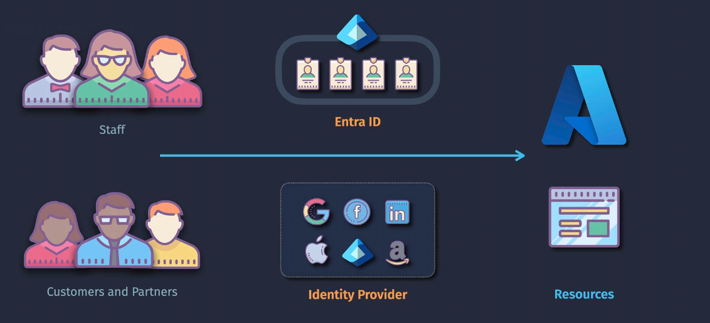
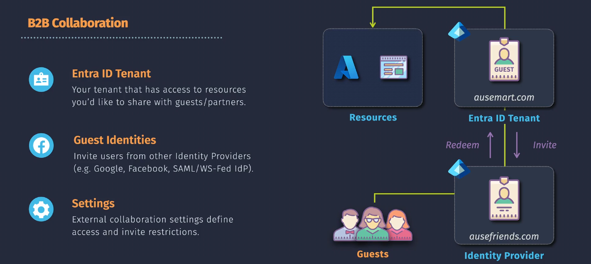
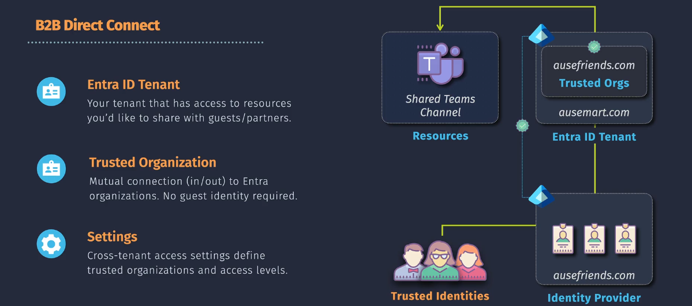
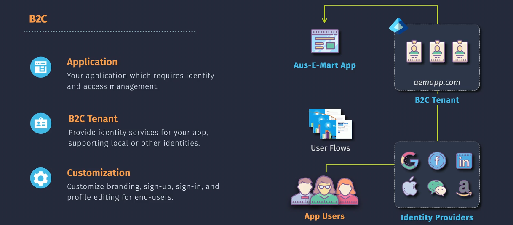

# **Entra External Identities**

**Entra External Identities** is a feature in Microsoft's Azure Entra platform (formerly Azure AD) that allows organizations to securely manage how external users (partners, vendors, or customers) access their systems. It supports both **B2B (Business-to-Business)** and **B2C (Business-to-Customer)** scenarios.

Guests may be from external organization (like external Entra ID) or external identity providers (like Google or Facebook, ..etc) depending on the specific feature.

## **B2B (Business-to-Business)**

B2B functionality is for managing access for external users like partners or vendors who need access to your organization's internal resources.

### **1. B2B Collaboration**

Enables external users to access your internal apps, services, or data by inviting them into your Azure AD as guest users. These guests can use external Entra ID accounts or accounts from external identity providers such as Google or Facebook.

- **Example:**
  - You are a company sharing files via SharePoint with a partner organization. Instead of creating a new account for them, you send them an invitation, and they log in using their existing email (e.g., Gmail, their organization's domain, or another supported provider).

### **2. B2B Direct Connect**

Provides direct integration with external organizations for seamless access to applications or systems. This feature only supports external organizations that use Microsoft Entra ID (formerly Azure AD).

- **Example:**
  - Your organization and a supplier use Microsoft Teams. With **Direct Connect**, employees from both companies can collaborate in the same Teams environment without switching accounts or platforms, using their organization's credentials.

## **B2C (Business-to-Customer)**

B2C is designed for managing access for customers who use your services or apps. It allows you to create a custom-branded authentication experience for your users. Customers can sign in using external identity providers such as Google, Facebook, or email/password accounts.

- **What it is:** Enables your customers to sign in to your apps or services using their existing social accounts (like Google, Facebook) or email.
- **Example:**
  - A retail company wants to let customers log in to their online shopping app. With Entra B2C, customers can sign in using their Google or Facebook account, or even create a custom account with their email address.
  - **Key benefit:** Improves user experience and reduces the burden of managing passwords.

## **Comparison of B2B vs. B2C**

| **Feature**            | **B2B Collaboration**                                          | **B2B Direct Connect**                     | **B2C**                                 |
| ---------------------- | -------------------------------------------------------------- | ------------------------------------------ | --------------------------------------- |
| **Audience**           | Partners, Vendors, Contractors                                 | External partners from other organizations | Customers or End Users                  |
| **Purpose**            | Share internal resources securely                              | Seamless integration with external systems | Authenticate users for your application |
| **Examples of Access** | Teams, SharePoint, CRM systems                                 | Collaboration platforms like Teams         | Online shopping, Banking portals        |
| **Authentication**     | Uses partner credentials (Entra ID, Gmail, external providers) | Entra ID credentials only                  | Social logins or custom email accounts  |
| **Customization**      | Limited branding                                               | Depends on the platform                    | Fully branded experience                |

## Why Use Entra External Identities?

1. **Simplifies Access:** External users use their own credentials (from external Entra IDs or identity providers like Google and Facebook); no need to create and manage new accounts.
2. **Enhanced Security:** Supports features like MFA (Multi-Factor Authentication), Conditional Access, and monitoring to protect resources.
3. **Improves Collaboration:** Seamless integrations reduce friction for external users.
4. **Scalability:** Handles millions of users efficiently (important for B2C scenarios).
