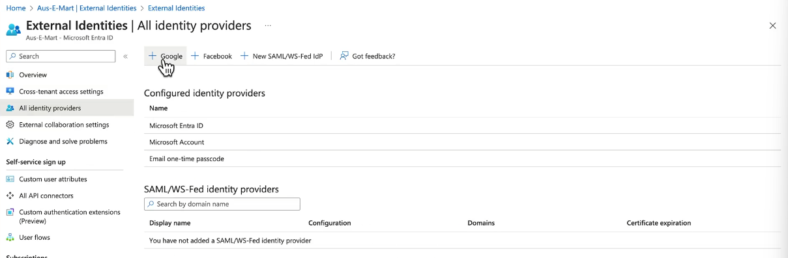

# All Identity Providers in Entra External Identities

## Default Identity Providers

### 1. Microsoft Entra ID

- **Description**: Default identity provider for organizational accounts within Microsoft Entra ID.
- **Usage**: Users with Entra ID accounts can access resources seamlessly without additional configuration.

### 2. Microsoft Account

- **Description**: Supports personal Microsoft accounts (MSA) like those used for Outlook, OneDrive, and Xbox.
- **Usage**: Users can sign in with their personal Microsoft accounts to access resources.

### 3. Email One-Time Passcode

- **Description**: default method for external users who don't have access to other identity providers.
- **Usage**: Users receive a one-time passcode via email, which they enter to access resources.
- **Typical Use**: Ideal for users with custom email domains or those without access to other identity providers.

## Additional Identity Providers

Entra ID natively supports:

1. `Google`
1. `Facebook`
1. `Additional providers using the SAML/WS-Fed protocols`

### Adding Google as Provider

#### Step 1: Create a Main Google Account

Ensure you have a Google account to use for accessing the Google API Console. This can be your existing organizational account or a new one specifically for this purpose.

#### Step 2: Access Google API Console

1. **Visit the Google API Console**: Go to [Google API Console](https://console.cloud.google.com/).
2. **Sign In**: Sign in with your Google account.

#### Step 3: Create a New Project

1. **Create a New Project**:
   - Click on the **Select a project** dropdown at the top, then click **New Project**.
   - Give your project a name and click **Create**.

#### Step 4: Enable APIs

1. **Navigate to APIs & Services**:
   - From the left menu, go to **APIs & Services** > **Library**.
2. **Enable Google Sign-In API**:
   - Search for **Google Sign-In API**.
   - Click on it and then click **Enable**.

#### Step 5: Configure OAuth Consent Screen

1. **Go to OAuth Consent Screen**:
   - From the left menu, go to **OAuth consent screen**.
2. **Select User Type**:
   - Choose **External** and click **Create**.
3. **Fill Out Information**:
   - Complete the required fields such as application name, support email, and authorized domains.
   - Click **Save and Continue**.

#### Step 6: Create OAuth 2.0 Credentials

1. **Navigate to Credentials**:
   - From the left menu, go to **Credentials**.
2. **Create Credentials**:
   - Click **Create Credentials** and select **OAuth client ID**.
3. **Set Application Type**:
   - Choose **Web application**.
4. **Configure Authorized Redirect URIs**:
   - Add the redirect URIs where users will be redirected after authentication. For example, if your application is hosted at `https://www.example.com`, add `https://www.example.com/callback` as a redirect URI.
5. **Create and Obtain Credentials**:
   - Click **Create**.
   - You will see your **Client ID** and **Client Secret**. Copy these values.

#### Step 7: Add Google as an Identity Provider in Microsoft Entra External Identities

1. **Go to Microsoft Entra Admin Center**:
   - Visit the [Microsoft Entra admin center](https://portal.azure.com/).
2. **Navigate to External Identities**:
   - Go to **Azure Active Directory** > **External Identities**.
3. **Add Identity Provider**:
   - Click on **+ Add identity provider**.
4. **Select Google**:
   - Choose **Google** from the list of available identity providers.
5. **Enter Credentials**:
   - Enter the **Client ID** and **Client Secret** you obtained from the Google API Console.
6. **Save Configuration**:
   - Click **Save** to complete the setup.

#### Step 8: Test the Integration

1. **Sign-In Test**:
   - Ensure that the Google Sign-In option appears on your application’s login page.
   - Test the sign-in process to confirm that users can authenticate using their Google accounts.

## Summary

Microsoft Entra ID supports default identity providers like Microsoft Entra ID, Microsoft Accounts, and Email One-Time Passcodes. To offer more options, you can add new identity providers such as Google or Facebook by registering your application in their respective API consoles and configuring them in the Entra admin center. This flexibility ensures a seamless and secure authentication process for external users.

**References**:

- [Google API Console](https://console.cloud.google.com/)
- [Configure Google as an Identity Provider in Microsoft Entra ID](https://learn.microsoft.com/en-us/azure/active-directory-b2c/identity-provider-google)
- [Microsoft Entra ID B2B Documentation](https://learn.microsoft.com/en-us/azure/active-directory/external-identities/)
