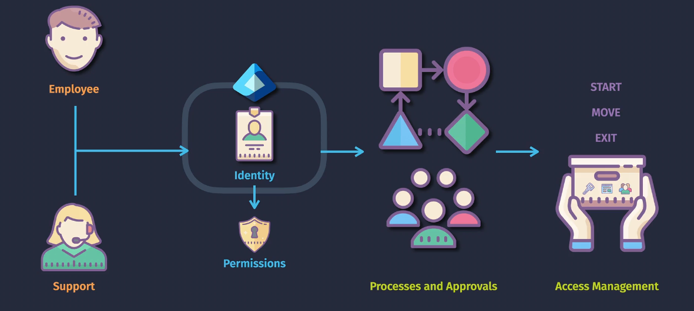
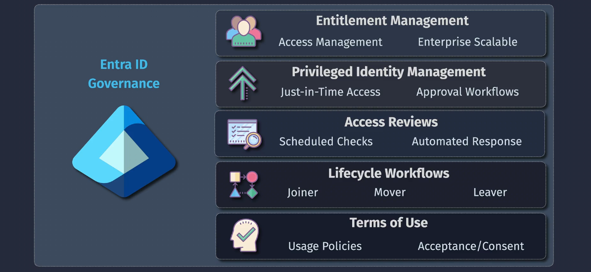
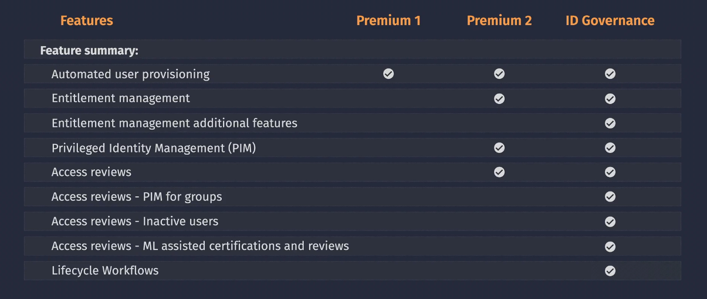

# Entra ID Governance

**Entra ID Governance** is a set of tools that helps organizations manage and secure user access to their resources. It ensures that the `right people` have the `right access` to the `right resources` at the `right time`.

Entra Governance is like a **manager** that makes sure access to your resources is **temporary, reviewed, and secure** over time. It works **with** Azure RBAC but adds extra tools to handle situations where access needs to be managed carefully or automatically.

## **How is it different from Azure RBAC?**

1. **Azure RBAC (Role-Based Access Control)**:

   - Assigns permissions (like read, write) to users.
   - It’s like giving someone the **key** to a room.
   - Once you give the key, they keep it until you manually take it away.

2. **Entra Governance**:
   - Adds rules to **review, limit, or automate access**.
   - It’s like giving someone a **temporary passkey** that works only for a specific time or requires approval every now and then.
   - Example: An admin can use their “passkey” for only 1 hour to fix a problem.

## **What does Entra Governance do?**

1. **Checks if access is still needed**:

   - Example: A manager reviews if an external user still needs access to a project.

2. **Limits sensitive access to “Just-in-Time”**:

   - Example: An IT admin gets admin access for 1 hour only when needed.

3. **Automates access requests**:

   - Example: When a new employee joins, they automatically get access to the tools they need (like email and file sharing).

4. **Helps with compliance**:
   - Example: Keeps logs and reports to show auditors that your company is following security rules.

## **Why Use Entra Governance?**

**It ensures:**

- No one keeps access longer than necessary.
- Critical roles (like admins) are used safely.
- You stay compliant with laws and regulations.

**Example:**

Without Entra Governance:

- You assign someone admin rights permanently and might forget to revoke it.

With Entra Governance:

- They get admin rights only when needed, and it automatically goes away after their task is done.

## Key Features

1. **Entitlement Management**:

   - Automates access requests, approvals, and onboarding/offboarding workflows.
   - Example: New employees automatically receive access to tools they need for their role.

2. **Privileged Identity Management (PIM)**:

   - Provide **just-in-time** (temporary) access to admin roles and resources.
   - Example: An IT admin gets elevated permissions for 1 hour to troubleshoot an issue.

3. **Access Reviews**:

   - Regularly review and confirm users' access to resources.
   - Example: A manager verifies if contractors still need access to a project.

4. **Lifecycle Management**:

   - Tracks and adjusts access as users change roles, projects, or leave the organization.
   - Example: Access to a project is removed automatically when the project ends.

5. **Compliance Reporting**:

   - Generate reports to show auditors who has access and why.
   - Example: Meet GDPR or ISO requirements by proving access policies are followed.

6. **Seamless Integration with Azure RBAC**:

   - Works alongside Azure RBAC to enhance security and governance without duplicating efforts.

7. **Auditing and Monitoring**:
   - Track all changes to user access and identify unusual patterns.
   - Example: Detect and flag unnecessary access granted to sensitive resources.

## **Licensing Requirements**

Microsoft Entra Governance is included in specific **Azure AD Premium Plans**:

1. **Azure AD Premium P2**:

   - Includes all Entra Governance features:
     - Access Reviews
     - Privileged Identity Management
     - Entitlement Management
   - Ideal for advanced governance needs.

2. **Azure AD Premium P1**:
   - Includes basic governance features but lacks advanced tools like PIM and entitlement management.
