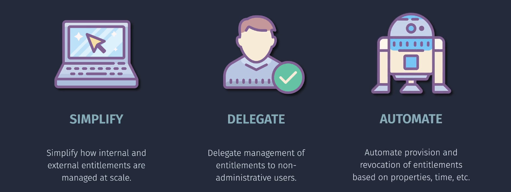

# Entra ID Entitlement Management

**Example Scenario:**

Imagine you're working on a project and need access to certain files and apps. With Entitlement Management, your manager can create an access package with everything you need and approve your request. You get access for the project duration, and after that, it automatically expires.

**Entra ID Entitlement Management** helps organizations **automate access** to resources like apps, files, and groups for users, whether they are employees, partners, or contractors. It makes granting, managing, and revoking access easier and more secure.

## **Key Features**

1. **Access Packages**:

   - Bundles of resources (apps, SharePoint sites, etc.) that users can request access to.
   - Example: A new employee requests an access package that includes access to Teams, Outlook, and SharePoint.

2. **Approval Workflows**:

   - Access requests can require approval from a manager or administrator.
   - Example: A contractor requests access to a project, and their manager approves it.

3. **Time-Limited Access**:

   - Access is granted only for a set duration and automatically removed when it expires.
   - Example: A guest partner gets access to a SharePoint site for 30 days.

4. **Automatic Offboarding**:

   - When users leave or their project ends, their access is revoked automatically.
   - Example: A vendor’s access ends on the contract expiry date.

5. **Policy-Based Assignments**:

   - Set rules for who can request access and what conditions must be met.
   - Example: Only employees in the “HR” department can request access to payroll systems.

6. **Integration with External Users**:
   - External users (partners, vendors) can request access using their existing email accounts, like Gmail or their organization’s Azure AD.

## **How It Works**

1. **Admin Creates an Access Package**:

   - Combines all necessary resources (apps, files, groups) into one package.
   - Sets rules like who can request access, approval requirements, and expiration dates.

2. **User Requests Access**:

   - A user (internal or external) fills out a request form to get access.

3. **Approval Process**:

   - The request goes through an approval workflow (e.g., manager approval).

4. **Access Granted**:

   - The user gets access to the resources in the package.

5. **Access Expires**:
   - When the set time ends, the system automatically removes access.

## **Why Use Entitlement Management?**

- **Saves Time**: Automates repetitive tasks like onboarding/offboarding.
- **Improves Security**: Ensures users only have access when they need it.
- **Simplifies External Collaboration**: Makes it easy for partners and contractors to request and get access securely.

Let's dive into how **Entra ID Entitlement Management** works and the types of resources it can manage:

### How the Process Works

1. **Create Access Packages**:

   - An access package is a bundle of resources (like apps, files, or sites) that a user might need to complete their tasks. Think of it as a set of permissions you can request.

2. **Request Access**:

   - Users who need access to these resources can request an access package. They might need to provide a reason for their request.

3. **Approval Workflows**:

   - Requests can go through an approval process. This means someone, like a manager or an admin, needs to approve the request before access is granted.

4. **Provision Access**:

   - Once approved, the user gets access to the resources included in the access package. This access can be time-limited, meaning it will automatically expire after a certain period.

5. **Access Reviews**:

   - Regular reviews are conducted to ensure that users still need the access they have. If the user no longer needs the access, it can be removed.

6. **Access Expiry**:
   - Access can be set to expire automatically after a certain period or at the end of a project. This helps ensure that users don’t retain access to resources they no longer need.

## Types of Resources

- **Applications**: Cloud-based or on-premises applications that the user might need to access.
- **Files and Documents**: Shared files or folders in platforms like OneDrive or SharePoint.
- **Groups**: Membership in certain security groups or distribution lists.
- **Roles**: Specific roles within applications or systems that grant certain permissions.
- **Sites**: Access to certain internal or external websites or portals.
- **Other Resources**: Any other resources that can be governed through identity and access management policies.

## Example Scenario

**Onboarding a New Employee:**

1. **Create Access Package**: HR creates an access package for new employees that includes:

   - Access to the corporate email system
   - Files and folders needed for onboarding
   - Applications like HR software and team collaboration tools
   - Membership in the company’s general information group

2. **Request and Approve Access**: The new employee requests access to this package. The request is automatically approved by HR based on predefined rules.

3. **Provision Access**: The new employee gets immediate access to all the resources in the access package.

4. **Periodic Reviews**: Every few months, a review is conducted to ensure the employee still needs access to all the resources. Adjustments are made if necessary.

5. **Access Expiry**: If the employee changes roles or leaves the company, their access automatically expires or is adjusted based on their new role.

## Important Considerations

## Summary

Entra ID Entitlement Management streamlines the process of managing access to resources by automating requests, approvals, and reviews. It ensures that users get the access they need when they need it, and only for as long as they need it.
