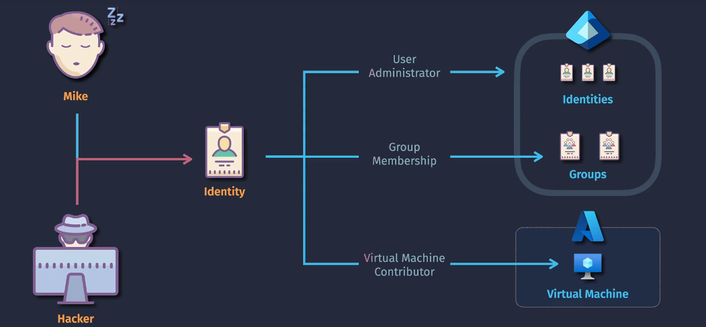
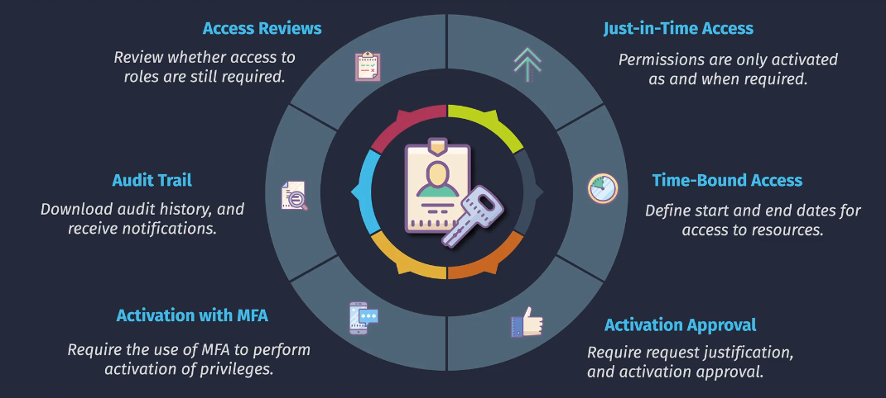
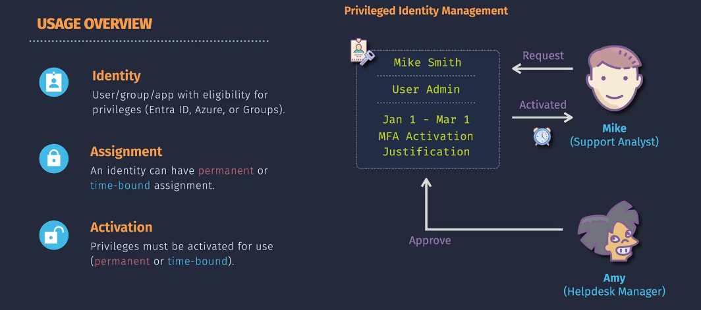

# Privileged Identity Management (PIM)

**Example Scenario:**
Imagine an IT admin needs temporary access to a critical system. With Entra PIM, they can request access, which is approved by their manager, and they receive a temporary role activation. They must provide a reason for the access and use MFA to activate the role. After completing their task, their access expires automatically.

**What is Entra PIM?**

**Microsoft Entra Privileged Identity Management (PIM)** is a service in Microsoft Entra ID that helps organizations manage, control, and monitor access to important resources. It provides just-in-time privileged access to ensure users have the necessary permissions only when they need them.

## Key Features

1. **Just-In-Time Access**:

   - Provides temporary access to resources, allowing users to activate their roles when they need them and for a limited time only.

2. **Time-Bound Access**:

   - Sets a specific time frame for when access is available, ensuring that privileges are automatically revoked after the specified period.

3. **Activation Approval**:

   - Requires approval from designated approvers before a user can activate their role, adding an extra layer of security.

4. **Activation with Multifactor Authentication (MFA)**:

   - Enforces MFA to ensure that the person activating the role is indeed the intended user, enhancing security.

5. **Audit Trail**:

   - Keeps a detailed record of all role activations and activities, providing visibility and accountability.

6. **Access Reviews**:
   - Conducts regular reviews to ensure that users still need the access they have, helping to maintain a secure environment.

## Implementation

1. **Enable PIM**:

   - Go to the Microsoft Entra admin center and enable PIM.

2. **Configure Roles**:

   - Set up the roles you want to manage with PIM, such as global admin or other privileged roles.

3. **Assign Eligible Users**:

   - Assign users who are eligible to activate these roles.

4. **Set Approval Workflows**:

   - Configure approval workflows for role activation, ensuring that an approver must grant permission before access is given.

5. **Enable Multifactor Authentication (MFA)**:

   - Ensure MFA is required for role activation to add an additional layer of security.

6. **Conduct Access Reviews**:

   - Regularly review and update access permissions to ensure users still need the access they have.

7. **Monitor and Audit**:
   - Use the audit trail to monitor role activations and activities, ensuring compliance and security.

## Example Scenario

Imagine an IT admin needs temporary access to a critical system:

1. **Request Access**: The admin requests access to a privileged role.
2. **Approval**: The request is sent to an approver who reviews and approves it.
3. **MFA**: The admin completes an MFA check to verify their identity.
4. **Activate Role**: The admin activates the role and performs their tasks.
5. **Access Expiry**: The role automatically deactivates after the specified time period.
6. **Audit**: The activity is recorded in the audit trail for future reference.

## Summary

Microsoft Entra PIM helps organizations control and secure privileged access by providing just-in-time, time-bound access, requiring approval and MFA for role activation, maintaining an audit trail, and conducting regular access reviews. This ensures that users only have the access they need, when they need it, and no longer than necessary.

**References**:

- [Microsoft Entra PIM Documentation](https://learn.microsoft.com/en-us/azure/active-directory/privileged-identity-management/)
