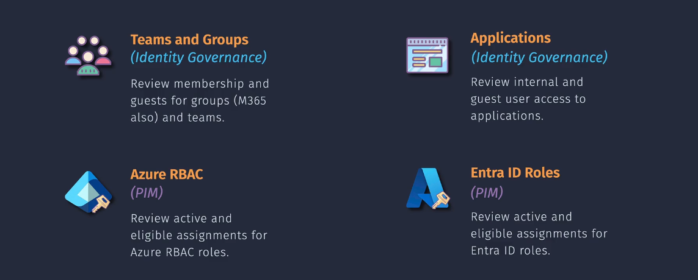
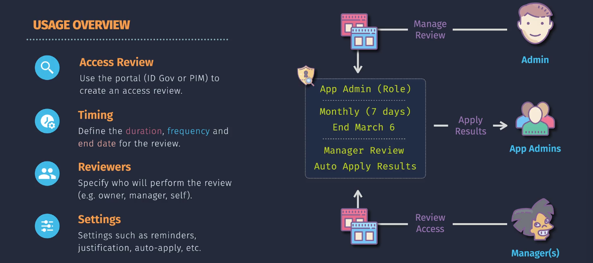

# Access Reviews

An **Access review** is a process where administrators and resource owners `periodically` review and confirm whether users need continued access to resources. This helps prevent unauthorized access and ensures compliance with organizational policies and regulatory requirements.

## Key Features

1. **Periodic Reviews**:

   - Regularly scheduled reviews to assess user access.
   - Ensures that access rights are appropriate and up-to-date.

2. **Customizable Review Settings**:

   - Define the scope of reviews, such as specific users, groups, or applications.
   - Set the frequency and duration of reviews.

3. **Automated Remediation**:

   - Automatically remove or adjust access based on review outcomes.
   - Ensure timely updates to access rights without manual intervention.

4. **Multi-Level Reviews**:

   - Involve multiple reviewers, such as managers, application owners, or security officers.
   - Provides a comprehensive review process with multiple perspectives.

5. **Detailed Reporting and Auditing**:
   - Generate reports on review outcomes and track compliance.
   - Keep a record of all review activities for auditing purposes.

## Example Scenario

Imagine you manage a team with access to sensitive financial data. To ensure that only authorized personnel have access, you set up a quarterly access review:

1. **Scope**: All users in the finance group.
2. **Reviewers**: Department managers and security officers.
3. **Settings**: Quarterly review with automatic remediation.
4. **Review Process**: Managers receive notifications, review each user’s access, and confirm whether they should retain their access.
5. **Outcome**: Access is automatically updated based on the review, ensuring that only necessary personnel have access to the sensitive data.

## Kinds of Access Reviews

### 1. **Teams and Groups**

- **Purpose**: Review and manage membership of teams and groups to ensure only authorized users are included.
- **Use Case**: Ensuring that group memberships, especially for security and distribution groups, are appropriate and up-to-date.

### 2. **Applications**

- **Purpose**: Review user access to specific applications.
- **Use Case**: Ensuring that only the necessary personnel have access to critical or sensitive applications.

### 3. **Azure RBAC (Role-Based Access Control)**

- **Purpose**: Manage access to Azure resources by reviewing role assignments.
- **Use Case**: Ensuring that users have the appropriate level of access to Azure resources and that elevated permissions are justified.

### 4. **Entra ID Roles (PIM)**

- **Purpose**: Review and validate privileged role assignments within Entra ID.
- **Use Case**: Regularly checking and confirming privileged role assignments, such as global admins or other high-privilege roles.

### Example Scenarios

#### Teams and Groups

- **Scenario**: An organization conducts quarterly reviews of the "Finance Team" group to ensure only current finance team members are included.

#### Applications

- **Scenario**: The IT department reviews access to a sensitive financial application to ensure only finance team members can access it.

#### Azure RBAC (PIM)

- **Scenario**: Regular reviews are conducted for users with the "Contributor" role in Azure to ensure they still require this level of access.

#### Entra ID Roles (PIM)

- **Scenario**: Monthly reviews are conducted for users with the "Global Admin" role to ensure they still need these elevated privileges.

## How to Implement Access Reviews

1. **Set Up Access Reviews**:

   - Go to the Microsoft Entra admin center.
   - Navigate to the **Identity Governance** section and select **Access Reviews**.
   - Click **+ New access review** to start setting up a new review.

2. **Define Scope and Reviewers**:

   - Choose the scope of the review, such as specific users, groups, or applications.
   - Select the reviewers who will perform the review (e.g., managers, resource owners).

3. **Configure Review Settings**:

   - Set the frequency and duration of the review (e.g., monthly, quarterly).
   - Choose whether to enable automatic remediation.

4. **Notify Reviewers**:

   - Send notifications to reviewers to inform them about the review.
   - Provide instructions and guidelines for completing the review.

5. **Conduct the Review**:

   - Reviewers assess whether users still need access to the specified resources.
   - Reviewers approve or deny continued access based on their assessment.

6. **Automate Remediation**:

   - If enabled, access rights are automatically updated based on the review outcomes.
   - Manual intervention can be performed if necessary.

7. **Generate Reports**:
   - Generate reports on the review outcomes to track compliance and identify trends.
   - Use reports for auditing and ensuring adherence to policies and regulations.

### Summary

Access reviews in Microsoft Entra ID provide a structured and efficient way to maintain control over user access. By periodically reviewing and updating access rights, organizations can ensure security, compliance, and proper access management.

**References**:

- [Microsoft Entra ID Access Reviews Documentation](https://learn.microsoft.com/en-us/azure/active-directory/governance/access-reviews-overview)
