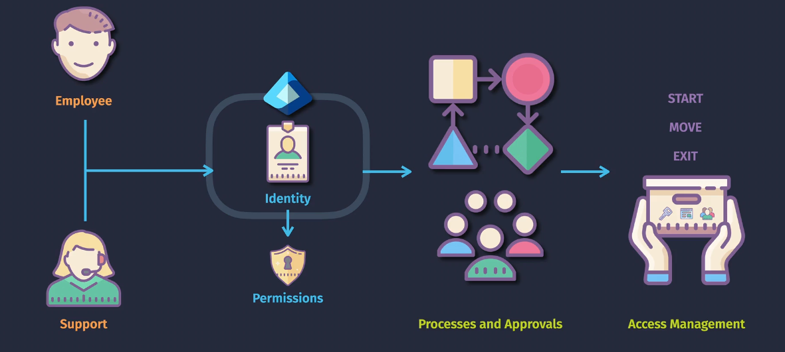
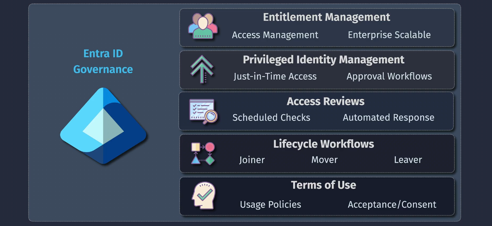
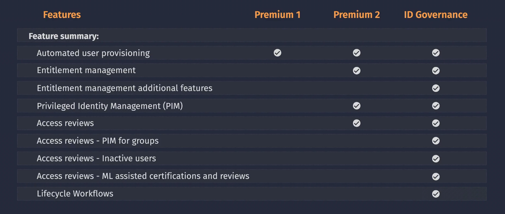

# Entra ID Governance

**Entra ID Governance** is a tool that helps organizations manage and secure user access to their resources. It ensures that the right people have the right access to the right resources at the right time.

## Example Scenario

Imagine a new employee joins your company. Entra ID Governance can automatically create their user account based on information from your HR system. As they change roles or leave the company, their access is updated or removed automatically.

## Key Features

1. **Identity Lifecycle Management**: Automates the process of creating, updating, and removing user identities based on events like hiring, role changes, or termination.
2. **Access Lifecycle Management**: Controls who has access to what resources and ensures that access is reviewed and updated regularly.
3. **Privileged Access Management**: Provides extra security for accounts with high-level access, ensuring they are monitored and controlled.
4. **Compliance and Auditing**: Helps organizations meet regulatory requirements by providing tools for monitoring and auditing access to critical resources.

## Benefits

- **Improved Productivity**: Automates routine tasks, making it easier for employees to get the access they need quickly.
- **Enhanced Security**: Reduces the risk of unauthorized access by ensuring proper controls and reviews are in place.
- **Better Compliance**: Helps organizations meet regulatory requirements by providing robust auditing and reporting capabilities.
