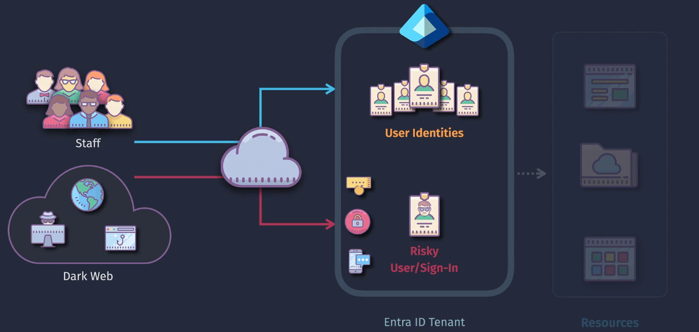

# Entra ID Protection

**Microsoft Entra ID Protection** helps organizations detect, investigate, and remediate identity-based risks. It uses advanced machine learning to identify risky sign-ins and unusual user behavior, helping to block potential threats in real-time.

## Benefits

- **Prevents Identity Takeover**: Blocks malicious actors from taking over user accounts.
- **Enhances Security**: Provides high-assurance authentication methods to safeguard sensitive access.
- **Improves Insights**: Offers actionable insights and reports to help administrators understand and address identity risks.

## Protection Policies

1. **User Risk Policy**

   - **Purpose**: Identifies and responds to risky user accounts based on their activities and behaviors.
   - **Actions**: Prompts users to change their passwords or perform multifactor authentication (MFA) if their risk level is high.

2. **Sign-In Risk Policy**

   - **Purpose**: Monitors sign-in attempts for suspicious activities, such as unusual locations, anonymous IP addresses, or unfamiliar devices.
   - **Actions**: Blocks access or requires MFA for high-risk sign-ins to ensure security.

3. **MFA Registration Policy**

   - **Purpose**: Ensures users register for multifactor authentication to add an extra layer of security.
   - **Actions**: Prompts users to set up MFA when a risk is detected or during initial setup.

4. **Conditional Access Policies**
   - **Purpose**: Enforces access controls based on specific conditions and risk levels.
   - **How It Works**: Defines rules to grant or deny access based on conditions such as user location, device compliance, or risk level.
   - **Actions**: Enforces MFA, requires device compliance checks, or blocks access based on the conditions set in the policy.
   - **Example**: A user trying to access a sensitive resource from an unfamiliar location might be required to complete an MFA challenge or be blocked from accessing the resource entirely.

### Example Scenario

Imagine a user attempts to log in from a new device in a different country:

1. **Sign-In Risk Policy**: The policy detects this as a high-risk sign-in due to the unfamiliar location and device.
2. **Actions**: The user is required to complete an MFA challenge to verify their identity.
3. **User Risk Policy**: If this behavior continues, the user's account might be flagged for further review, potentially requiring a password change.
4. **MFA Registration Policy**: Ensures that users have already registered for MFA, making the verification process smooth and secure.
5. **Conditional Access Policies**: Additional rules might enforce device compliance checks or block access from certain locations, providing an extra layer of security.

## Summary

Microsoft Entra ID Protection leverages **User Risk Policy**, **Sign-In Risk Policy**, **MFA Registration Policy**, and **Conditional Access Policies** to detect and mitigate identity risks. These policies work together to ensure that only legitimate users access your resources, enhancing overall security and reducing the risk of identity-based attacks.

**References**:

- [Microsoft Entra ID Protection Documentation](https://learn.microsoft.com/en-us/azure/active-directory/identity-protection/overview-identity-protection)
