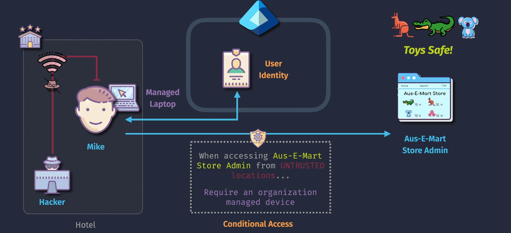

# Entra Conditional Access

**Microsoft Entra Conditional Access** is a powerful feature that helps secure your organization by enforcing access controls based on specific conditions. It ensures that only the right people, from the right places, using compliant devices, can access your resources.

## Key Component

### 1. Identity

**Definition**: Identity refers to the users or groups to which the conditional access policies apply.

**Key Points**:

- **Users**: Individual user accounts.
- **Groups**: Specific groups within the organization.
- **Roles**: Certain roles, like administrators or specific job functions.

**Example**:

- Apply a policy to all users in the "Sales Team" group to enforce multifactor authentication (MFA) when accessing sales applications.

### 2. Target Resources

**Definition**: Target resources are the applications and services that are protected by conditional access policies.

**Key Points**:

- **Cloud Applications**: SaaS apps like Microsoft 365, Salesforce, and custom applications registered with Microsoft Entra ID.
- **On-Premises Applications**: Applications accessed via the Microsoft Entra Application Proxy.
- **Other Resources**: Any resources that require controlled access, such as databases or file storage systems.

**Example**:

- Enforce conditional access policies for accessing the financial application to ensure that only authorized personnel can access it.

### 3. Conditions

**Definition**: Conditions are the criteria that must be met for the policy to be applied.

**Key Points**:

- **Sign-In Risk**: Evaluate the risk level of a sign-in attempt (low, medium, high).
- **User Risk**: Assess the overall risk level of a user.
- **Device Platform**: Specify policies for different operating systems (e.g., Windows, iOS, Android).
- **Location**: Define trusted or untrusted locations based on IP addresses.
- **Client Apps**: Apply policies based on the application used (e.g., browser, mobile apps).
- **Device State**: Check if the device is compliant with organizational policies.

**Example**:

- Require MFA for users attempting to sign in from outside the corporate network.

### 4. Access Controls

**Definition**: Access controls are the actions taken when the conditions of a policy are met.

**Key Points**:

- **Grant Controls**: Actions to allow access, such as requiring MFA, device compliance, or approved client apps.
- **Session Controls**: Additional restrictions applied during the session, like limiting access to certain functions or enforcing terms of use.

**Example:**

- Grant access only if the user completes MFA and their device is compliant with security policies.

## How Conditional Access Works

1. **Define Conditions**: Set the conditions under which access policies are enforced. This can include user location, device state, application risk level, and sign-in risk.

2. **Set Access Controls**: Specify the actions to take when conditions are met. Common actions include requiring MFA, blocking access, or requiring a password change.

3. **Apply Policies**: Conditional access policies are applied in real-time during user sign-in attempts. If the conditions match, the specified controls are enforced.

## Example Scenario

Imagine your organization wants to secure access to its financial application:

1. **Identity**: Apply the policy to users in the "Finance Team" group.
2. **Target Resources**: Protect the financial application.
3. **Conditions**: Require MFA for sign-ins from outside the corporate network.
4. **Access Controls**: Grant access only if MFA is completed and the device is compliant.

## Summary

Conditional Access in Microsoft Entra ID involves defining **identities** (who the policy applies to), **target resources** (what applications or services are protected), **conditions** (criteria for applying the policy), and **access controls** (actions taken when conditions are met). This structured approach ensures that only the right people, under the right conditions, can access sensitive resources, enhancing security and compliance.

**References**:

- [Microsoft Entra Conditional Access Documentation](https://learn.microsoft.com/en-us/azure/active-directory/conditional-access/overview)
